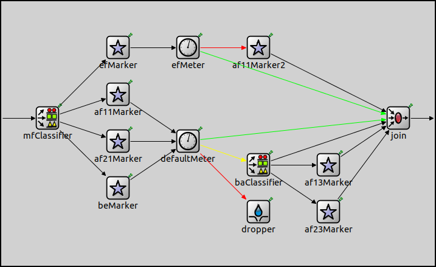
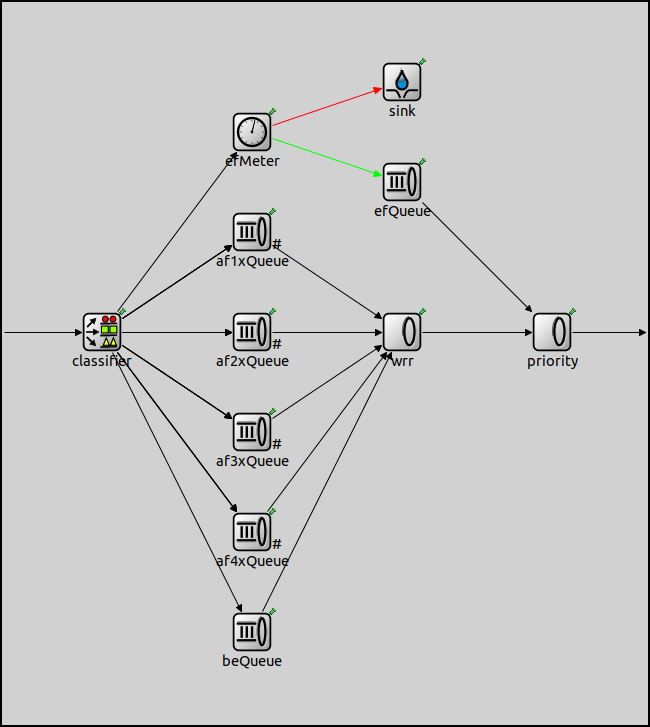
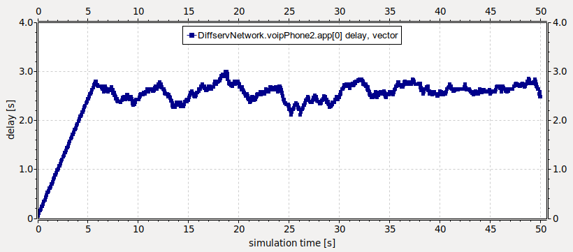
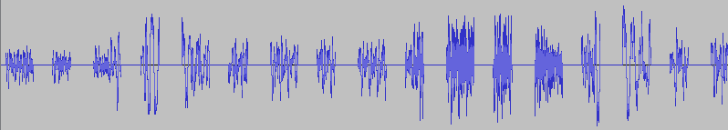
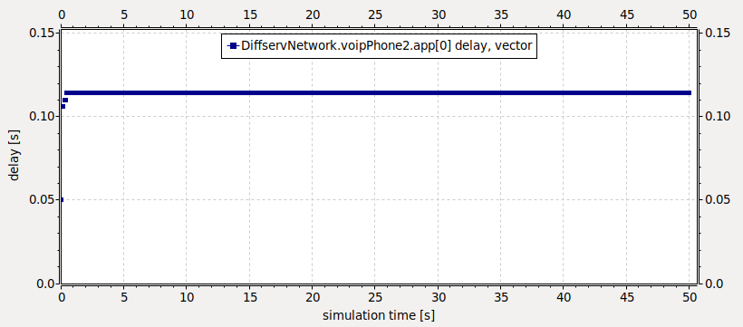

## Goals

Differentiated Services (DiffServ) was invented to provide a simple and scalable quality of service (QoS) mechanism for IP networks. Differentiated Services can, for example, be used to provide low latency for delay-sensitive network traffic such as voice while providing simple best-effort service to other services such as web traffic or file transfer.

This showcase presents an example network that employs DiffServ to provide preferential service to voice over other types of traffic.

INET version: `4.0` 
Source files location: <a href="https://github.com/inet-framework/inet-showcases/tree/master/general/diffserv" target="_blank">`inet/showcases/general/diffserv`</a>

## About Differentiated Services

The INET User's Guide, among many other resources, contains a good overview of Differentiated Services. If you are unfamiliar with the concept, we recommend that you read that first, because here we provide a brief summary only.

Differentiated Services classifies traffic entering a DiffServ domain into a limited number of forwarding classes, and encodes the forwarding class into the 6-bit DSCP field of the IP header. The DSCP field will then determine the treatment of packets (resource priority and drop priority) at intermediate nodes.

In theory, a network could have up to 64 (i.e. 26) different traffic
classes using different DSCPs. In practice, however, most networks use the
following commonly defined per-hop behaviors:

- Default PHB — which is typically best-effort traffic
- Expedited Forwarding (EF) PHB — dedicated to low-loss, low-latency traffic
- Assured Forwarding (AF) PHBs — gives assurance of delivery under prescribed conditions; there are four classes and three drop probabilities, yielding twelve separate DSCP encodings from AF11 through AF43
- Class Selector PHBs — which maintain backward compatibility with the IP Precedence field.

As EF is often used for carrying VoIP traffic, we'll also configure our example network to do that.

## The model

### The network

The following image shows the layout of the network:

We will simulate one direction of a VoIP conversation. The `voipPhone1` module transmits VoIP packets to `voipPhone2`, representing a VoIP telephone call over the Internet. The `client` generates non-VoIP traffic towards the `server`, representing for example web traffic or file transfer. In order to demonstrate the principles by which Differentiated Services works, `client` is configured to generate traffic which exceeds the 128kbps capacity of the link between the `router` and the `internet`. This causes congestion at the router's PPP interface. Differentiated handling of the VoIP packets is required in order to achieve a high quality voice transmission between the two VoIP devices.

The module called `internet` is technically a router and it is there to represent the Internet.

This showcase does not describe a real-life scenario. The links' capacities and the number of clients are deliberately set low, because that makes it easier to demonstrate the effects of Differentiated Services.

### Configuration and Behavior

In the simulation, `voipPhone1` will send the content of an audio file in a VoIP session. Note that some quality degradation will be inevitable, because the sender application will resample and downmix the originally 44.1kHz stereo sound to 8kHz mono. The `client` node will generate constant bit rate UDP background traffic.

The showcase contains three different configurations:
- `VoIP_WithoutQoS:` The queue in the router's PPP interface is overloaded and packets are dropped.
- `VoIP_WithPolicing:` The VoIP traffic is classified as EF traffic and others as AF. AF traffic is rate limited using Token Bucket to 70% of the link's capacity.
- `VoIP_WithPolicingAndQueuing:` This is same as the previous configuration, except the router's queue is configured so that EF packets are prioritized over other packets, so lower delays are expected.

In the `VoIP_WithPolicing` and `VoIP_WithPolicingAndQueuing` configurations, the `TrafficConditioner` module is used in the router's PPP interface in order to achieve the required policing.

The `TrafficConditioner`, offered by INET, is an example traffic conditioner. The `mfClassifier` module is used for separating packets of different flows for marking with different DSCP values. It contains a list of filters that identifies the flow and determines their classes. Each filter can match the source and destination address, IP protocol number, source and destination ports, or ToS of the datagram. The first matching filter determines the index of the out gate. If no matching filter is found, then the packet will be sent through the `defaultOut` gate. The filters that are used in this showcase can be found in the `filters.xml` file:

<pre class="snippet" src="../../general/diffserv/filters.xml" comment="#!"></pre>

For example, the VoIP packets, which can be recognized by their destination address `voipPhone2` and UDP destination port 1000, are marked as EF traffic.

The DSCP field of the packets is then set by the modules named `efMarker`, `af11Marker`, `af21Marker` and `beMarker`. The differentiated handling of the marked packets is then achieved by metering the traffic with the token bucket based meters `efMeter` and `defaultMeter`, and dropping or reclassifying packets that do not conform to the traffic profile. In particular, excess AF traffic will be sent to the `dropper` module. Metering parameters are configured in the `omnetpp.ini` file:

<pre class="snippet" src="../../general/diffserv/omnetpp.ini" from="WithPolicing" until="####" comment="#!"></pre>

In the `VoIP_WithPolicingAndQueuing` configuration, a `DiffServQueue` module is used instead of `DropTailQueue` in the router's PPP interface in order to achieve priority queuing.

`DiffservQueue`, offered by INET, is an example queue that can be used in interfaces of Differentiated Services core and edge nodes to support AFxy and EF per-hop behaviors. The incoming packets are first classified by the `classifier` module according to their DSCP field previously set in the traffic conditioner. EF packets - these are the VoIP packets in this case - are stored in a dedicated queue, and served first when a packet is requested. Because they can preempt the other queues, the rate of the EF packets should be limited to a fraction of the bandwidth of the link. This is achieved by metering the EF traffic with a token bucket meter and dropping packets that do not conform to the traffic profile configured in the `omnetpp.ini` file:

<pre class="snippet" src="../../general/diffserv/omnetpp.ini" from="WithQueueing" until="####" comment="#!"></pre>

We examine the results of the three different configurations listed above.

## Results

#### Original Sound Track

As a reference, you can listen to the original audio file by clicking the play button below:

<audio controls> <source src="ria_44100_stereo.mp3" type="audio/mpeg">Your browser does not support the audio tag.</audio>

#### VoIP_WithoutQoS configuration

As expected, the quality of the received sound using the `VoIP_WithoutQoS` configuration is very low:

<audio controls> <source src="VoIP_WithoutQoS_results.wav" type="audio/wav">Your browser does not support the audio tag.</audio>

This low quality is due to the fact that approximately half of the VoIP data sent by `voipPhone1` are dropped by the router's `DropTailQueue` before reaching the server, due to the lack of traffic conditioning.

The delay of the VoIP packets is very high, approximately 2.5 seconds, which is way too much compared to a real phone call. The following plot shows the delay of each VoIP packet:

The dropouts you hear can also easily be observed if we zoom into the timeline of the received audio track using Audacity:

#### VoIP_WithPolicing configuration

In this configuration we use a traffic conditioner inside the router's PPP interface.
The following (edited) video, captured from the simulation, shows the classification and the differentiated handling of the packets in the traffic conditioner.

<video autoplay loop controls src="TrafficConditioner.mp4" type="video/mp4" onclick="this.paused ? this.play() : this.pause();">Your browser does not support HTML5 video.</video>
<!--Emulation proof-->

We can see that VoIP packets (`VOICE`, `SILENCE`) are classified as EF traffic, while the packets generated by `client` are classified as AF traffic. As a result, the data rate of the VoIP traffic increases and no VoIP packets are dropped. 

The changes result in a better sound quality:

<audio controls> <source src="VoIP_WithPolicing_results.wav" type="audio/wav">Your browser does not support the audio tag.</audio>

The following plot shows the delay of the VoIP packets:

Although the delay of the packets is much less than it was with the previous configuration (0.3s instead of 2.5s), it is still very high for IP telephony.

The dropout problem that was present throughout the whole transmission using the first configuration is successfully eliminated, as we can see if we take a look at the audio track:

#### VoIP_WithPolicingAndQueuing configuration

With the `VoIP_WithPolicingAndQueuing` configuration, where the router's queue is configured to prioritize EF packets (VoIP traffic in this case) over other packets, lower delay can be achieved.

This configuration introduces priority queuing to provide first class service for EF packets. The following video shows how the different type of packets are forwarded and handled:

<video autoplay loop controls src="DiffServQueue.mp4" type="video/mp4" onclick="this.paused ? this.play() : this.pause();">Your browser does not support HTML5 video.</video>
<!--Emulation proof-->

Some delay still remains, of course, but the best quality could be reached with this configuration:

<audio controls> <source src="VoIP_WithPolicingAndQueueing_results.wav" type="audio/wav">Your browser does not support the audio tag.</audio>

The lag at the beginning of the music that was present with the previous configuration is not audible anymore, because the difference between the delays of the packets is less. The average delay of the packets is also lower than it was before:

## Further Information

The following link provides more information about Differentiated Services in general:
- <a href="https://en.wikipedia.org/wiki/Differentiated_services" target="_blank">Differentiated Services</a>

Audacity ® was used to visualize the audio tracks:
- <a href="https://www.audacityteam.org/" target="_blank">Audacity ® official website</a>

The following link provides more information about VoIP in general:
- <a href="https://hu.wikipedia.org/wiki/Voice_over_IP" target="_blank">VoIP</a>

More information can be found in the <a href="https://omnetpp.org/doc/inet/api-current/neddoc/index.html" target="_blank">INET Reference</a>.

## Discussion

Use <a href="https://github.com/inet-framework/inet-showcases/issues/??" target="_blank">this page</a>
in the GitHub issue tracker for commenting on this showcase.

