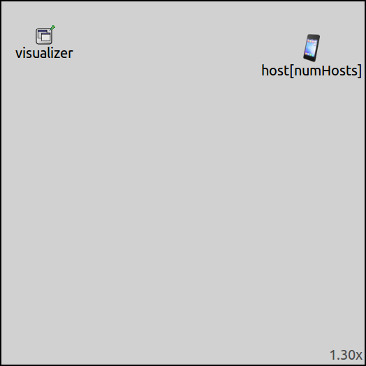
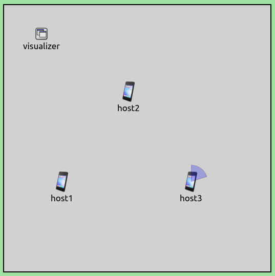

## Goals

In INET, mobility models are used to describes motion. This showcase introduces the concepts of mobility, and demonstrates various available mobility models, grouped along several dimensions into several categories. It contains example simulations demonstrating mobility modules from each category.

INET version: `4.0` 
Source files location: <a href="https://github.com/inet-framework/inet-showcases/tree/master/general/mobility" target="_blank">`inet/showcases/general/mobility`</a>

TODO: separate showcase for geographic vs. Euclidean which is this one

## Concepts

<!-- What are moblity models? -->
In general, mobility models describe motion in a 3D right-handed Euclidean coordinate system. More precisely, they describe how position and orientation (and also their derivatives: velocity/acceleration, angular velocity/acceleration) changes over time. Mobility models are abstract models in the sense that they are not concerned with how the motion is actually used (e.g. desribe the motion of a wireless network node).

<!-- How does one interpret position, orientation, etc.? -->
Coordinates are in X, Y, Z order measured in metres. Conceptually, the X axis goes to the right, the Y axis goes forward, the Z axis goes upward. The 2D canvas in Qtenv displays the scene looking towards positive Z by default, so the X axis goes to the right and the Y axis goes downward. Orientations are represented by 3D Tait-Bryan (Euler) angles measured in radians. The angles are in Z, Y', X" order that is often called intrinsic rotations.

TODO: illustrate the coordinate system

TODO: there's a projection involved between the 3D and the 2D coordinate systems, the projection is the Z axis by default, can be overridden with the scene visualizer

The `SceneCanvasVisualizer` module allows configuring a different 2D projection using angle, scaling and translation parameters. For more information, see <a href="/showcases/visualizater/environment">Visualizing the Physical Environment</a>

<!-- How are mobility models implemented in INET?-->
In INET, mobility models are usually implemented as OMNeT++ simple modules. There are several mobility modules, <!--describing different motions/-->implementing various mobility models. Some only determine initial position, some describe a motion over time, some allows combining other mobility models to create complex motions. The available mobility modules can be found in the `inet/src/inet/mobility` directory.

<!-- How are moblity models used? -->
But of course, modeling motion in itself is not very useful, so the motion pretty much always has a subject. For example, mobility models are used to describe the motion of wireless network nodes. In wireless networks, the signal strength depends on the position and orientation of transmitting and receiving nodes, which in turn determines the success of packet reception. In order to simulate this, the `WirelessHost` module contains a mobility submodule which describes its motion.

In contrast, wired network nodes generally don't have mobility submodules, because they are stationary and the position of wired network nodes have no effect on communication.

TODO: too much "wired network nodes"

TODO: explain use cases for human motion, vehicle motion, antenna offset and orientation, etc.

<!-- How are mobility modules connected to their subject modules? -->
There's an optional bidirectional mapping between the motion described by the mobility module and the position of its subject module on the 2D canvas in Qtenv. The bidirectional mapping is realized through reading from and writing to the **display string p tag** of the subject module.

<!-- What is the display string p-tag and how does it work? -->
Submodules, such as network nodes, have optional "p" tags in their display strings in the NED file, which tell the graphical runtime environment where to draw the icons representing the modules on the canvas (and also in the IDE).
Display string p-tags are two-dimensional (X and Y), and their purpose is to contol where to draw the submodule icons.
For example, a `StandardHost` with p tag set to the coordinates (93,167):

<pre class="include" src="MobilityShowcase.ned" from="host1" upto="display"></pre>

Position is three-dimensional and is a state of mobility modules. Position is used in the calculations of wireless communications, for example. For example, the position of a host (the host's mobility submodule selected in the inspector panel):

Position is always relevant, even if the simulation is run without a GUI, whereas the display string is not. (not always)

<!-- How is the bidirectional mapping realized? -->
The two directions of the bidirectional mapping can be toggled independently, with parameters.

In one direction, mobility modules can read the display string p tag of a subject module, and initialize the position based on the coordinates in the display string p tag. This mapping helps positioning using the IDE, where you can drag submodules. The mapping is done only once, at initialization, and works even if there is no GUI. The mapping is controlled by the `initFromDisplayString` parameter, where applicable.

In the other direction, mobility modules can continuously update the display string p tag of the subject module, according to the current position. This mapping helps understanding motion in the runtime GUI, where submodules move around on the parent compound module's canvas. The mapping is controlled by the `updateDisplayString` paramater. The mapping is only relevant when the simulation is run with a GUI.

<!-- The behavior is controlled by the `initFromDisplayString`, where applicable (certain mobilities have it, others dont because its not compatible with the model, such as in the case of CircleMobility, where the position must be on the circle) -->

<!-- There's an optional bidirectional mapping between the motion described by the mobility module and the position of its subject module on the 2D canvas in Qtenv. The position on the canvas is determined by the display string p-tag of a submodule. The bidirectional mapping is realized through reading from and writing to the display string p tag of the subject module. The two directions of the mapping can be toggled independently, with parameters. TODO: actually, all mobilities have updateDisplayString,
and initFromDisplayString is not interpreted everywhere ? ? ? ? -->

<!-- TODO: -initFromDisplayString: this mapping helps positioning using the IDE, you can drag submodules, p tag, etc.
Firstly, mobility modules can read the display string p tag of a subject module, and initialize the position based on the coordinates in the display string p tag. This action is done only once, at initialization, and works even if there is no GUI. The behavior is controlled by the `initFromDisplayString`, where applicable (certain mobilities have it, others dont because its not compatible with the model, such as in the case of CircleMobility, where the position must be on the circle)

TODO: -updateDisplayString: this mapping helps understaning motion in the runtime GUI, submodules move around in the parent compound module's canvas
Secondly, mobility modules can continuously update the display string p tag of a subject module, according to the current position. The update is only relevant when the simulation is run with a GUI. -->

The above effects pertain to the subject module of the mobility.

<!-- - it is done through the display string p tag
- the two directions can be toggled independently
- the initFromDisplayString reads from the p tag for initial pos (one time, at initialization)(not GUI only)
- the updateDisplayString updates the p tag according to the position (continuously)(its GUI only thing)
- the subjectModule selects the subject -> the above two pertains to that -->

<!-- -initFromDisplayString: this mapping helps positioning using the IDE, you can drag submodules, p tag, etc.
-updateDisplayString: this mapping helps understaning motion in the runtime GUI, submodules move around in the parent compound module's canvas -->

TODO: copy stuff from old version

<!-- How can mobility modules get positions? -->
Without mobility, the position of nodes is not interpreted (in fact doesn't exist), and not relevant. In this case, if the nodes have a display string p tag, they are drawn in the GUI and IDE according to that. If they don't have a p tag, the GUI places them with the layouter algorithm (this can lead to different layouts when re-layout is selected).

<!--how do nodes get positions when they have mobility?-->
When nodes have mobility, the situation is a bit more complex.
They can either get their initial position from the display string p tag, or from the mobility module.

Some mobility modules have the `initFromDisplayString` and `initialX`, `initialY`, and `initialZ` parameters for initial positioning.
When a module has a p tag set, and the `initFromDisplayString` parameter is set to `true` in its mobility module, the position will be initialized from the p tag. Otherwise, when there is no p tag set or `initFromDisplayString` is `false`, the position will be set according the `initialX`, `initialY`, and `initialZ` parameters. The default for these three parameters is a random value inside the constraint area.

Other mobility modules (e.g. those that describe completely deterministic trajectory) initialize position with other parameters.
For example, the `CircleMobility` module (describing circular motion) has parameters to define the center and the radius of the circle, and also the starting angle. The starting angle parameter is what does the initial positioning, along the circle defined by the other parameters.

### Generic Parameters

All mobility modules in INET extend `MobilityBase`. It has some generic parameters, which are thus common to all mobility modules, such as the following:

- The **constraint area**, as the name suggests, limits movement to an area (more precisely, volume) of definite size. By default, the constraint area is infinite (i.e. unconstrained). The constraint area is defined by six parameters, setting the two boundaries of the area per coordinate axis. The parameters are the following:
  - `constraintAreaMinX`
  - `constraintAreaMaxX`
  - `constraintAreaMinY`
  - `constraintAreaMaxY`
  - `constraintAreaMinZ`
  - `constraintAreaMaxZ`
- `displayStringTextFormat`: Contains directives as to what to display above mobility submodules in the GUI. For example, displaying position and velocity can be achieved with `"p: %p\nv: %v"` format string:
  
- `visualRepresentation`: Selects which module is moved by this mobility module (parent module by default), more on this in a later section.

### Visualizing state of mobility modules

<!-- What does the mobility visualizer do? -->
The `MobilityVisualizer` module can display certain states of mobility modules:

- **Position**  as a colored dot (useful when the mobility doesn't have a subject module, i.e. doesn't move anything; `displayPositions` parameter)
- **Orientation** as a semi-transparent cone, representing angular position (`displayOrientations` parameter)
- **Velocity** as an arrow, representing the velocity vector (`displayVelocities` parameter)
- **Movement trail** as a fading path (`displayMovementTrails` parameter)

The `displayMobility` parameter is the master switch, toggling the display of the above features.

### Simplistic examples

This section demonstrates the above concepts in a very simple way. It contains two example simulations.
The example simulations illustrate that mobility modules are abstract models, and the effects of the `visualRepresentation` parameter of `MobilityBase`. The example simulations are defined in `Simplistic1` and `Simplistic2` configurations in omnetpp.ini.

In the **first example**, there are just two mobility modules in the network, which will move themselves.
The mobility modules are of the type `LinearMobility`. The `LinearMobility` module describes motion along a straight line. Here is the NED definition of the network:

<pre class="include" src="MobilityShowcase.ned" from="MobilityShowcaseSimplistic1" until="MobilityShowcaseSimplistic2"></pre>

Here is the configuration in omnetpp.ini:

<pre class="include" src="omnetpp.ini" from="Simplistic1]" until="Simplistic2"></pre>

The configuration sets the speed to 10 m/s and the constraint area of the two mobility modules to 400x400 meters (matching the playground). The display string text format is set to display the position, velocity and orientation. The `visualRepresentation` parameter is set to `"."` (itself), so mobility modules move themselves. Here is a video of the simulation:

<video autoplay loop controls src="Simplest1.mp4" onclick="this.paused ? this.play() : this.pause();" max-width-percent="50"></video>

<!--internal video recording, zoom 1.3, playback speed 4.37, animation speed 1-->

<!-- TODO: they start at the same angle beause of the default, and they bounce back from the side -->

The two modules move around inside the constraint area (which currently matches the playground), bouncing back from the boundaries.

In the **second simple example**, there are two mobility modules, which are set to not move anything. They will just keep track of position and orientation, which can be visualized with `MobilityVisualizer`.
The configuration extends the previous one, but uses the `MobilityShowcaseSimplistic2` network:

<pre class="include" src="MobilityShowcase.ned" from="MobilityShowcaseSimplistic2" until="MobilityShowcaseI"></pre>

It contains two `LinearMobility` modules, and an `IntegratedVisualizer` module. The configuration in omnetpp.ini is the following:

<pre class="include" src="omnetpp.ini" from="Simplistic2" upto="moduleFilter"></pre>

And here are the relevant keys from the `General` configuration:

<pre class="include" src="omnetpp.ini" from="displayMobility" upto="displayMovementTrails"></pre>

In addition to the keys defined in the `Simplistic1`, the visual representation is turned off in both mobility modules, so they won't move anything. In the `MobilityVisualizer` submodule of `IntegratedVisualizer`, all visualization features are is turned on, and the `moduleFilter` is set to `**.mobility*` from the default of `**.mobility`, because the modules are named `mobility1` and `mobility2`.
(It is needed because generally hosts contain one mobility module named `mobility`, but not in this case. The default module filter wouldn't match `mobility1` and `mobility2`.)

Here is the simulation when running:

<video autoplay loop controls onclick="this.paused ? this.play() : this.pause();" src="Simplest2.mp4" max-width-percent="50"></video>

<!--internal video recording, zoom 1.3, playback speed 4.37, animation speed 1-->

<!-- TODO: actually, the constraint area is defined in the general config...so as the visualization. maybe this example shouldnt be here? -> nope...the constraint area keys are not the same DELETE THIS
but later -->

<!-- TODO: now the mobility doesn't move anything, but it keeps track of the position. The mobility visualizer can visualize the position...
and the orientation and the velicity and the movement trail. this is useful for what? also, how is the initial positioning here ? -->

<!-- TODO: visualizeMobility ? -->

## Categorizing mobility models<!-- / Mobility model categories-->

<!-- there are some which describe orientation. some do both. The groups and dimensions. -->

<!-- TODO: the concepts of mobility...a mobility module describes a motion...keeps track of a position and orientation state...it can move a visual representation of a node (can be nothing, itself, another node) -->

Users are likely to have ideas about different kinds of motion, and mental models of what motions should be simulated.

There are all kinds of motions that can be modeled. This section takes a look at them, and gives examples of how they can be simulated in inet, which mobility modules implement them, and how to combine mobility modules to create complex motion.

The models can be grouped <!--according to several aspects/-->along several dimensions.
The following sections will describe such dimensions and their categories, illustrating mobility models in each category with mobility modules and example simulations. Of course, a mobility module can belong to multiple categories. The dimensions along which we categorize mobility models in this showcase are the following:

- **Type of movement**
- **Scope of the model**
- **State changed by the model**
- **Method of configuration**
- **Time scope**/**Initial vs. overtime positioning**
- **Model Complexity**
- **Trace-based vs. calculated / time of calculation**

Note that this showcase describes the featured mobility modules and their important parameters. For all parameters, check the NED documentation of the different mobility modules (<a href="https://github.com/inet-framework/inet/tree/master/src/inet/mobility" target="_blank">`inet/src/inet/mobility`</a>).

<!-- TODO: somewhere -> mobilitybase -->

### The configuration / about the simulations

In the example simulations, the mobility modules are submodules of network nodes, as this is the most prevalent use case.
The simulations use one of two networks, `MobilityShowcaseA` and `MobilityShowcaseB`.
In both of them, the size of the playground is 400x400 meters.
Both of them contain `StandardHost`s.
`MobilityShowcaseA`, defined in <a srcfile="general/mobility/MobilityShowcase.ned"/>, looks like the following:

The network contains seven `StandardHost`s (`host1` to `host7`), laid out on the playground using display string tags ("p" tags), like as follows:

<pre class="include" src="MobilityShowcase.ned" from="MobilityShowcaseA" upto="}"></pre>

In the `MobilityShowcaseB` network, the number of `StandardHost`s can be set with the `numHosts` parameter from the ini file. Also, <!--the hosts don't have display strings--> there is no display string "p" tag:

<pre class="include" src="MobilityShowcase.ned" from="MobilityShowcaseB" upto="}"></pre>

Here is what the network looks like in the IDE:

Both networks also contain an `IntegratedVisualizer` module to visualize some aspects of mobility. No other modules are needed (i.e. Ipv4NetworkConfigurator or radio medium) to demonstrate the mobility models. There won't be any communication, just movement.

<!-- TODO to keep it simple...no communication will take place -->

The `General` configuration in <a srcfile="general/mobility/omnetpp.ini"/> contains some configuration keys common to all example simulations:

<pre class="include" src="omnetpp.ini" from="General" until="StaticPosition" comment="#"></pre>

By default, hosts look for the configurator module in the top level of the network, under the name `configurator`. Since the network doesn't need and doesn't have a configurator, the configurator module path in all hosts is set to an empty string to prevent error messages.

All visualization features of `MobilityVisualizer` are turned on, and the constraint areas of all mobility modules are set to match the size of the playground. (All nodes will move in the XY plane, so the Z coordinate is 0 everywhere.)

<!-- TODO: from the perspective of a network node moved by mobility models -->

<!-- TODO: the common parts...general config, the two networks -->

<!-- TODO: the list of dimensions -->

### Categorizing mobility models according to **type of movement**

Mobility models are now grouped according to the nature of movement they describe.
From this aspect, there are three categories of mobility models:

- **Static position**<!--: the mobility's position is constant, i.e. the node is not moving.-->
- **Deterministic movement**<!--: the movement described by the mobility model doesn't contain randomness-->
- **Stochastic movement**<!--: the movement contains random elements-->

<!-- TODO: the definition should be not here? -->

The example simulations for these categories use the `MobilityShowcaseA` network.

##### <!--Category: -->**Static position**

In this category, the position set by mobility models is constant, i.e. the nodes are stationary.
These kinds of mobility models are useful for e.g. initial positioning of network nodes.
Examples include `StationaryMobility`, `StaticLinearMobility`, `StaticConcentricMobility`.

<!-- <pre>
They just set the positions, and they are constant. Static movement -> constant position

the main feature here is that they dont move...
</pre> -->

The example simulation for this category is the `StaticPosition` configuration, using the `StationaryMobility` model. <!--This model TODO.wirelesshost.-->
The `StationaryMobility` model only sets position. It has `initialX`, `initialY`, `initialZ` and `initFromDisplayString` parameters.
By default, the `initFromDisplayString` parameter is `true`, and the initial coordinate parameters select a random value inside the constraint area. Additionally, there are parameters to set the initial heading, elevation and bank (i.e. orientation in 3D), all zero by default. It also has parameters for positioning in a geographical coordinate system (undefined by default), but that is out of scope for this showcase. Note that `StationaryMobility` is the default mobility model in `WirelessHost` and derivatives.

The configuration for the example simulation in omnetpp.ini is the following:

<pre class="include" src="omnetpp.ini" from="StationaryMobility" upto="false"></pre>

The configuration just sets the mobility type, and turns off orientation visualization. Here is what it looks like when the simulation is run:

<!-- Which is the default in `WirelessHost`. It just sets the positions. -->

<!--zoom 1.30-->

As the nodes are stationary and nothing happens, there is no need for a video :)

##### <!--Category: -->**Deterministic movement**

In this category, the mobility models describe movement deterministically, in the sense that the mobility model doesn't use randomness when calculating the trajectory (the parametrization can contain random values, however). Examples of such mobility modules include `LinearMobility`, `CircleMobility`, `RectangleMobility`.

The example simulation for this category is the `DeterministicMotion` configuration, which uses the `LinearMobility` module.

The `LinearMobility` module describes a linear trajectory. It has parameters for speed, acceleration and starting angle. After the initial setting, the angle only changes when the node bounces back from the boundary of the constraint area. The model also has parameters for initial positioning <!--(`initialX`, `initialY`, `initialZ`, `initFromDisplayString`).-->:
- `initialX`, `initialY`, `initialZ`: random value inside the constraint area by default (effective when not initialized from display string)
- `initFromDisplayString`: true by default

There are additional parameters. By default, the `speed` and `acceleration` parameters are zero. The angle parameter sets the initial orientation, it is a random value by default.

The `LinearMobility` model is a derivative of `MovingMobilityBase`, which has the `faceForward` parameter.
When this parameter is `true` (the default), orientation matches the velocity vector. When it's `false`, the orientation is (0,0,0).

<!-- TODO: the defaults for the other parameters -->

The configuration in omnetpp.ini is the following:

<pre class="include" src="omnetpp.ini" from="LinearMobility" upto="speed"></pre>

It leaves most parameters on default, but sets the mobility type and the speed (the speed is 0 by default).

<video autoplay loop controls src="Deterministic2.mp4" onclick="this.paused ? this.play() : this.pause();" max-width-percent="50"></video>

##### <!--Category: -->**Stochastic movement**

Mobility models in this category contain random elements when describing the movement (although in a sense the movement is deterministic, as the random number generators are deterministic.) Example mobility modules include `GaussMarkovMobility`, `MassMobility`, `ChiangMobility`, `RandomWayPointMobility`.

The example simulation for this category is the `StochasticMotion` configuration, which uses the `GaussMarkovMobility` module.

V1

`GaussMarkovMobility` uses a Gauss-Markov model to contol randomness in the movement. It has an `alpha` parameter, which can run from 0 (totally random motion) to 1 (deterministic linear motion), with the default of 0.5. There is also a `speed` parameter with no default, and an `angle` parameter with random angle by default. TODO: what does variance do ?

<!-- `GaussMarkovMobility` uses a Gauss-Markov model to control the randomness in the movement. -->

V2

`GaussMarkovMobility` uses a Gauss-Markov model to contol randomness in the movement.
<!-- The movement of node has a mean angle, and some random variations applied to the angle. -->
The mobility starts with a mean direction. At constant intervals, a new direction is chosen based on the mean direction, the direction in the previous time interval, and a gaussian random variable. The alpha parameter controls how much the random variable affects the direction.
It has an `alpha` parameter, which can run from 0 (totally random motion) to 1 (deterministic linear motion), with the default of 0.5. The random variable has a mean of 0, and its variance can be set by the `variance` parameter.
There is also a `speed` parameter with no default, and an `angle` parameter with random angle by default.
<!--The `margin` parameter can set a margin to the constraint area...TODO
A margin can be set by the `margin` parameter, which in essence reduces the available space for the mobility, from the constraint area.
The `margin` parameter sets a margin, which reduces the space the mobility can move in, from the constraint area.-->
The `margin` parameter adds a margin to the boundaries of the constraint area, so that the mobility bounces back before reaching it.

<!-- TODO: the showcase doesnt describe all parameters, for that, check the ned documentation. -->

Here is the configuration in omnetpp.ini:

<pre class="include" src="omnetpp.ini" from="GaussMarkovMobility" upto="alpha"></pre>

The mobility module is set to totally random motion, with a variance of 0.5.

<video autoplay loop controls src="Stochastic2.mp4" onclick="this.paused ? this.play() : this.pause();" max-width-percent="50"></video>

<!--internal video recording, animation speed 1, playback speed 4.37, zoom 1.3, normal run, about 100s simulation time-->

### Categorizing mobility models according to their **scope**

Mobility models can be grouped according to their scope, i.e. they either affect a `single` module, or a `group` of modules.

Mobility models can be grouped according to their scope:
- **single**: they describe the motion of a single module, independent of the motion of other modules.
- **group**: they describe the motion of a group of modules, e.g. a flock of birds flying in formation.

<!-- More precisely, when multiple modules are affected, each module contains its own mobility submodule. The mobility submodules are of the same type, and all mobility submodules work together to position/move the modules. -->

More precisely, when a module describes the motion of multiple modules, each module contains an instance of the same mobility module type. The mobility submodules in the group work together to describe the group's motion.

The mobility modules demonstrated so far were from the `single` category. Examples from the `group` category include `StatisGridMobility` and `StaticConcentricMobility`.

##### <!--Category: -->**Group mobility**

The example simulation for this category is defined in the `Group` configuration in omnetpp.ini. It uses the `StaticGridMobility` module.

`StaticGridMobility` positions all nodes in a rectangular grid. It has parameters for setting the properties of the grid, such as a margin, the number of row and columns, and the separation between rows and columns. By default grid has the same aspect ratio as the available space (constraint area by default). The `numHosts` parameter must be set in all mobility modules of the group.

The simulation uses the `MobilityShowcaseB` network. The configuration in omnetpp.ini is the following:

<pre class="include" src="omnetpp.ini" from="Group" upto="mobility.numHosts"></pre>

We specify the `numHosts` parameter, the other parameters of the mobility are left on their defaults.
Thus the layout conforms to the available space:

<!-- <pre>
changing position and derivatives
changing orientation and derivatives
both
</pre> -->

### Categorizing mobility modules according to the **state** they affect

Virtually all mobility models affect the whole state of mobility (position, orientation and derivatives), even if they set some of them to zero, for example.
Mobility models are categorized according to which state of motion they **focus** on:

<!-- Mobility models are now categorized according to what mobility state they affect. The categories are the following: -->

- `Position` and derivatives: focusing on position, velocity and acceleration
- `Orientation` and derivatives: focusing on orientation (heading, elevation, bank), angular velocity/acceleration
- `Both` of the above

Some modules only focus on position, such as `StaticGridMobility`. Most mobility modules focus on both position and orientation. The examples so far fell into the `Position` and `Both` category. What follows is an example from the `Orientation` category. Please rewrite this.

##### <!--Category: -->**Orientation**

Mobility models in this category only focus on orientation. The example simulation features the only such module, `FacingMobility`.

`FacingMobility` sets the orientation of the mobility module to face towards another mobility module.
More precisely, the orientation is set to point from a source mobility module to a target mobility module. Both can be selected by the `sourceMobility` and `targetMobility` parameters.
By default, the source mobility is the mobility module itself (`sourceMobility = default(".")`).
The target mobility parameter has no default.
`FacingMobility` also has the inital positioning parameters `initialX`, `initialY`, `initialZ`, and `initFromDisplayString`.

For example, one can set in `host3` the source mobility to `host1`'s mobility module, the target mobility to `host2`'s mobility module. So the orientation of `host3` points in the direction of the `host1`-`host2` vector:

Note that this screenshot is not from the example simulation for this category, it's just for illustration.

<!-- On to the example simulation... -->

The example simulation demonstrating `FacingMobility` uses the `MobilityShowcaseA` network.
The nodes which are in a circle around the central node are configured to face towards the central node. The central node itself is configured to move around using `LinearMobility`.
The example simulation is defined in the `Orientation` configuration in omnetpp.ini:

<pre class="include" src="omnetpp.ini" from="Config Orientation" until="Scriptable"></pre>

Note that the value for the `sourceMobility` and `targetMobility` parameters is a path to a mobility module (relative to the current mobility module). So the mobility of `host1` to `host6` is configured to face towards `host7`'s mobility submodule.

<video autoplay loop controls onclick="this.paused ? this.play() : this.pause();" src="Facing1.mp4" max-width-percent="50"></video>

### Categorizing mobility models according to **method of configuration**

Mobility models can be grouped according to how they are configured:

- **ini parameter driven**
- **Scriptable**

In the ini parameter driven category, the mobility module's behavior can be controlled with parameters from the ini file. The category included all mobility modules demonstrated so far. The motion in mobility modules in the scriptable category can be controlled with various XML scripts, depending on the actual mobility module. In general, scripting allows for more flexible configuration.

##### <!--Category: -->**Scriptable mobility models**

Mobility modules in this category include `TurtleMobility` and `BonnMotionMobility`. The example simulation uses the `TurtleMobility` module.

Movement in `TurtleMobility` is controlled by an XML script. The script contains elements and attributes, which describe the motion, such as setting coordinates, turning by some angle, going a certain distance, etc. These motion elements can be used as building blocks for descibing complex motion. Motion elements can be repeated as well. See the example below. For the complete description of the XML language, see the <a href="https://github.com/inet-framework/inet/blob/master/src/inet/mobility/single/TurtleMobility.ned" target="_blank">NED documentation of `TurtleMobility`</a>. The mobility model's only ini parameter is `turtleScript`, which specifies the XML file to use.

The XML script used in the example simulation describes a node moving along a perfect hexagon.
The motion is described as such: start at X with a speed of V. Go 100 meters, then turn 60 degrees.
Repeat the last two.
The simulation uses the `MobilityShowcaseB` network, with one host. Here is the configuration in omnetpp.ini:

<pre class="include" src="omnetpp.ini" from="Scriptable" upto="turtleScript"></pre>

And here is the XML config file:

<pre class="include" src="config.xml"></pre>

The script describes the hexagon motion pattern:

- the `set` element sets the initial position and speed
- the code in the repeat element is repeated for each side of the hexagon:
  - go `forward` 100 meters
  - `turn` 60 degrees
  - (repeat this 12 times, so the node does two laps)

It looks like the following when the simulation is run:

<video autoplay loop controls onclick="this.paused ? this.play() : this.pause();" src="scriptable.mp4" max-width-percent="50"></video>

<!--internal video recording, animation speed 1, playback speed 5.5, zoom 1.3-->

Note that the flexibility of `TurtleMobility` allows for implementing the functionality of some of the other mobility models with a turtle script. There are some examples of this in the <a href="https://github.com/inet-framework/inet/blob/master/src/inet/mobility/single/TurtleMobility.ned" target="_blank">`TurtleMobility` NED documentation</a>.

### Categorizing mobility models according to their **complexity**

There are two categories of  mobility models:
- **simple**
- **compound**

The models described so far belonged in the simple category.
Compund mobilities use multiple mobility modules to describe a motion.
There are two examples, `AttachedMobility` and `SuperpositioningMobility`.
Both are demonstrated below.

##### <!--Category: -->**Compound** mobilities

`AttachedMobility` can "attach" itself to another mobility module, with a certain offset. I.e. the `AttachedMobility` module takes the mobility state of the mobility module it is attached to, and applies and optional offset to the position and orientation. It keeps its mobility state up-to-date.
Position and orientation, and their derivatives are all affected by the mobility where the `AttachedMobility` is attached.

TODO: the coordinate systems, the constraint area, etc.

The `mobilityModule` parameter selects the mobility module to attach to (the parameter has no default, so it must be set). There are also per coordinate offset parameters for position and orientation:

- `offsetX`, `offsetY`, `offsetZ`
- `offsetHeading`, `offsetElevation`, `offsetBank`

##### **`AttachedMobility`**: Example 1

In the first example, `host[0]` is moving using `LinearMobility`. Three more hosts are attached to it using `AttachedMobility` at different offsets.
The simulation uses the `MobilityShowcaseB` network with four hosts. The simulation is defined in `Attached1` in omnetpp.ini:

<pre class="include" src="omnetpp.ini" from="Attached1" upto="offsetHeading"></pre>

`host[0]` starts at the center of the playground, and moves using `LinearMobility`. The other three hosts have `AttachedMobility`, and are attached to `host[0]`'s mobility module. The offset is interpreted in the coordinate system of `host[0]`'s mobility module. The coordinate system rotates and translates as `host[0]` moves. `host[1]` is offset 50m along the X axis, `host[2]` 50m along the Y axis, `host[3]` -50m along the Y axis. Also, `host[3]`'s heading is offset 45 degrees.

Here is a video of the simulation running:

<video autoplay loop controls onclick="this.paused ? this.play() : this.pause();" src="Attached2_2.mp4" max-width-percent="70"></video>

The hosts keep a formation around `host[0]`. Note that as `host[0]` bounces back from the boundary of the constraint area, there is a jump in the position of the other hosts.

<!-- In the second example, there will be circular motion. -->

<!-- The nodes move circularly, but keep the offset from the source node. They move circularly as the coordinate system of the source node rotates. -->

##### **`AttachedMobility`**: Example 2

In the second example simulation, one of the hosts will be moving along a circle, with other hosts "attached".
The example simulation uses the `MobilityShowcaseB` network, with five hosts. The simulation is defined in the `Attached2` configuration in omnetpp.ini:

<pre class="include" src="omnetpp.ini" from="Attached2" upto="offsetHeading = -180deg"></pre>

`host[0]` will move along a circle, orbiting around the center of the playground. The other hosts will use `AttachedMobility`, and will be attached to `host[0]` with various offsets, summarized on the following image:

<!-- TODO: more details -->

<!-- TODO: host x is set to orbit on the opposite side from host 0 -> radius of the circle and the heading -->

The attached hosts will keep the offset from `host[0]`, and they'll move circularly as the coordinate system of `host[0]` rotates.

<video autoplay loop controls onclick="this.paused ? this.play() : this.pause();" src="Attached3.mp4" max-width-percent="50"></video>

The relative position of the hosts is constant. `host[4]` is configured to orbit on the opposite side of the circle. It appears as if host[4] is orbiting on the same circle, and in the same direction, but actually it is just offset in `host[0]`'s coordinate system by the circle radius and -180 degrees.

##### **`SuperpositioningMobility`**

`SuperpositioningMobility` combines the effect of multiple mobility models. It is a compound module containing other mobility modules. The number and type of mobility modules is configurable.

`SuperpositioningMobility` combines the trajectory of multiple mobility modules. It is a compound module, which contains other mobilities as submodules. The mobility state (position, orientation and their derivatives) of `SuperpositioningMobility` is the sum of the states of the contained submodules.
It allows to create complex motion with several simple mobilities, and to separate initial and over time positioning.

The `numElements` parameter defines the number of mobility submodules, which are in a submodule vector named `element`. `SuperpositioningMobility` also disables the visual representation of the mobility submodules by default, and does the representation itself according to the sum of the others. Rewrite.

The elements can be accessed/referenced from the ini file as if they were ordinary mobility submodules in a host, but they are one level deeper. So instead of `mobility.typeName = XY`, the mobility submodules can be referenced with `mobility.element[0].typeName = XY`

##### **`SuperpositioningMobility`**: Example 1

<!-- In the first example simulation, a single host will be moving in a circle, with some randomness applied. -->
In the first example simulation, `host[0]` will move in a circle using `CircleMobility`. Some random movement will be applied on the circular motion, using `GaussMarkovMobility`.
The simulation uses the `MobilityShowcaseB` network with one host. The simulation is defined in the `Superpositioning1` configuration in omnetpp.ini:

<pre class="include" src="omnetpp.ini" from="Superpositioning1" upto="constraintAreaMaxZ"></pre>

So `host[0]` uses `SuperpositioningMobility`. The mobility is configured to have two submodules: element[0] is a `CircleMobility`

`host[0]` will move in a circle using `CircleMobility`. Some random movement will be applied on the circular motion, using `GaussMarkovMobility`.

The circlemobility in host0 is configured to have two submodules, a circlemobility and a gauss markov mobility. The two mobility submodules are set up similarly as in the previous examples that featured them.
The constraint area TODO

<video autoplay loop controls src="Superposition1.mp4" onclick="this.paused ? this.play() : this.pause();" max-width-percent="50"></video>

### More superpositioning examples here

##### **`SuperpositioningMobility`**: Example 2

TODO: it combines attached and superpositioning

In the second example simulation, a host will move in a hexagonal pattern (indentically to the previous example simulation featuring `TurtleMobility`). Another host will orbit around the first host as it moves.
The first host, `host[0]` uses `TurtleMobility`, the host's trajectory and turtle script is indentical to the previous example simulation featuring `TurtleMobility`. The other host, `host[1]`, uses `SuperpositioningMobility`, with the superposition of an `AttachedMobility` and a `CircleMobility`.
The simulation uses the `MobilityShowcaseB` network with two hosts.
Here is the configuration in omnetpp.ini:

<pre class="include" src="omnetpp.ini" from="Superpositioning2" upto="-50mps"></pre>

<!-- TODO how it is attached. why the constraint area needed. The network, 2 hosts... -->

The mobility of `host[1]` is attached to `host[0]`'s mobility, without an offset. The `CircleMobility` in `host[1]` is configured to circle around 0,0 with a radius of 50m. The constraint area of the `CircleMobility` module is interpreted in the coordinate system of the mobility module it is attached to. By default, it is limited between 0 and 400m as defined in the `General` configuration. Position 0,0 in this coordinate system is at the position of `host[0]`'s mobility. So when `host[1]` starts to orbit around 0,0 (`host[0]`), the `CircleMobility`'s coordinates would become negative, and the host would bounce back. Thus the constraint area of the `CircleMobility` module need to be set to allow negative values for the X and Y coordinates.

<video autoplay loop controls src="Superposition2.mp4" onclick="this.paused ? this.play() : this.pause();" max-width-percent="50"></video>

### Categorizing mobility models according to **time of positioning**

According to the time of positioning, mobility models can be grouped into two categories:

- **initial positioning**: only concerned with initial positioning
- **over-time positioning**: concerned with position over time, i.e. movement

This classification is meaningful in the context of the superposition of different mobility models.
The idea is that in a complex, superpositioned motion, some models are responsible for the position of nodes relative to each other, while other models are reposinsible for the movement of the nodes. The sum effect can be nodes moving while keeping a formation (e.g. a flock of birds or formation of airplanes).

The two categories are illustrated with one example simulation, where mobilities responsible for initial positioning and those for over-time positioning is superimposed. (superpositioned?).

The example simulation uses the `MobilityShowcaseB` network, with eight hosts.
The example simulation uses `SuperpositioningMobility` to combine the effects of multiple mobility modules. The scenario is that one of the hosts is stationary at the center of the playground. The other seven hosts are laid out in circle with one of them at the center. This group of hosts move in a circle around the host at the center, while facing towards it.

- the center host uses `StationaryMobility`
- the other hosts have a `SuperpositioningMobility` module, with three mobility submodules
- one of them is `StaticConcentricMobility`...

Here is the configuration in omnetpp.ini:

<pre class="include" src="omnetpp.ini" from="InitialVsOvertimePositioning" upto="targetMobility"></pre>

V2

Here is the configuration in omnetpp.ini:

`host[7]` stays at the center of the playground, using `StationaryMobility`:

<pre class="include" src="omnetpp.ini" from="InitialVsOvertimePositioning" upto="initialZ"></pre>

The other hosts have a `SuperpositioningMobility` module, with three elements. Initial positioning is done by `element[0]`, a `StaticConcentricMobility` module:

<pre class="include" src="omnetpp.ini" from="static concentric circles" upto="distance" comment="#"></pre>

The other hosts will move around `host[7]` in a circle. This is achieved by `element[1]` in `host[0]`, which is a `CircleMobility`:

TODO: why is the center of the circle not 200,200 ?

<pre class="include" src="omnetpp.ini" from="larger circle following" upto="speed" comment="#"></pre>

The other hosts (`host[1]` to `host[6]`) have an `AttachedMobility` submodule as `element[1]`.

TODO: why no other settings are needed. that, from the perspective of only attached mobility, they are at the same position, but later will be superponed with the initial circle positioning

<pre class="include" src="omnetpp.ini" from="other hosts follow" upto="mobilityModule" comment="#"></pre>

Also, all moving hosts face towards `host[7]` with `FacingMobility`:

<pre class="include" src="omnetpp.ini" from="towards the last host" upto="targetMobility" comment="#"></pre>

The example simulation also aims to illustrate that `SuperpositioningMobility` and `AttachedMobility` can be combined to create very complex motion patterns.

TODO: maybe rewrite this ?

### The mars rover example -> using the mobility to orient antennas
