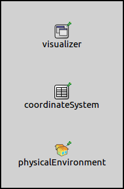

## Goals

It is often desirable for simulations to have a real world context. One way to
achieve this is to place network nodes on a real world map. The map doesn't have
any effect on the simulation, it only alters the visuals of the network. However,
objects can be added to represent buildings, which can affect the simulation.

This showcase is about placing a map in the simulation. It contains three example
configurations of increasing complexity, each demonstrating various features of
the visualization.

INET version: `3.6`<br>
Source files location: <a href="https://github.com/inet-framework/inet-showcases/tree/master/visualizer/earth" target="_blank">`inet/showcases/visualizer/earth`</a>

## About the Visualizer

The map can be displayed by including a `SceneOsgEarthVisualizer`
module in the network. It can display the map on the 3D scene by using osgEarth,
thus any part of the world can be inserted (provided there is a source for the map
data). The use of the map requires an internet connection, and it is only available
in the 3D scene.

## Visualization with the Default Settings

This example configuration demonstrates inserting the map of downtown Boston
into the simulation. It can be run by choosing the `DefaultSettings`
configuration from the ini file. It uses the following network:


The network contains an `IntegratedVisualizer` module, and an
`OsgGeographicCoordinateSystem` module. The configuration from
omnetpp.ini is the following:

``` {.snippet}
*.visualizer.osgVisualizer.sceneVisualizerType = "SceneOsgEarthVisualizer"
*.visualizer.osgVisualizer.sceneVisualizer.mapFile = "boston.earth"

*.coordinateSystem.playgroundLongitude = -71.06792deg
*.coordinateSystem.playgroundLatitude = 42.35717deg
```

-   By default, the type of the scene visualizer module in `IntegratedVisualizer` is `SceneOsgVisualizer`. Inserting the map requires the `SceneOsgEarthVisualizer` module, thus the default osg scene visualizer is replaced. The `SceneOsgEarthVisualizer` provides the same functionality as `SceneOsgVisualizer`, and adds support for the osgEarth map.

-   To display the map, the visualizer requires a .earth file. This is an XML file that specifies how the source data is turned into a map, and how to fetch the necessary data from the internet. In this configuration, the <span stype="font-family: monospace;">boston.earth</span> file is used. There are more .earth files in the osgEarth directory, and at <a href="http://osgearth.org" target="_blank">osgearth.org</a>). There are also instructions on this site on how to create .earth files.

-   Locations on the map are selected with geographical coordinates, i.e. longitude and latitude. In INET, locations of nodes and objects are represented internally by cartesian coordinates. The `OsgGeorgraphicCoordinateSystem` module is responsible for converting between geographical and cartesian coordinates. The geographical coordinates of the cartesian coordinate system's origin must be specified, to connect the map and the location of nodes and objects in the simulation. The origin's coordinates are specified by the visualizer's `playgroundLongitude` and `playgroundLatitude` parameters. In this configuration, the origin is set to somewhere near Boston Common park. Additionally, the origin's altitude can be configured, However, specifying the latitude and longitude is sufficient for the map visualization to work.

-   The size of the playground is determined automatically, taking into account the position of objects, network nodes, and movement contraints of network nodes. Thus everything in the simulation should happen within the boundaries of the playground. The playground's elevation, heading, and bank can be specified in the coordinate system module. The playground is visible by default. When the simulation starts, the view will be centered on the cartesian coordinate system's origin if there are no nodes in the network. If there are nodes, the initial viewpoint will be set so that all nodes are visible.

It looks like the following when the simulation is run:


The map is displayed on the 3D scene. Since there are no nodes or objects in the network, the size of the playground is zero (thus not visible).

## Adding Physical Objects

The map doesn't affect simulations in any way, just gives a real world context to
them. For network nodes to interact with their environment, physical objects have
to be added. The example configuration for this section can be run by selecting
the `PhysicalObjects` configuration from the ini file. It extends the
previous configuration by adding physical objects to the simulation. The objects
are placed in the simulation to align with the building blocks on the map; they are
meant to represent those building blocks. The objects could affect radio
transmissions if an obstacle loss model was set.

The network for this configuration extends the network from the previous section
with a `PhysicalEnvironment` module:



The configuration for this example simulation extends the previous configuration with the following:

``` {.snippet}
*.physicalEnvironment.coordinateSystemModule = "coordinateSystem"
*.physicalEnvironment.config = xmldoc("obstacle.xml")
```

The `PhysicalEnvironment` module is responsible for placing the
physical objects on the playground. The physical environment module doesn't use
a coordinate system module by default, but it is set to use the one present in the
network. This makes it possible to define the objects using geographical
coordinates. The objects are defined in the <span style="font-family:
monospace;">obstacle.xml</span> config file.

It looks like the following when the simulation is run:


The objects representing building blocks are displayed with transparent red, and
there is a line of trees on the other side of the road displayed in transparent
green.

TODO: the playground is also visible -&gt; when it is fixed

## Placing Network Nodes on the Map

This example configuration demonstrates the placement of network nodes on the
map. The simulation can be run by choosing the `NetworkNodes`
configuration from the ini file. The network for this configuration extends the
previous network with a radio medium and a network configurator module. It also
adds two `AdhocHosts`:


The configuration extends the previous configuration with the following:

``` {.snippet}
*.visualizer.osgVisualizer.sceneVisualizer.playgroundShading = false
*.visualizer.osgVisualizer.sceneVisualizer.playgroundColor = "#000000"
*.visualizer.osgVisualizer.sceneVisualizer.playgroundOpacity = 0.1

*.coordinateSystem.playgroundAltitude = 1m
*.coordinateSystem.playgroundHeading = 68.3deg

*.host*.mobilityType = "StationaryMobility"
*.host*.mobility.coordinateSystemModule = "coordinateSystem"
*.host*.mobility.initialAltitude = 1m
*.host*.mobility.initFromDisplayString = false

*.host1.mobility.initialLatitude = 42.35659deg
*.host1.mobility.initialLongitude = -71.06762deg

*.host2.mobility.initialLatitude = 42.35585deg
*.host2.mobility.initialLongitude = -71.06727deg

*.host3.mobility.initialLatitude = 42.35716deg
*.host3.mobility.initialLongitude = -71.06911deg

*.host4.mobility.initialLatitude = 42.35685deg
*.host4.mobility.initialLongitude = -71.06639deg
```

The first block of keys configure the playground to be transparent black, so the
underlying map is visible. The next block sets the altitude of the playground. By
default, the altitude is zero; it is set to one meter, so the nodes are not on the level
of the ground. The heading is also specified, so that the edges of the playground
roughly aligns with the streets on the map.

Network nodes are placed on the map by setting their mobility type to
`StationaryMobility`. This mobility module has parameters which can
position the node with geographical coordinates.

The required coordinates can be easily obtained from
<a href="http://www.openstreetmap.org" target="_blank">www.openstreetmap.org</a>.
Choose *Share* from the menu at the right, and tick *Include marker*. The
marker can be dragged on the map, and the coordinates of the marker's location
is shown in the Share panel.


It looks like the following when the simulation is run:


The playground is visible against the map. The nodes are placed on the playground.

TODO: This paragraph doesn't seem useful

## Further Information

For further information about the visualizer, refer to the `SceneOsgEarthVisualizer` NED documentation.

## Discussion

Use <a href="TODO" target="_blank">this page</a>
in the GitHub issue tracker for commenting on this showcase.
