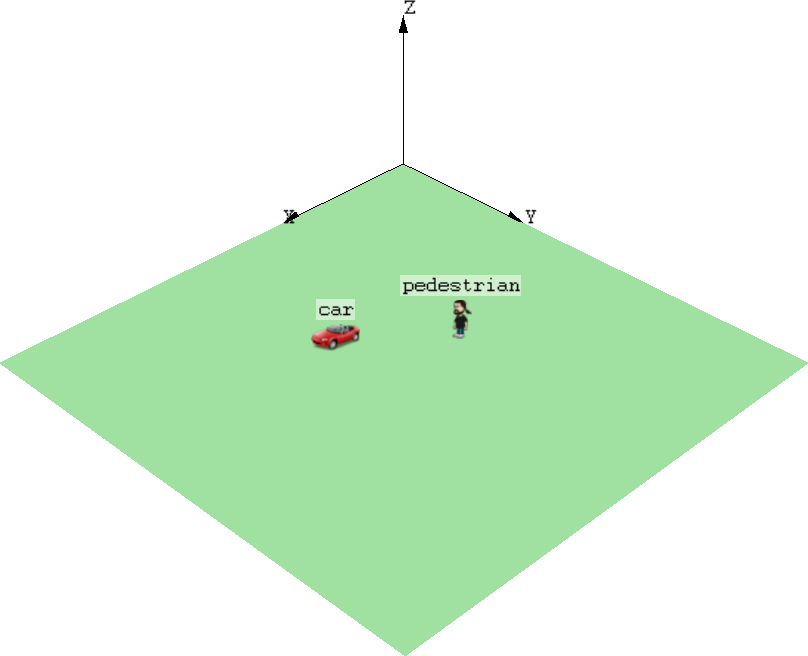

## Goals

In network simulations, it is essential to visualize the participants of the
communication. Customizing the appearance of nodes may also be important, for
example, to highlight nodes or to distinguish nodes based on location or function.

This showcase demonstrates how network nodes are visualized how their appearance
can be customized in INET simulations.

INET version: `3.6`<br>
Source files location: <a href="https://github.com/inet-framework/inet-showcases/tree/master/visualizer/networknode" target="_blank">`inet/showcases/visualizer/networknode`</a>

## About the Visualizer

In INET simulations, `NetworkNodeVisualizer` module (included in the
network as part of `IntegratedVisualizer`) is responsible for visualizing
network nodes. `NetworkNodeVisualizer` includes two submodules:
`NetworkNodeCanvasVisualizer` and `NetworkNodeOsgVisualizer`.

All nodes can be visualized on a 2D canvas by the `NetworkNodeCanvasVisualizer` module
and on a 3D scene by the `NetworkNodeOsgVisualizer` module. We can narrow the list of nodes 
to be displayed by using the `nodeFilter` parameter.
The name of the node is displayed by default, but it can be hidden by setting the
`displayModuleName` parameter to `false`.

### Visualization on a 2D canvas

`NetworkNodeCanvasVisualizer` is responsible for displaying nodes on a 2D canvas.
On the 2D canvas, each node is represented by an icon. The icon of the node can be 
customized  by setting the display string of the node in the network description file (NED). 
The display string can be set by tags. The icon can be customized
by specifying the `i` display string tag. It has three arguments:

- The first argument specifies the icon to be used. This argument is used 
to find the image, just like the OMNeT++ image path or the `cIconFigure` class.
- The second argument specifies the color of the icon. It accepts English color names 
(more precisely, SVG color names) and HTML-style RGB values.
- The third argument defines the amount of colorization in percent. 
If the parameter value is 100, it means full colorization.

We can set the size of the icon by using the `is` display string tag. The size can be 
`vs` (very small), `s` (small), `n` (normal), `l` (large) and `vl` (very large).

(**NOTE:** All supported display string tags are listed in the 
<a href="https://omnetpp.org/doc/omnetpp/manual/#cha:display-strings" target="_blank">OMNeT++ Simulation Manual</a>.)

### Visualization on a 3D scene

`NetworkNodeOsgVisualizer` is responsible for displaying nodes on a 3D scene.
(In this version of INET, `IntegratedVisualizer.osgVisualizerType = "IntegratedOsgVisualizer"` 
must be set for visualizing nodes in 3D.)
`OMNeT++`'s 3D visualization is based on the open-source `OpenSceneGraph` (osg) and 
`osgEarth` libraries. These libraries offer high-level functionality, 
such as the ability of using 3D model files directly, accessing and rendering 
online map and satellite imagery data sources, and so on. In this showcase, we deal
only with 3D models and we do not deal with maps. You can learn about maps 
in the <a href="https://inet.omnetpp.org/inet-showcases//visualizer/earth/" target="_blank">Visualizing Terrain and Urban Environment</a> showcase.

By default, each node is represented by a 2D icon on the 3D osg scene which is set 
in the display string of the node. If we want to replace the 2D icon, 
we need to load external resources, for example, images or 3D models.
The resource we want to load is specified in the `osgModel` parameter.
By default, the `OMNeT++` image path is used to find the image.

**NOTE:** Here are some supported file formats:
- geometric file formats: 3dc, 3ds, flt, geo, iv, ive, lwo, md2, obj, osg, osgb,
- image file formats: bmp, gif, jpeg, rgb, tga, tif.

There is support for so-called "pseudo loaders" in osg, which provide additional 
options for loading 3D models. Pseudo loaders are able to perform some basic operations
on the 3D model, after it is loaded. To use pseudo loaders, append the parameters
for the modifier followed by the name of it to the end of the file name upon loading the model.
The pseudo loaders are able to use in any order and they are separated by dots.

- The `scale` pseudo loader can multiply the size of the model by a certain value.
If decimal fraction is used, it must be written in parentheses, e.g `(0.8).scale`.
- The `trans` pseudo loader can translate the model by a certain value along 
the X, Y and Z axes. The values are separated by commas.
The format of the `trans` pseudo loader is `X,Y,Z.trans`. 
- The `rot` pseudo loader can rotate the model by a certain degree
around the X, Y and Z axes. The format of the `rot` pseudo loader is `X,Y,Z.rot`.

Examine the following example.

`*.exampleNode.osgModel = "example.osg.2.scale.0,0,10.trans.180,0,90.rot"`.<br>

- `example.osg` is the file name of the external 3D model that represents 
the `exampleNode` network node,
- `2.scale` scales `example.osg` to 200%,
- `0,0,10.trans` translates `example.osg` 10 units upwards,
- `180,0,90.rot` rotates `example.osg` 180 degrees around the X axis 
and 90 degrees around the Z axis,
- The parts of the parameter string are separated by dots.

The color of the model also can be changed by using the `osgModelColor` parameter.
This parameter accepts English color names (more precisely, SVG color names) 
and HTML-style RGB values.

**NOTE:** Further information about `OpenSceneGraph` can be found on the 
<a href="http://www.openscenegraph.org" target="_blank">OpenSceneGraph web site</a> 
and in dedicated <a href="http://www.openscenegraph.org/index.php/documentation/books" target="_blank">OpenSceneGraph books</a>.

## Customizing Appearance of Network Nodes

This example demonstrates how the nodes' look can be customized. A simulation is created
for this example, it can be run by selecting the `VisualizingNodes`
configuration from the ini file.

The network contains two `AdhocHost` nodes, `pedestrian` and
`car`. The default icon of nodes is changed by modifying their 
display string in the `NetworkNodeVisualizerShowcase.ned` file.
(The default icon also can be modified in the node's 
*Properties* on the *Appearance* tab.)

``` {.snippet}
car: AdhocHost {
    @display("p=168,117;i=misc/car2");
    }
pedestrian: AdhocHost {
    @display("p=113,156;i=misc/person3");
    }
```


On the 2D canvas, a car and a man appears, 
representing the nodes. The `p` display string tag defines 
the position of the nodes. On the 2D canvas, the (0,0) position is
in the upper left corner of the playground.



By default, the icons on the 3D scene are the same as on the 2D canvas.
The icons are automatically rotating towards the camera.
The playground axes are also displayed.

In our next experiment, we replace the icon of the nodes with external 3D models. 
The models will be scaled in order to be proportionate to each other.

``` {.snippet}
*.pedestrian.osgModel = "boxman.osgb.(0.3).scale"
*.car.osgModel = "car.osgb.50.scale"
```

The `boxman.osgb` and the `car.osgb` files are loaded and scaled.
This configuration affects only 3D models. The following animation shows
how the nodes look like after we have replaced their icon with 3D models.

<p><video autoplay loop controls onclick="this.paused ? this.play() : this.pause();" width="656" height="404" src="ModelsLoaded.mp4"> </video></p>

The `pedestrian` node is represented by an animated walking
boxman and the `car` node is represented by a car model instead of 2D icons.

The orientation of network nodes is updated by their own mobility submodule.
It is possible that orientation of the 3D model does not match 
with the orientation of the node, i.e. the `pedestrian` 3D model is moving sideways.

<p><video autoplay loop controls onclick="this.paused ? this.play() : this.pause();" width="626" height="390" src="PedestrianMovesSideways.mp4"> </video></p>

The orientation of the 3D model can be initialized by the `rot` pseudo loader.
If the node is a mobile node then the mobility submodule of the node
will manage future rotations of the node during the simulation.
To achieve the correct orientation, the `pedestrian` 3D model should be rotated 
90 degrees counterclockwise around the Z axis.

``` {.snippet}
*.pedestrian.osgModel = "boxman.osgb.(0.3).scale.0,0,90.rot"
```

<p><video autoplay loop controls onclick="this.paused ? this.play() : this.pause();" width="626" height="390" src="NodesOrientationIsRight.mp4"> </video></p>

The above animation shows that both 3D model's orientation is correct.
They are initialized by pseudo loaders and updated
by the mobility model of the network node.

## More Information

This example only demonstrates the key features of network node visualization.
For more information, refer to the `NetworkNodeVisualizer`, `NetworkNodeCanvasVisualizer` 
and `NetworkNodeOsgVisualizer` NED documentations.

<!--
## Discussion

Use <a href="https://github.com/inet-framework/inet-showcases/issues/"
target="_blank">this page</a> in the GitHub issue tracker for commenting on
this showcase.
-->
