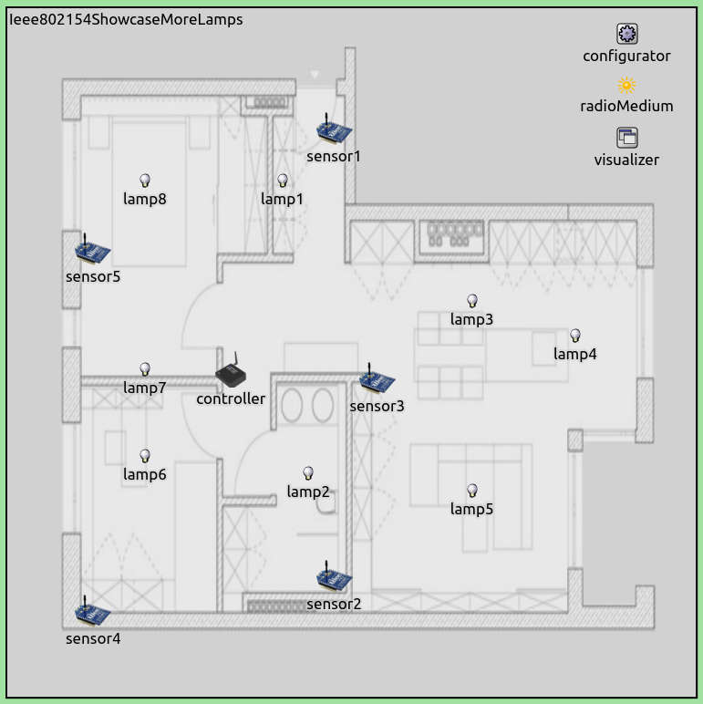

## Goals

IEEE 802.15.4 is a widely used standard for wireless sensor networks.
INET has support for simulating various IEEE 802.15.4 physical and MAC layers.
This showcase demonstrates the narrow band IEEE 802.15.4 model available in INET.
It contains an example simulation which features a wireless sensor network.

INET version: `4.0` 
Source files location: <a href="https://github.com/inet-framework/inet-showcases/tree/master/wireless/ieee802154" target="_blank">`inet/showcases/wireless/ieee802154`</a>

## The model

<!-- - about ieee 802154 modes, topology, ffds and rfds
- about the inet implementation
- the scenario
- the configuration -->

IEEE 802.15.4 is a standard that defines the physical layer and media access control (MAC)
layer of low-rate wireless personal area networks (LR-WPANs). LR-WPANs are low power,
low throughput communication networks, which can be used for creating
wireless sensor networks (WSNs), Internet-of-things applications, etc.
It defines multiple physical layer specifications (PHYs), based on different modulations,
such as Direct Sequence Spread Spectrum (DSSS), Chirp Spread Spectrum (CSS), Ultra-wideband (UWB).
It defines CSMA-CA and ALOHA MAC-layer protocols as well.

<!-- INET has two IEEE 802.15.4 PHY models, a narrow band version and an ultra-wideband version:
`Ieee802154NarrowBandScalarRadio` and `Ieee802154UwbIrRadio`.
The narrow band version uses DSSS-OQPSK modulation, the ultra wide-band version NOPE -->

<!-- ### About the INET implementation

INET has two IEEE 802.15.4 models:

- `Ieee802154NarrowBandScalarRadio`: A narrow band IEEE 802.15.4 PHY model using
DSSS-OQPSK modulation (scalar)
- `Ieee802154UwbIrRadio`: An ultra-wideband IEEE 802.15.4 PHY model (dimensional)

This showcase demonstrates the narrow band version.

The `Ieee802154NarrowBandScalarRadio` is a scalar model. It uses DSSS-OQPSK modulation,
and operates at 2450 MHz. By default, the transmissions have a 2.8 MHz bandwidth and
250 kbps data rate, and 2.24 mW transmission power.

`or maybe should start with the interface?`

`more details on the narrow band...defaults, etc...` -->

<!-- TODO
Frequency bands, topologies, ffd's and rfd's...is that needed here?
Also, the available inet implementations...maybe that shouldnt be here

INET has the following IEEE 802.15.4 models available:

INET has a narrowband and an ultra-wideband IEEE 802.15.4 physical layer implementation.
The narrow band version uses the DSSS-OQPSK modulation, the modules are
`Ieee802154Ieee802154NarrowbandScalarRadio`, and `Ieee802154NarrowbandScalarRadioMedium`.
The ultra-wideband implementation modules are `Ieee802154UwbIrRadio` and
`Ieee802154UwbIrRadioMedium`.

TODO:
they have sensible defaults, by default operating on 2.45 GHz, 2.8 MHz bandwidth,
250 kbps, 2.24 mW transmission power. The uwbir has what parameters and defaults ?
except for none. By the way, its operating on 4.5 GHz, 500 MHz bandwidth, 850 kbps data rate.
The narrowband version is scalar, the uwbir version is dimensional -> actually, it makes sense,
because the uwbir version occupies a lot of the spectrum

UPDATE:
this showcase only contains the narrow band version -->

<!-- So the structure should be something like this:

- About Ieee 802154
- About the inet implementation...the narrowband, just mention there is an uwbir
some details about them...and more details about the narrowband
- the configuration and the screnario
- results -->

### The INET implementation

INET features a narrow band and an ultra-wideband IEEE 802.15.4 PHY model:

- `Ieee802154NarrowBandScalarRadio`
- `Ieee802154UwbIrRadio`

This showcase demonstrates the narrow band model. `Ieee802154NarrowbandScalarRadio`
uses DSSS-OQPSK modulation, and operates at 2.45 GHz. It uses the scalar analog model.
By default, the transmissions have a bandwidth of 2.8 MHz, and 2.24 mW transmission power.

The `Ieee802154NarrowbandInterface` module contains a `Ieee802154NarrowbandScalarRadio`
and the corresponsing `Ieee802154NarrowbandMac`. The radio medium module corresponding
with the radio is `Ieee802154NarrowbandRadioMedium`. As per the name, the radio uses the
scalar analog model for signal representation.
The radio has default values for its parameters, based on the 802.15.4 standard.
For example, by default it uses the carrier frequency of 2450 MHz, 2.8 MHz bandwidth,
250 kbps bitrate, and 2.24 mW transmission power. As such, it works "out-of-the-box",
without setting any of its parameters.
The radio medium uses `BreakPointPathLoss` by default as its path loss model.
To see all parameters and default values, check out the NED files for these modules
(`Ieee802154NarrowbandScalarRadio.ned`, `Ieee802154NarrowScalarRadioMedium.ned`.)

### The configuration

The showcase contains an example simulation, which demonstrates the operation of
INET's narrow band IEEE 802.15.4 model. The scenario is that wireless nodes are
used to control lighting in an apartment. There are sensor nodes in the rooms working
as presence sensors, detecting when people are in a room. They periodically send
sensor data to a controller node, which decides how to adjust the lighting conditions
in different rooms. The controller sends control packets to the lamps in the rooms to
set their brightness or turn them on and off. All nodes use the IEEE 802.15.4 narrowband model
to communicate. Note that this is not a working simulation of the light control and
presence detection, just a mockup based on that scenario - only the periodic communication
of the nodes is simulated.

The simulation can be run by choosing the `Ieee802154` configuration from
<a srcFile="wireless/ieee802154/omnetpp.ini"/>. It uses the following network:

The network contains 14 hosts of the `SensorNode` type, which has an
`Ieee802154NarrowbandInterface` by default. The network also contains an
`Ipv4NetworkConfigurator`, an `Ieee802154NarrowbandScalarRadioMedium`,
and an `IntegratedVisualizer` module.

<!-- <pre>
- routes config -> star topology
- app config
- ieee802154 config? if there is any

- results

some power statistics ? maybe compare to the case if it was done with wifi?
</pre> -->

Routes are set up according to a star topology, with the controller at the center.
This is achieved with the following configuration of `Ipv4NetworkConfigurator` defined
in the `startopology.xml` file:

<pre class="include" src="startopology.xml"></pre>

 The following image shows the routes:

All sensors will send packets to the controller, and the controller will send packets to the lamps.
<!-- `more detailed description including the app configs` -->

Here is the app configuration from <a srcFile="wireless/ieee802154/omnetpp.ini"/>:

<pre class="include" src="omnetpp.ini" from="numApps" until="routing table visualization"></pre>

All sensors will send one 10-byte UDP packet to the controller each second,
with randomized start times. The controller will send one 10-byte UDP packet
per second as well. The controller's app is an `UdpBasicApp`, and all lamp nodes
are specified in its `destination` parameter. If multiple destinations are specified
in `UdpBasicApp`, a random destination is chosen for each packet. Thus each packet
will be addressed to a different lamp.

All sensors will send one 10-byte UDP packet to the controller each second,
with randomized start times. The controller will send one 10-byte UDP packet
per second as well. The controller's app is an `UdpBasicApp`, and all lamp nodes
are specified in its `destination` parameter (a random destination is chosen for each packet.)

The radio's parameters are not set, the default values will be used.
We arbitrarily set the background noise power to -110 dBm.

<!-- `There is no need for 802.15.4 configuration, it works out of the box...
some values of the 802154 model` -->

## Results

<!-- `some details of the 802.15.4, for example in the packet inspector
some details in the config section? power statistics without comparison
should check the zigbee power data?` -->

The following video shows the running simulation:

<video autoplay loop controls max-width-percent="60" onclick="this.paused ? this.play() : this.pause();" src="Ieee802154_2.mp4"></video>

Sensors send packets to the controller, each sensor sending one packet per second.
The controller sends 8 packets per second, to one of the lamps selected randomly.
Note that each packet transmission is followed by an IEEE 802.15.4 ACK, but the ACKs
are not visualized.

The `SensorNode` host type has energy storage and consumption modules by default,
so power consumption can be measured without adding any modules to the hosts.
`SensorNode` contains an `IdealEpEnergyStorage` by default, and the radio in
`SensorNode` contains a `SensorStateBasedEpEnergyConsumer`. The `residualEnergyCapacity`
statistic is available.

We want to measure the energy consumption of the different nodes in the network.
For this, we use the `Ieee802154Power` configuration in <a srcFile="wireless/ieee802154/omnetpp.ini"/>. This just extends the `Ieee802154` configuration with a simulation time limit of 100s:

<pre class="include" src="omnetpp.ini" from="Ieee802154Power" upto="sim-time-limit"></pre>

We plotted the energy consumption (-1*`residualEnergyCapacity`) of all nodes on the
following bar chart (values in Joules):

<!-- TODO:

why are these values?

the sensors consumed a little more power than the lamps, but not much. All nodes get
all transmissions in the physical layer, so since the lamps only receive and not send,
they should have the same power consumption. Which they dont. Whats the difference ?
-> they send acks, and not the same number of acks -->

The sensors consumed a bit more power than the lamps, and the controller consumed the most energy.
Nodes in the same role (i.e. lamps, sensors) consumed roughly the same amount of energy.
Although the controller transmitted eight times as much as the sensors, it consumed just about
25% more energy. This is because energy consumption was dominated by idle radio state.
The controller transmitted in about 8% of the time, the sensors about 1%. Also, all transmissions
were received by all nodes in the network at the PHY level, thus they shared the energy consumption
due to reception. The small difference between the energy consumption of the lamps and the sensors
is because the sensors transmitted data, and the lamps just transmitted ACKs (the data transmissions
were longer than ACK transmissions, 1.7ms vs 0.3 ms.)

TODO: To sum it up...
So the energy consumption was dominated by the idle radio state. The portion of time when the
radio wasn't in idle state, about 13% of the time, was dominated by reception for the sensors
and lamps, and transmission for the controller.

<!-- ez a power consumption kb reális...az idő 8%-ában receive-elnek, 1%-ában transmittálnak,
250kbps, 40byte

1.7 ms data, 0.3 ms ack -> 2 ms/s reception -> 2ms*50mW

how is that ? 8 packets from the controller, 5 from the sensors -> 13 packets / s -> 13*2ms*50mw ->
1300 nJ -> 1300 nW 1s alatt -> 1.3mW -> this is the common power consumption, dominated by reception

now...the sensors each have an additional...1.7ms*75mW = 127.5nJ ->0.1275 mW for transmission
the lamps send 1 ack each second -> 0.3ms*75mW -> 22.5nJ -> 0.0225 mW for transmission

should calculate with 25 mW because its additional...one of the packets calculate for reception
is actually tranmission -> so its more like 0.0075 mW for the lamps
and 0.0425 mW for the sensors.

for the controller, its 8 data and 5 acks, so its 25mW*8*1.7 + 25mW*5*0.3 -> 0.3775 mW

controller: 1.3 + 0.3775 = 1.6775 mW
sensors: 1.3 + 0.0425 = 1.3425 mW
lamps: 1.3 + 0.0075 = 1.3075 mW

for 100s ->

controller: 167.75 mJ
sensors: 134.25 mJ
lamps: 130.75 mJ

which is about right -> is this explanation needed? this is exactly what the model does...
calculate this

actually, dont need to explain it, just make sense of it just interpret -->
