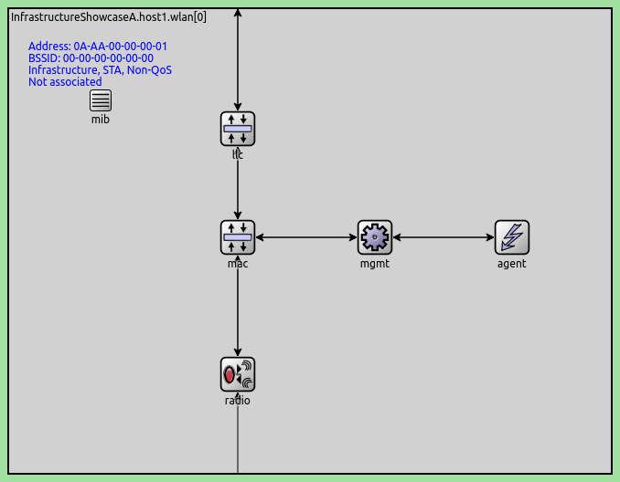
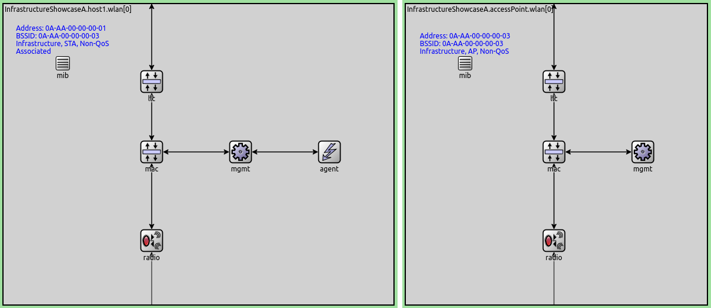

## Goals

802.11 devices can operate in two basic modes. In infrastructure mode,
nodes connect to wireless networks created by access points, which provide services,
such as internet access. In adhoc mode, nodes create an adhoc wireless network,
without using additional network infrastructure.
<!--which they can use to transfer data between each other.-->

INET has support for simulating both operating modes. This showcase demonstrates
how to configure 802.11 networks in infrastructure and adhoc mode, and how to check
if they are configured correctly. The showcase contains two example simulations
defined in omnetpp.ini.

INET version: `4.0`<br>
Source files location: <a href="https://github.com/inet-framework/inet-showcases/tree/master/wireless/infrastructure" target="_blank">`inet/showcases/wireless/infrastructure`</a>

## The model

<!--
- you need to use the correct management module
- there is simple and normal management modules
-->

<!--
The operating mode of a node is determined by the type of management module the node has.
The management module type can be set from ini or ned, or by using a host type which has the proper
management module type by default.
-->

A node's operating mode (infrastructure or adhoc) is determined by the type
of its management module. The management module type can be set from the ini or NED files,
or by choosing one of INET's host types which have the desired management module by default.

In INET, the management module is a submodule of `Ieee80211Interface`. It connects to
the MAC module, and it is responsible for handling management frames, such as beacon frames,
probe request and response frames, and association and authentication frames. The management
module is also responsible for scanning channels and switching between them. Several types of
management modules are available:

- `Ieee80211MgmtSta`: management module for stations (nodes that join wireless networks)
in infrastructure mode
- `Ieee80211MgmtAp`: management module for access points in infrastructure mode
- `Ieee80211MgmtAdhoc`: management module for nodes in adhoc mode

<!--
There is the simplified versions of all of these except the adhoc
Which hosts have them
The role of agent modules
-->

<!--
TODO: the simplified versions dont implement beacons, probes, association, authentication
they only send and receive data frames and treats all stations as if they were associated
-->

There are also simplified versions of the infrastructure mode management modules:
`Ieee80211MgmtStaSimplified` and `Ieee80211MgmtApSimplified`. They only send and receive
data frames, and they don't simulate the association and authentication process,
but assume that stations are always associated with the access point. They also cannot
simulate handovers.

The agent module (`Ieee80211AgentSta`) is the submodule of `Ieee80211Interface` in devices
that act as stations (nodes with `Ieee80211MgmtSta` management module types.) It connects
to the management module, and it is responsible for initiating channel scanning, associations
and handovers. It controls these by sending commands to the management module (which turn
sends commands to the MAC.) TODO: is this correct?
It basically simulates user actions, such as the user instructing the device to connect to a
Wifi network. The topology of connected modules in `Ieee80211Interface` is displayed on the
following image:



<!-- TODO: note that you can see if the correct management type is configured at the mib.
-> not needed -->

Hosts can be configured to use infrastructure or adhoc mode by specifying the
corresponding management module type. By default, `WirelessHost` uses `Ieee80211MgmtSta`,
and `AccessPoint` uses `Ieee80211MgmtAp`. Additionally, `AdhocHost` is suitable for simulating
adhoc wireless networks. It is derived from `WirelessHost` by changing management module to
`Ieee80211MgmtAdhoc` (and also turning on IPv4 forwarding.)

In infrastructure mode, the SSID of the network created by an access point is a parameter of
`Ieee80211MgmtAp`, and it is "SSID" by default. In stations, the agent module has an
SSID parameter, which sets which network should the node join. When the simulation is run,
the access points automatically create the wireless networks, and agent modules in
station nodes cause the nodes to automatically join the appropriate network.

<!-- TODO: about the adhoc management module...what it does and what it doesnt -->

The `Ieee80211MgmtAdhoc` module only sends data frames, and discards all other
frame types like control and management frames. Also, it doesn't switch channels,
just operates on the channel configured in the radio.

## The configuration

The showcase contains two example simulations, with one of them demonstrating
infrastructure mode and the other adhoc mode (the configurations in omnetpp.ini
are named `Infrastructure` and `Adhoc`.) Two nodes communicate wirelessly in both of them,
the difference being that in the first case they communicate through an access point in
infrastructure mode, and in the second, directly between each other in adhoc mode.
The two simulations use similar networks, the only difference is that there is an
access point in the network for the infrastructure mode configuration.
The networks look like the following:


TODO: write the mode on the playground in a figure ? -> obvious its infrastructure or not
-> not needed

The networks contain two `WirelessHosts` named `host1` and `host2`.
They also contain an `Ipv4NetworkConfigurator`, an `Ieee80211ScalarRadioMedium` and
an `IntegratedVisualizer` module. The network for the infrastructure mode configuration
also contains an `AccessPoint`.

<!--
TODO: the configuration

<p>
<video autoplay loop controls onclick="this.paused ? this.play() : this.pause();" src="Infrastructure1.mp4"></video>
</p>

<p>
<video autoplay loop controls onclick="this.paused ? this.play() : this.pause();" src="Infrastructure2.mp4"></video>
</p>

second one seems better
the third one too

<pre>
How does it work? In infrastructure mode, the agent module initiates connecting to the
wireless network. In adhoc mode, they are assumed to be connected.
</pre>

<pre>
some of these might belong to the next section (the configuration)
</pre>
-->

In both simulations, `host1` is configured to send UDP packets to `host2`.
`WirelessHost` has `Ieee80211MgmtSta` by default, thus no configuration of the
management module is needed in the infrastructure mode simulation.
<!--In the other one, it is replaced with ieee80211mgmtadhoc. the same could be
achieved by using adhoc host instead of wirelesshost. it is done like this: include key-->
In the adhoc mode simulation, the default management module in hosts is replaced with
`Ieee80211MgmtAdhoc`. (The same effect could have been achieved by using the
`AdhocHost` host type instead of `WirelessHost`, as the former has the
ad hoc management module by default.) The configuration key for the
management module type in omnetpp.ini is the following:

``` {.include}
*.*.wlan[*].mgmtType = "Ieee80211MgmtAdhoc"
```
<!--
TODO: The forwarding is not needed here because hosts can directly reach each other
(packets doent need to be forwarded). It would be needed if some hosts were only
reachable in multiple hops.
-->

Note that in the `AdhocHost` type, forwarding is enabled. However,
forwarding is not required in this simulation, because the hosts can
reach each other in one hop, and packet don't need to be forwarded
(forwarding is required for multihop networks.)

## Results

### Infrastructure mode

When the infrastructure mode simulation is run, the hosts get associated
with the access point, and `host1` starts sending UDP packets to `host2`.
The packets are relayed by the access point.
The following video depicts the UDP traffic:

<p>
<video autoplay loop controls onclick="this.paused ? this.play() : this.pause();" src="Infrastructure4.mp4"></video>
</p>
<!--internal video recording, animation speed none, zoom 1.3x-->

To verify that the correct management type is configured, go into a
host's wlan module. The `mib` module (management information base) displays
information about the node's status in the network, e.g. MAC address,
association state, weather or not it's using QoS, etc. It also displays
information about the mode, i.e. infrastructure or adhoc, station or access point.
The wlan module of `host1` and `accessPoint` is displayed on the following image:

<!--


-->



<!--
TODO: this might not be needed because it should be mentioned earlier
or the earlier image should be cropped to show only the topology
there should be a screenshot showing the mib in both cases
and even for the AP and after association for host1
-->

### Adhoc mode

When the adhoc mode simulation is run, the hosts can communicate directly with each other.
There is no association and authentication, `host1` starts to send UDP data at the
start of the simulation. `host1` is sending UDP packets to `host2` in the following video:

<p>
<video autoplay loop controls src="Adhoc3.mp4" onclick="this.paused ? this.play() : this.pause();"></video>
<!--internal video recording, animation speed none, zoom 1.3x-->
</p>

The wlan module of `host1` is displayed on the following image, showing the mib
and the host's network status:


