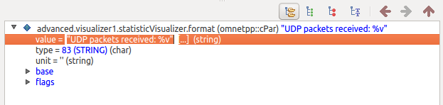

    TODO:

    The title could be "Advanced Visualizer module use cases"

TODO: emphasize how this visualization needs two visualizer modules

## Goals

Complex simulations often require complex visualization to better
understand what is happening in the network. For example, one might want
to configure different path visualizations for different parts of the
network. Multiple visualizer modules can be included in the network if
the desired visualization cannot be accomplished with a single
visualizer module. The various visualizer modules can be configured
independently, providing a flexible way to customize visualizations to
one's needs.

This showcase describes the various types of compound visualizer
modules, such as <var>IntegratedVisualizer</var>. It demonstrates the
use of multiple visualizers with an example simulation, and shows how
the visualization settings can be modified at runtime. Finally, it
demonstrates how to add your own visualizer types to the existing
compound visualizer modules.

INET version: <var>3.6</var> 
Source files location: <a href="https://github.com/inet-framework/inet-showcases/tree/master/visualizer/advanced" target="_blank"><var>inet/showcases/visualizer/advanced</var></a>

## About Visualizer Module Types

INET has visualizer simple modules for specific visualization tasks,
such as <var>RoutingTableCanvasVisualizer</var> or
<var>InterfaceTableOsgVisualizer</var>. However, there are visualizer
compound modules, which contain multiple visualizer simple modules. The
following section aims to clarify the various visualizer types available
in INET.

V1

-   Canvas and Osg simple modules

    There are separate types of visualizer simple modules for 2D and
    3D visualization. 2D visualization is implemented by <var>Canvas
    visualizer</var> modules, while 3D visualization is handled by
    <var>Osg visualizers</var>. The visualizer simple modules have the
    word <var>Canvas</var> or <var>Osg</var> in their type names, e.g.
    <var>RoutingTableCanvasVisualizer</var> or
    <var>StatisticOsgVisualizer</var>.

-   Compound modules of Canvas and Osg visualizers

    There are compound modules containing the Canvas and Osg versions of
    specific types of visualizers, e.g. the
    <var>RoutingTableVisualizer</var> compound module contains a
    <var>RoutingTableCanvasVisualizer</var> and a
    <var>RoutingTableOsgVisualizer</var> simple module. A rule of thumb
    is if the type name doesn't contain either <var>Canvas</var> or
    <var>Osg</var>, the module contains both kinds of visualizers.

-   Integrated Canvas and Osg visualizers

    The <var>IntegratedCanvasVisualizer</var> and
    <var>IntegratedOsgVisualizer</var> compound modules each contain all
    available Canvas and Osg visualizer types, respectively.

-   Integrated visualizer

    The <var>IntegratedVisualizer</var> contains an
    <var>IntegratedCanvasVisualizer</var> and a
    <var>IntegratedOsgVisualizer</var>. Thus it contains all
    available visualizers.

<!-- -->

    TODO:

    if one doesnt include a canvas then there is no 2D visualization
    the same for osg

    some diagrams of the hierarchy

<!--pre>
Consisely

- the visualizations are handled by visualizer simple modules such as foo
- there are two kinds of those, canvas and osg, for 2d and 3d, respecively
- there are compound modules that contain a specific visualizer's canvas and osg version. the name doesnt have
  canvas or osg in it -> it means it is capable of both / it contains both
- there are integrated visualizers, that contain multiple visualizer simple modules
- there are 3 types
- the integrated canvas and osg visualizers contain all canvas and osg visualizers, respectively
- the IntegratedVisualizer contains an integrated canvas and an integrated osg, thus containing all available visualizer
  simple module types
</pre-->

V2

<ul>
<li>

The various visualizations are handled by specific visualizer simple modules. Visualizations in 2D are implemented by
<var>Canvas</var> visualizer simple modules, while visualizations in 3D are handled by <var>Osg</var> visualizer simple modules. The visualizer simple modules have the word <var>Canvas</var> or <var>Osg</var> in their type name, e.g. <var>RoutingTableCanvasVisualizer</var> or <var>InterfaceTableOsgVisualizer</var>.

</li>

<li>

There are compound modules which contain both the Canvas and the Osg version of a specific visualizer simple module,
e.g. <var>RoutingTableVisualizer</var> contains a <var>RoutingTableCanvasVisualizer</var> and a <var>RoutingTableOsgVisualizer</var> simple module. Thus these specific compound visualizers can provide both 2D and 3D visualizations (i.e. the RoutingTableVisualizer can visualize routing tables in both 2D and 3D).
The rule of thumb is if the type name doesn't contain either
<var>Canvas</var> or <var>Osg</var>, the module contains both kinds of visualizers.

</li>

<li>

There are integrated visualizer compound modules, which contain multiple specific visualizer simple modules. There are three kinds of integrated visualizers:

</li>

<ul>
<li>

The <var>IntegratedCanvasVisualizer</var> contains all Canvas visualizer simple modules, while the <var>IntegratedOsgVisualizer</var> contains all Osg visualizer simple modules.

</li>

<li>

The <var>IntegratedVisualizer</var> contains an <var>IntegratedCanvasVisualizer</var> and an <var>IntegratedOsgVisualizer</var>. Thus it contains all available visualizer simple modules.

</li>
</ul>

<li>

By including an <var>IntegratedVisualizer</var> in the network, the features of all contained visualizers are available in
the simulation using the network, both in 2D and 3D.
The parameters of the visualizer simple modules can be configured from the ini file.

</li>
</ul>

The screenshots illustrating the above HERE

V3

<ul>
<li>

The various visualizations are handled by specific visualizer simple modules. Visualizations in 2D are implemented by
<var>Canvas</var> visualizer simple modules, while visualizations in 3D are handled by <var>Osg</var> visualizer simple modules. The visualizer simple modules have the word <var>Canvas</var> or <var>Osg</var> in their type name, e.g. <var>RoutingTableCanvasVisualizer</var> or <var>InterfaceTableOsgVisualizer</var>.

</li>

<li>

There are compound modules which contain both the Canvas and the Osg version of a specific visualizer simple module,
e.g. <var>RoutingTableVisualizer</var> contains a <var>RoutingTableCanvasVisualizer</var> and a <var>RoutingTableOsgVisualizer</var> simple module. Thus these specific compound visualizers can provide both 2D and 3D visualizations (i.e. the RoutingTableVisualizer can visualize routing tables in both 2D and 3D).
The rule of thumb is if the type name doesn't contain either
<var>Canvas</var> or <var>Osg</var>, the module contains both kinds of visualizers.

</li>

<li>

There are integrated visualizer compound modules, which contain multiple specific visualizer simple modules. There are three kinds of integrated visualizers:

</li>

<ul>
<li>

The <var>IntegratedCanvasVisualizer</var> contains all Canvas visualizer simple modules, while the <var>IntegratedOsgVisualizer</var> contains all Osg visualizer simple modules.

</li>

<li>

The <var>IntegratedVisualizer</var> contains an <var>IntegratedCanvasVisualizer</var> and an <var>IntegratedOsgVisualizer</var>. Thus it contains all available visualizer simple modules.

</li>
</ul>

<li>

By including an <var>IntegratedVisualizer</var> in the network, the features of all contained visualizers are available in
the simulation using the network, both in 2D and 3D.
The parameters of the visualizer simple modules can be configured from the ini file.

</li>
</ul>

TODO: are these screenshots needed? seem to cut up the flow of text. without it it was more fluid

TODO: are these screenshots ok?

<pre>
TODO
For consistency, these should be made with the IDE
The modules names should be capitalized
Actually, the qtenv looks better
</pre>

## Including Multiple Visualizer Modules

Visualizations from multiple visualizer modules of the same type can be
combined to create more complex visualizations that would not be
possible using a single visualizer module. In this section, we present
an example simulation that demonstrates the use of two visualizer
modules. The configuration for the simulation is defined in the
omnetpp.ini file. The configuration uses the following network:

The hosts and the server in the network are <var>StandardHosts</var>.
The network contains two <var>IntegratedVisualizer</var> modules, named
<var>visualizer1</var> and <var>visualizer2</var>.

The <var>server</var> runs an UDP video stream server
(<var>UDPVideoStreamSvr</var>), and two <var>TCPSessionApps</var>. These
applications are configured to send UDP and TCP streams to certain
hosts:

-   <var>host2</var> and <var>host4</var> are configured to send UDP
    video stream requests to the server, which in turn sends UDP streams
    to the hosts.
-   The <var>server</var> is configured to send TCP streams to
    <var>host3</var> and <var>host5</var>.

The goal is to visualize UDP and TCP streams with different colors, so
it is easier to differentiate between them. We configure the
<var>NetworkRouteVisualizer</var> in <var>visualizer1</var> to display
TCP packet paths with blue arrows, and the
<var>NetworkRouteVisualizer</var> in <var>visualizer2</var> to indicate
UDP packet paths with red arrows.

<pre class="snippet">
*.visualizer1.networkRouteVisualizer.displayRoutes = true
*.visualizer1.networkRouteVisualizer.packetFilter = "*tcp* or *ACK* or *SYN*"
*.visualizer1.networkRouteVisualizer.lineColor = "blue"

*.visualizer2.networkRouteVisualizer.displayRoutes = true
*.visualizer2.networkRouteVisualizer.packetFilter = "*Video*"
*.visualizer2.networkRouteVisualizer.lineColor = "red"
</pre>

The TCP visualization is configured to display all TCP packets,
including the ones that take part in establishing the connection, i.e.
the ACK, SYN+ACK, and SYN. The other visualizer is configured to
visualize all UDP packets (packets with 'Video' in their names, which
covers all UDP packets in the network).

The <var>StatisticVisualizer</var> in <var>visualizer1</var> is
configured to display the number of received UDP packets in the affected
nodes. The other <var>StatisticVisualizer</var> in
<var>visualizer2</var> is configured to indicate the total size of the
received TCP data.

Additionally, the <var>TransportConnectionVisualizer</var> in
<var>visualizer1</var> is enabled, and set to visualize transport
connections in the network, i.e. the TCP connections. The color of the
icons is set to blue, to match the color of the TCP network path arrows.

When the simulation is run, this happens:

<video autoplay loop controls onclick="this.paused ? this.play() : this.pause();" src="advanced3.mp4" width="864" height="610"></video>

The server starts sending the UDP and TCP streams to the hosts. The
paths of UDP packets are indicated with red arrows, and the paths of TCP
packets with blue arrows. The statistics for the UDP and TCP packets are
displayed above the affected nodes. The number of received UDP packets
at the server is just two, which are the two video stream request
packets from the hosts. The received UDP packets at <var>hosts 2 and
4</var> keep increasing. The received TCP data is displayed above the
TCP hosts. TCP connection visualization icons are differentiated based
on the letters in the icons, as the
<var>TransportConnectionVisualizer</var> is using just one color.

## Modifying Visualizer Parameters at Runtime

    normally you set the visualizer parameters in the ini file
    but you can modify them in the graphical runtime environment
    click here and there and they change
    these and those parameters can be modified from the runtime environment
    -> filters, display flag, format
    illustrated with screenshots

Visualizer parameters are usually set from the ini file, but it is also
possible to modify some of the parameters in the graphical runtime
environment. The modified parameters take effect immediatelly. This is
useful for tuning the visualizer parameters, as one doesn't have to
close and restart qtenv to see the effects of the parameter changes. The
following parameters react to changes in qtenv:

-   <var>display flag</var>: used to turn visualizations on and off
-   <var>filters</var>: various filters like node, packet, and interface
    filters
-   <var>format string</var>: used to customize how information is
    displayed

TODO: not sure the description is needed...as this is an advanced
showcase, should be familiar with those

The parameters can be changed by clicking on the appropriate visualizer
module in the network. The parameters are displayed in the inspector
panel to the right (make sure children mode is selected at the top of
the panel.)

Double click a parameter to select it, then double click on the value
field to change it:

The changes will take effect immediatelly.

## Including Your Own Visualizers in the Integrated Visualizer Modules

    It is possible to replace the specific visualizer types in the compound visualizer modules with your own
    for example you have a CustomRoutingTableCanvasVisualizer module, you can use that in IntegratedCanvasVisualizer
    instead of the default RoutingTableCanvasVisualizer module.
    How to do it, illustrated with screenshots

## Further Information

