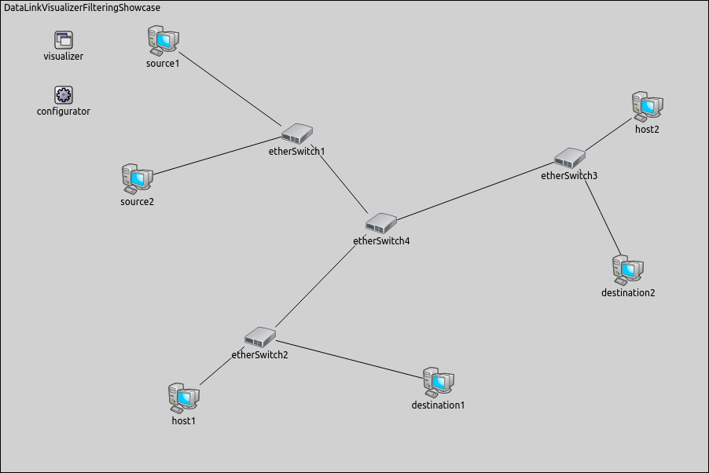

<script type="text/javascript" src="../../javascripts/imgToFullSize.js" charset="UTF-8"></script>

## Goals

With INET simulations, it is often useful to be able to visualize network traffic.
INET offers several visualizers for this task, operating at various
levels of the network stack. In this showcase, we examine
`DataLinkVisualizer` that can provide graphical feedback about data link
level traffic.

The showcase consists of four simulation models, each demonstrating different
features of the data link activity visualizer.

INET version: `3.6`<br>
Source files location: <a href="https://github.com/inet-framework/inet-showcases/tree/master/visualizer/datalinkactivity" target="_blank">`inet/showcases/visualizer/datalinkactivity`</a>

## About the Visualizer

In INET, data link activity can be visualized by including a
`DataLinkVisualizer` module in the simulation. Adding an
`IntegratedVisualizer` module is also an option, because it also contains a
`DataLinkVisualizer` module. Data link visualization is disabled by
default, it can be enabled by setting the visualizer's `displayLinks`
parameter to true.

`DataLinkVisualizer` currently observes packets that pass through the
data link layer (i.e. carry data from/to higher layers), but not those that are
internal to the operation of the data link layer protocol. That is, frames such as
ACK, RTS/CTS, Beacon or Authentication/Association frames of IEEE 802.11,
although potentially useful, will not trigger the visualization. Visualizing such
frames may be implemented in future INET revisions.

The activity between two nodes is represented visually by an arrow that points
from the sender node to the receiver node. The arrow appears after the first
packet has been received, then gradually fades out unless it is refreshed by
further packets. The style, color, fading time and other graphical properties can
be changed with parameters of the visualizer.

By default, all packets, interfaces and nodes are considered for the visualization.
This selection can be narrowed to certain packets and/or nodes with the
visualizer's `packetFilter`, `interfaceFilter`, and
`nodeFilter` parameters.

## Enabling Visualization of Data Link Activity

The following example shows how to enable the visualization of data link activity,
and what the visualization looks like. In the first example, we configure a simulation
for a wired network. The simulation can be run by choosing the
`EnablingVisualizationWired` configuration from the ini file.

The wired network contains two `StandardHosts`, `wiredSource` and 
`wiredDestination`. The `linkVisualizer` module's type is `DataLinkVisualizer`.


In this configuration, `wiredSource` pings `wiredDestination`. 
Data link activity visualization is enabled by setting the
`displayLinks` parameter to true.

``` {.snippet}
*.linkVisualizer.*.displayLinks = true
```

The following video shows what happens when the simulation is started.

<p><video autoplay loop controls onclick="this.paused ? this.play() : this.pause();" width="722" height="352" src="EnablingVisualizationWired_v0613.m4v"></video></p>

At the beginning of the video, a red strip appears and moves from
`wiredSource` to `wiredDestination`. This strip is the standard
OMNeT++ animation for packet transmissions, and has nothing to do with
`DataLinkVisualizer`. When the packet is received in whole by
`wiredDestination` (the red strip disappears), a dark cyan arrow is added by
`DataLinkVisualizer` between the two hosts, indicating data link
activity. The packet's name is also displayed on the arrow. The arrow fades out
quickly, because the `fadeOutTime` parameter of the visualizer is set
to a small value.

Visualization in a wireless network is very similar. Our next example is the
wireless variant of the above simulation. In this network we use two
`AdhocHosts`, `wirelessSource` and `wirelessDestination`.
The traffic and the visualization settings are the same
as the configuration of the wired example. The simulation can be run by choosing
the `EnablingVisualizationWireless` configuration from the ini file.


The following animation depicts what happens when the simulation is run.

<p><video autoplay loop controls onclick="this.paused ? this.play() : this.pause();" width="722" height="352" src="EnablingVisualizationWireless_v0613.m4v"></video></p>

This animation is similar to the video of the wired example (apart from an extra
blue dotted line which can be ignored, as it is also part of the standard OMNeT++
packet animation.) Note, however, that the ACK frame does not activate the
visualization, because ACK frames do not pass through data link layer.

## Filtering Data Link Activity

In complex networks with many nodes and several protocols in use, it is often
useful to be able to filter network traffic, and visualize only the part of the
traffic we are interested in.
The following example shows how to set packet filtering in
`DataLinkVisualizer`. This simulation can be run by choosing the
`Filtering` configuration from the ini file.

We use the following network for this showcase.



This network consists of four switches (`etherSwitch1..etherSwitch4`)
and six endpoints: two source hosts (`source1`, `source2`), two destination 
hosts (`destination1`, `destination2`) and two other hosts (`host1`, `host2`) 
which are inactive in this simulation. `Source1` pings `destination1`, and 
`source2` pings `destination2`.

For this network, the visualizer's type is `IntegratedVisualizer`. Data
link activity visualization is filtered to display only ping messages. The other
packets, e.g. ARP packets, are not visualized by `DataLinkVisualizer`.
We adjust the `fadeOutMode` and the `fadeOutTime` parameters so that 
the activity arrows do not fade out completely before the next
ping messages are sent.

We use the following configuration for the visualization.

``` {.snippet}
*.visualizer.*.dataLinkVisualizer.displayLinks = true
*.visualizer.*.dataLinkVisualizer.fadeOutMode = "simulationTime"
*.visualizer.*.dataLinkVisualizer.fadeOutTime = 1.4s
*.visualizer.*.dataLinkVisualizer.packetFilter = "ping*"
```

The following animation shows what happens when we start the simulation. You
can see that although there is both ARP and ping traffic in the network,
`DataLinkVisualizer` only takes the latter into account, due to the presence
of the `packetFilter` parameter.

<p><video autoplay loop controls onclick="this.paused ? this.play() : this.pause();" width="900" height="651" src="Filtering_v0613.m4v"></video></p>

It also is possible to filter for network nodes. For the following example, let's
assume we want to display traffic between the hosts `source1` and `destination1`
only, along the path `etherSwitch1`, `etherSwitch4` and `etherSwitch2`. 
To this end, we set the visualizer's `nodeFilter` parameter by using the 
following line (note the curly brace syntax used for specifying numeric substrings).

``` {.snippet}
*.visualizer.*.dataLinkVisualizer.nodeFilter = "source1 or etherSwitch{1,4,2} or destination1"
```

This is what it looks like when we run the simulation:

<p><video autoplay loop controls onclick="this.paused ? this.play() : this.pause();" width="900" height="651" src="Filtering2_v0613.m4v"></video></p>

As you can see, visualization allows us to follow the ping packets between
`source1` and `destination1`. Note, however, that ping traffic
between the two other hosts, `source2` and `destination2`, also activates 
the visualization on the link between `etherSwitch1` and `etherSwitch4`.

## Visualizing Data Link Activity in a Mobile Ad-Hoc Network

The following simulation shows how visualization can help you to follow
dynamically changing data link activity in a wireless environment. The simulation
can be run by choosing the `Dynamic` configuration from the ini file.

We use the following network for this simulation:


Nodes are of the type `AODVRouter`, and are placed randomly on the
playground. The communication range of the nodes is chosen so that the network
is connected, but nodes can typically only communicate by using multi-hop paths.
The nodes will also randomly roam within predefined borders. The routing
protocol is AODV. During the simulation, the `source` node will be
pinging the `destination` node.

In our first experiment, the goal is to visualize the operation of the AODV protocol
as it sets up a route from `source` to `destination`. We
expect to see the following. As long as `source` has a valid route
towards `destination`, AODV is inactive. When a new route is needed
towards `destination`, `source` starts to flood the network
with AODV route request (RREQ) messages. RREQ messages propagate through
the intermediate nodes until one of them reaches the `destination`
node. The route is made available by unicasting AODV route reply (RREP)
messages back to the originator of the RREQ messages. Reception of the RREP
message in each host results in the node updating its routing table with the next
hop address towards the destination node.

As AODV operates with two message types, we'll use two
`DataLinkVisualizer` modules configured to use two different colors.

``` {.snippet}
*.RREQVisualizer.*.displayLinks = true
*.RREQVisualizer.*.packetFilter = "AODV-RREQ"
*.RREQVisualizer.*.fadeOutMode = "simulationTime"
*.RREQVisualizer.*.fadeOutTime = 0.002s
*.RREPVisualizer.*.displayLinks = true
*.RREPVisualizer.*.packetFilter = "AODV-RREP"
*.RREPVisualizer.*.fadeOutMode = "simulationTime"
*.RREPVisualizer.*.fadeOutTime = 5s
*.RREPVisualizer.*.lineColor = "blue"
*.RREPVisualizer.*.labelColor = "blue"
```

The following video has been captured from the simulation, and allows us to
observe the AODV protocol in action. The dark cyan arrows indicate RREQ packets
which flood the network. When an RREQ message reaches
`destination`, `destination` sends an RREP message (blue arrow)
back towards `source`. Note that nodes appear stationary because the
whole process takes place in a very short time period.

<p><video autoplay loop controls onclick="this.paused ? this.play() : this.pause();" width="642" height="602" src="AODV_v0614.m4v"></video></p>

In the second experiment, we configure the visualizer to display only the ping
traffic between `source` and `destination`. (The AODV
visualizers will be disabled.) We'll simulate a longer time period so that nodes
move around in the playground, forcing AODV to find new routes from time to
time.

We use the following configuration for the visualization.

``` {.snippet}
*.visualizer.*.dataLinkVisualizer.displayLinks = true
*.visualizer.*.dataLinkVisualizer.packetFilter = "ping*"
*.visualizer.*.dataLinkVisualizer.fadeOutMode = "simulationTime"
*.visualizer.*.dataLinkVisualizer.fadeOutTime = 5s
```

The following animation illustrates what happens when the simulation is run.

<p><video autoplay loop controls onclick="this.paused ? this.play() : this.pause();" width="642" height="602" src="Dynamic_v0613.m4v"></video></p>

The communication ranges of `source` and `destination`
are visualized as blue circles.

The video clearly shows the route ping packets are taking between
`source` and `destination`. Visualization is triggered by the ping
packets being sent up from the data link layer (wireless interface) of the receiver
node to the network layer (IPv4), where they are routed towards the next hop.

When the existing route breaks due to two nodes drifting away (out of the
communication range of each other), this manifests as link-level failure (ACK
frames do not arrive). This condition is detected by AODV and it starts searching
for a new route. When the new route is found, the ping traffic resumes.

We can observe in the video that the route the ping packets take is not always
optimal (in terms of hop count). The reason is that nodes use an existing route as
long as possible, even when a shorter route becomes available as a result of node
movement. AODV is only activated when the existing route breaks.

## More Information

This example only demonstrates the key features of data link activity
visualization. For more information, refer to the `DatalinkVisualizer`
NED documentation.

## Discussion

Use <a href="https://github.com/inet-framework/inet-showcases/issues/12"
target="_blank">this page</a> in the GitHub issue tracker for commenting on
this showcase.

