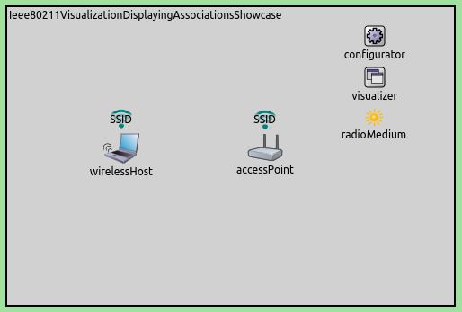
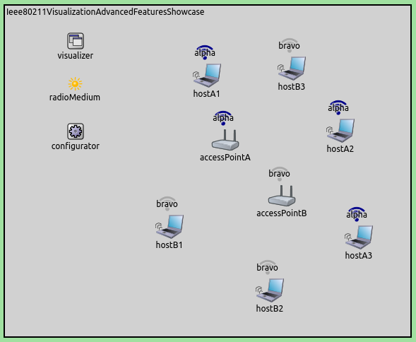

## Goals

When simulating wifi networks that overlap in space, it is difficult to
see which node is a member of which network. The membership may even
change over time. It would be useful to be able to display e.g. the SSID
above node icons. INET provides such a visualizer that we demonstrate in
this showcase.

INET version: `3.6`<br>
Source files location: <a href="https://github.com/inet-framework/inet-showcases/tree/master/visualizer/ieee80211" target="_blank">`inet/showcases/visualizer/ieee80211`</a>

## About the visualizer

In INET, IEEE 802.11 network membership can be visualized by including a
`Ieee80211Visualizer` module in the simulation. Adding an
`IntegratedVisualizer` is also an option, because it also
contains a `Ieee80211Visualizer`. Displaying network membership
is disabled by default, it can be enabled by setting the visualizer's
`displayAssociations` parameter to `true`.

The `Ieee80211Visualizer` displays an icon and the SSID above
network nodes which are part of a wifi network. The icons are
color-coded according to the SSID. The icon, colors, and other visual
properties can be configured via parameters of the visualizer.
<!--The icon is also displayed above nodes that create the networks, e.g. access points.-->
<!--Additionally, the icon indicates the signal strength present at the
location of a given node. TODO: how is it indicated? and how does it work?-->

The visualizer's `nodeFilter` parameter selects which nodes'
memberships are visualized. The `interfaceFilter` parameter
selects which interfaces are considered in the visualization. By
default, all interfaces of all nodes are considered.

## Basic use

The first example simulation demonstrates the visualization with the
default visualizer settings. It can be run by choosing the
`OneNetwork` configuration from the ini file. The simulation
uses the following network:


The network contains a `WirelessHost` and an
`AccessPoint`. The access point SSID is left at the default
setting, `"SSID"`. At the beginning of the simulation, the host
will initate association with the access point. When the association
process goes through, the node becomes part of the wireless network, and
this should be indicated by the icon.

The visualization is activated with the visualizer's
`displayAssociations` parameter:

``` {.snippet}
*.visualizer.*.ieee80211Visualizer.displayAssociations = true
```

When the simulation is run for a while, the network will look like the
following. Note the icons above the host and the access point.



## Multiple networks

The following example simulation demonstrates the visualization when
multiple networks are present. The simulation can be run by choosing the
`MultipleNetworks` configuration from the ini file.

The network contains two `AccessPoints` with different SSIDs,
and three `WirelessHosts` configured to associate with each. We
will see the icons being color-coded. When the association processes
take place, the network will look like the following. Note the different
SSIDs (`alpha`, `bravo`) and the colors.

 <!--
TODO
There are 2 wireless networks, with different colors.
The icon indicates signal strength. The node close to access point alpha has the strongest signal,
the node farther away from access point alpha has the second strongest.
The wall reduces the strength of the signal from access point bravo. It depends on distance as well.
So, A1 has 4 bars, A2 3 bars, B1 2 bars, B2 one bar. Or something like that.
-->

## Visualizing handover

The following example simulation shows how visualization can help you
follow handovers in the network. The simulation can be run by choosing
the `VisualizingHandover` configuration from the ini file. The
network contains two `AccessPoints` with different SSIDs,
`alpha` and `bravo`. There is also a
`WirelessHost` which is configured to move horizontally back
and forth between the two access points. Transmission powers are
configured so that when a host gets near one access point, it will go
out of the range of the other access point. This will trigger a
handover.

The communication ranges of the access points are visualized as blue
circles. The following animation shows what happens when the simulation
is run. Note how the indicator above the host changes after each
handover.

<video controls loop autoplay src="handover9.mp4" width="580" height="500" onclick="this.paused ? this.play() : this.pause();">
</video>

## Further information

For more information on IEEE 802.11 visualization, see the
`Ieee80211visualizer` NED documentation.

## Discussion

Use <a href="https://github.com/inet-framework/inet-showcases/issues/4" target="_blank">this page</a>
in the GitHub issue tracker for commenting on this showcase.

