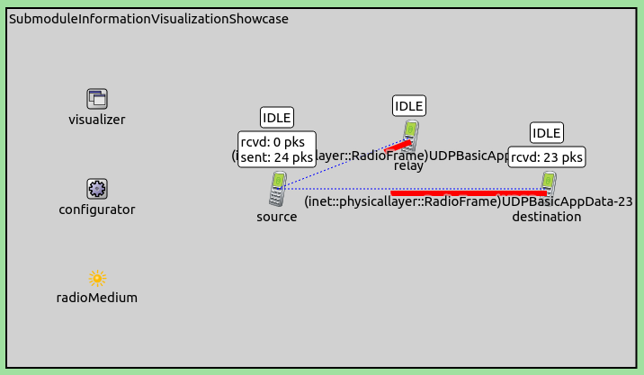

## Goals

Complex models such as protocols are often implemented as compound
modules sometimes several levels deep. Submodules deep down in the
module tree often contain information that is essential to understand
model behavior. In the graphical runtime environment, one has to enter
the compound modules or drill down in the object inspector to access
this kind of information.

This showcase demonstrates how state information of important submodules
can be visualized at containing network nodes, at the top level of the
network. This visualization makes such information conveniently
available at a glance, without the need to go deep into compound
modules. This showcase contains a configuration that demonstrates
visualization of IEEE MAC 802.11 contention states during the channel
access procedure.

INET version: `3.6`<br>
Source files location: <a href="https://github.com/inet-framework/inet-showcases/tree/master/visualizer/info" target="_blank">`inet/showcases/visualizer/info`</a>

## About the visualizer

The `InfoVisualizer` module (included in the network as part of
`IntegratedVisualizer`) can visualize information provided by
various submodules deep down in the module hierarchy. This information
is visualized at the submodule of the contaning network node, typically
at the top level canvas. The following image illustrates this with the
example of the UDP submodule:


The image on the left shows the state information displayed by the UDP
app. To see this, one has to go into the containing node. The image on
the right shows the same information displayed by
`InfoVisualizer` above the containing node, on the top level
canvas.

The submodules whose states should be visualized can be selected with
the visualizer's `modules` parameter. This parameter takes full
path module names. Wildcards can be used to select a certain submodule
in multiple nodes. Additionally, one can specify multiple submodules for
a node. By default, the value of the `modules` parameter is
`""` (no information displayed.) Also, the visualization can be
turned on and off with the `displayInfos` parameter, which is
`true` by default.

The visualizer can display module information in various ways, selected
with the `format` parameter. This takes a format
string, which can contain the following directives:

-   %n: module full name
-   %p: module full path
-   %d: display string text - the 't' tag of the submodule's display
    string
-   %i: the return value of the module's info() function
-   %s: the return value of the module's str() function

The default format string is `"%s"`.

On the example image above, the display string text is visualized,
selected with the `"%d"` directive.

## The visualization

In the example simulation, three wireless nodes will communicate via wifi. We
will visualize the contention state of their MAC modules. The simulation
can be run by choosing the `VisualizingSubmoduleInformation`
configuration from the ini file. The network for the simulation is the
following:


It contains three `AdhocHosts` arranged in a simple chain. It
also contains an `IPv4NetworkConfigurator`, an
`Ieee80211ScalarRadioMedium`, and an
`IntegratedVisualizer` module. The communication ranges of
hosts is determined by their radio transmitter power, which is
configured so that hosts can only reach adjacent hosts in the chain.
Hosts' routing tables are set up accordingly, thus packets going between
`source` and `destination` are routed via
`relay`.

The visualization is enabled by setting the `modules`
parameter. The visualizer is configured to visualize IEEE 802.11 MAC
contention state during the channel access procedure. This information
is contained in each node's Contention module. The location of the
Contention module is
`somehost.wlan[*].mac.dcf.channelAccess.contention`:

``` {.snippet}
*.visualizer.*.infoVisualizer.modules = "*.*.wlan[0].mac.dcf.channelAccess.contention"
```

The `format` parameter is set to display the submodule's
display string text:

``` {.snippet}
*.visualizer.*.infoVisualizer.format = "%d"
```

Additionally, `source` is configured to send UDP packets to
`destination`.

When the simulation is run, the contention state is displayed above the
nodes:


The visualization automatically reflects the changes in the contention
state. It takes on the following values:

-   IDLE when the node doesn't want to transmit
-   DEFER when the node wants to transmit but the channel is busy
-   IFS+BKOFF when the node is backing off while the channel is idle

The following animation illustrates as a packet from `source`
makes its way to `destination`:

<p><video autoplay loop controls onclick="this.paused ? this.play() : this.pause();" src="VisualizingSubmoduleInformation0.mp4" width="718" height="480"></video></p>

<!--internal video recording playback speed 0.43 animation speed none-->

TODO: what is happening on the animation

<!--
When `source` starts transmitting the UDP packet, its state
changes to OWNING. The relay host's state is IDLE while receiving this
packet. After it has received it, the state changes to IFS+BKOFF, then,
while transmitting the ACK, it changes to DEFER. Meanwhile, the state of
the source host remains OWNING, because it has the channel for the
duration of the PACKET-ACK exchange. The relay host's state is DEFER
because it wants to send the packet it just received to the destination
host. After the ACK, the relay host has the channel. The state of the
destination host remains IDLE, as it doesnt want to send any packets.

The source host transmits an UDP packet to relay host, which ACKs it.
While this happens, the state of the source hosts OWNING, as it owns the
channel for the duration of the packet-ACK exchange. When the relay host
receives the UDP packet, its state changes to IFS+BKOFF. It then
transmits the ACK, while its state turns to DEFER, because it already
has the packet it wants to relay to the destination host. After the ACK,
the relay host gets the channel. The state of the destination host
remains IDLE, as it doesn't transmit any packets, just ACKs the ones it
receives.
-->

Multiple submodules can be specified with the visualizer's
`modules` parameter. For example, the UDP application's state
can be displayed in addition to the channel access state:

``` {.snippet}
*.visualizer.*.infoVisualizer.modules = "*.*.wlan[0].mac.ctn[0] *.*.udpApp[0]"
```

This would look like the following:



Here, the visualizer displays the UDP application's number of sent and
received packets, in addition to the contention state.

## More information

For more information, refer to the `InfoVisualizer` NED
documentation.

## Discussion

Use <a href="TODO" target="_blank">this page</a>
in the GitHub issue tracker for commenting on this showcase.
