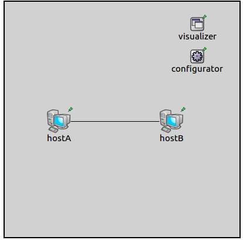
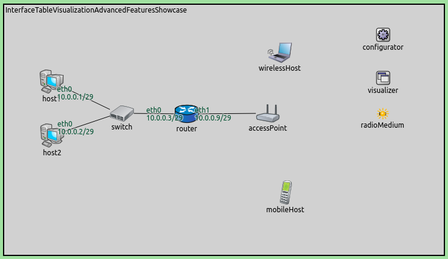
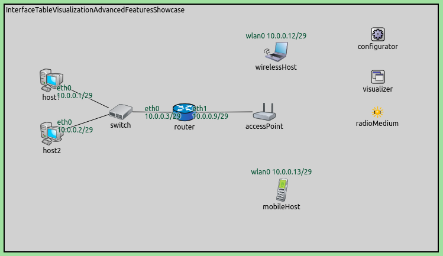

## Goals

In the simulation of complex networks, it is often useful to be able to
display node IP addresses, interface names, etc. above the node icons or
on the links. For example, when automatic address assignment is used in
a hierarchical network (e.g. using `IPv4NetworkConfigurator`),
visual inspection can help to verify that the result matches the
expectations. While it is true that addresses and other interface data
can also be accessed in the GUI by diving into the interface tables of
each node, that is tedious, and unsuitable for getting an overview.

This example contains two configurations. The first one demonstrates the
visualization with the visualizer's default settings, the second one is
about the advanced features.

INET version: `3.6`<br>
Source files location: <a href="https://github.com/inet-framework/inet-showcases/tree/master/visualizer/interfacetable" target="_blank">`inet/showcases/visualizer/interfacetable`</a>

## About the visualizer

The `InterfaceTableVisualizer` module (included in the network
as part of `IntegratedVisualizer`) displays data about network
nodes' interfaces. (Interfaces are contained in interface tables, hence
the name.) By default, the visualization is turned off. When it is
enabled using the `displayInterfaceTables` parameter, the
default is that interface names, IP addresses and netmask length are
displayed, above the nodes (for wireless interfaces) and on the links
(for wired interfaces). By clicking on an interface label, details are
displayed in the inspector panel.

The visualizer has several configuration parameters. The
`format` parameter specifies what information is displayed
about interfaces. It takes a format string, which can contain the
following directives:

-   %N: interface name
-   %4: IPv4 address
-   %6: IPv6 address
-   %n: network address. This is either the IPv4 or the IPv6 address
-   %l: netmask length
-   %M: MAC address
-   %\\: conditional newline for wired interfaces. The '\\' needs to be
    escaped with another '\\', i.e. '%\\\\'
-   %i and %s: the info() and str() functions for the interfaceEntry
    class, respectively

The default format string is `"%N %\\%n/%l"`, i.e. interface name, IP
address and netmask length.

The set of visualized interfaces can be selected with the configurator's
`nodeFilter` and `interfaceFilter` parameters. By
default, all interfaces of all nodes are visualized, except for loopback
addresses (the default for the `interfaceFilter` parameter is
`"not lo\*"`.)

It is possible to display the labels for wired interfaces above the node
icons, instead of on the links. This can be done by setting the
`displayWiredInterfacesAtConnections` parameter to `false`.

There are also several parameters for styling, such as color and font
selection.

## Enabling the visualization

The first example demonstrates the default operation of the visualizer.
The simulation uses the following network:



The network contains two connected `StandardHosts`. IP
addresses are auto-assigned by an `IPv4NetworkConfigurator`
module.

We enable visualization by the following configuration line:

``` {.snippet}
*.visualizer.*.interfaceTableVisualizer.displayInterfaceTables = true
```

The interface names and the assigned IP addresses are displayed at the
gates where the interfaces are connected. When the simulation is run,
the network looks like the following:


## More examples

In the following example, we'd like to show the usefulness of this
visualizer in a dynamic scenario, as well as demonstrate filtering. The
simulation can be run by choosing the `AdvancedFeatures`
configuration from the ini file. It uses the following network:


It contains two `StandardHosts` connected to an
`EtherSwitch`. The switch is connected to a `Router`,
which is connected to an `AccessPoint`. There is a
`WirelessHost` and an `AdhocHost` near the access
point. They will obtain their addresses from the router via DHCP. We
would like to see IP addresses appear above the hosts when they get
their addresses.

We would like to hide the display of loopback addresses and of the
unspecified address, so we set the following filter for the visualizer:

<p>
<div class="snippet">
*.visualizer.*.interfaceTableVisualizer.interfaceFilter="not lo*  and not ipv4Address(< unspec >)"
</div>
</p>

Initially, the addresses of the wired interfaces of `host1`,
`host2` and the router are visualized. The wireless hosts have
unspecified addresses, thus no interface indicator is displayed. The
network looks like this:



When the wireless hosts have been associated with the access point and
received their addresses from the DHCP server, the new addresses will be
displayed. The network will look like this:



## Further information

For more information, refer to the `InterfaceTableVisualizer`
NED documentation.

## Discussion

Use <a href="https://github.com/inet-framework/inet-showcases/issues/3" target="_blank">this page</a>
in the GitHub issue tracker for commenting on this showcase.

