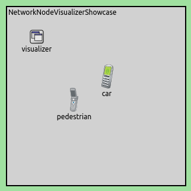

## Goals

In network simulations, it is essential to visualize the participants of
communication. Customizing nodes' appearance may also be important, for
example to highlight nodes or to distinguish nodes based on location or function.
In complex networks with many nodes, it also can be useful to visualize only the
nodes we are interested in.

This showcase demonstrates how network nodes are visualized in INET
simulations.

INET version: <var>3.6</var><br>
Source files location: <a href="https://github.com/inet-framework/inet-showcases/tree/master/visualizer/networknode" target="_blank"><var>inet/showcases/visualizer/networknode</var></a>

## About the Visualizer

In INET simulations, <var>NetworkNodeVisualizer</var> module (included in the
network as part of <var>IntegratedVisualizer</var>) is responsible for visualizing
network nodes. By default, all nodes are visualized on a 2D canvas and on a 3D
osg scene. We can narrow the list of nodes to be displayed by using the
<var>nodeFilter</var> parameter. By using <var>NetworkNodeVisualizer</var>
module, we also are able to customize the look of nodes and to specify the position
of annotations.

On 2D canvas, each node is displayed as a 2D icon. Icon can be customized by
setting the display string of the node. The icon's path, color and the colorization
can be set by the "i" tag, inside the display string. These attributes can also be set
in the node's properties.

On 3D osg scene, each node is displayed as a 2D icon by default. 2D icons can be
replaced with 3D external models. It can make the simulation more
understandable, however it does not have any effect on the simulation. The
external 3D osg model is specified by the node's <var>osgModel</var>
parameter. Color, size and other appearance settings can be changed with
<var>osgModel</var> and <var>osgModelColor</var> parameters of the node. Here
are some examples:

-   <var>*.example.osgModel = "example.osg.10,10,10.trans"</var><br>
    This line of code translates the example.osg by some XYZ offset.
-   <var>*.example.osgModel = "example.osg.90,10,30.rot"</var><br>
    This line of code rotates the example.osg about the XYZ axes.
-   <var>*.example.osgModel = "example.osg.5.scale"</var><br>
    This line of code scales the example.osg.

These parameters can be combined by writing them after each other. Consider the following example:<br>
<var>*.example.osgModel = "example.osg.10,10,10.trans.90,10,30.rot"</var>.<br>
The above code combines translation and rotation.

By default, the module's name is displayed, but it can be hide by setting the
<var>displayModuleName</var> parameter to <var>false</var>.

## Customizing Appearance of Network Nodes

This example shows how the nodes' look can be customized. For this example, a
simulation is created. It can be run by selecting the <var>VisualizingNodes</var>
configuration from the ini file.

The network contains two <var>AdhocHosts</var>, <var>pedestrian</var> and
<var>car</var>. We change the default icon of <var>pedestrian</var> by
modifying its display string in the
<var>NetworkNodeVisualizerShowcase.ned</var> file. (Note that the default icon also
can be modified in the node's *Properties* on the *Appearance* tab.)

``` {.snippet}
pedestrian: AdhocHost {
    @display("p=113,156;<strong>i=device/cellphone2</strong>");
}
```

On the 2D canvas, two cellphone icons can be seen, representing <var>car</var>
and <var>pedestrian</var>.



On the 3D osg scene, you can see the same cellphone icons as on the 2D canvas.
The cellphone icons are automatically rotating towards the camera.


In our next experiment, we replace the nodes' icon with external 3D models by
using the following configuration.

``` {.snippet}
*.pedestrian.osgModel = "boxman.osgb.(0.3).scale.0,0,45.rot"

*.car.osgModel = "car.osgb.200.scale.0,0,45.rot"
*.car.osgModelColor = "red"
```

This configuration affects only 3D visualization. The following animation shows
how the nodes look like after we have replaced their icon.

<video autoplay loop controls onclick="this.paused ? this.play() : this.pause();" width="774" height="490" src="CustomizedRotateCam_v2.mp4"></video>

The <var>pedestrian</var> node is represented by an animated walking
boxman and <var>car</var> is represented by a car model instead of 2D
cellphone icons. The 3D models make the nodes recognizable even without
displaying the module's name.

## More Information

This example only demonstrated the key features of network node visualization.
For more information, refer to the <var>NetworkNodeVisualizer</var> NED
documentation.
