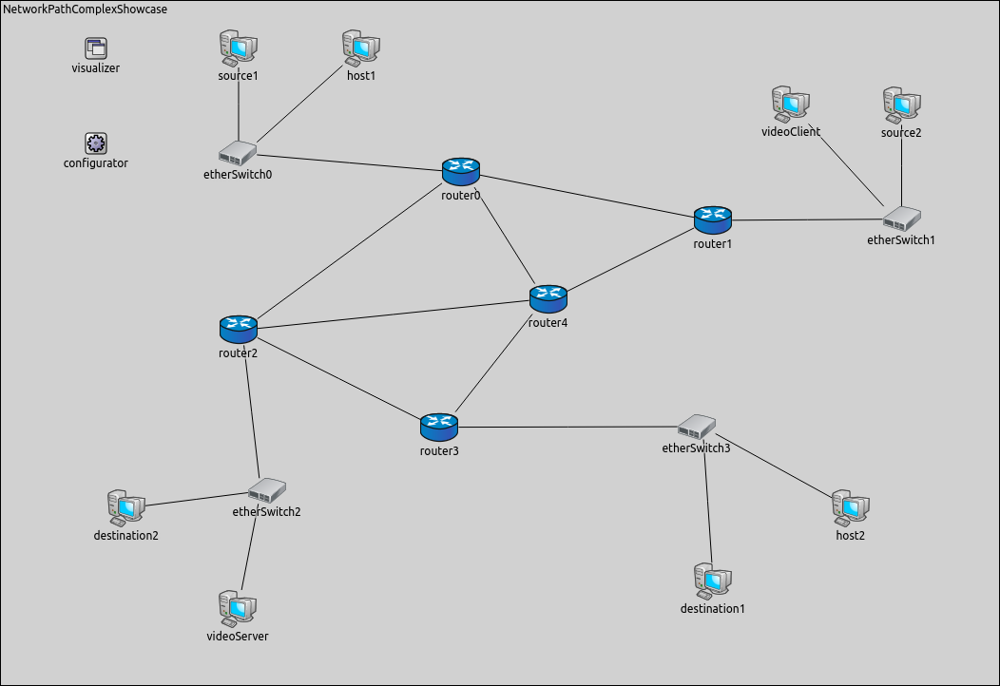
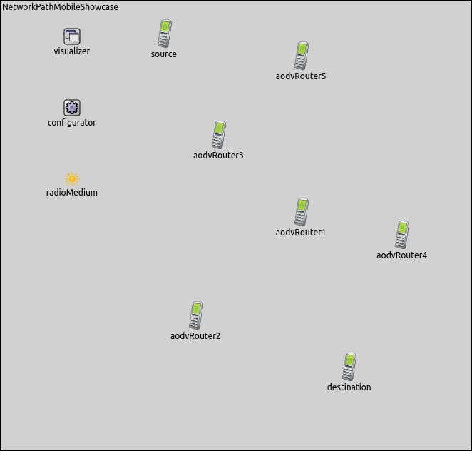
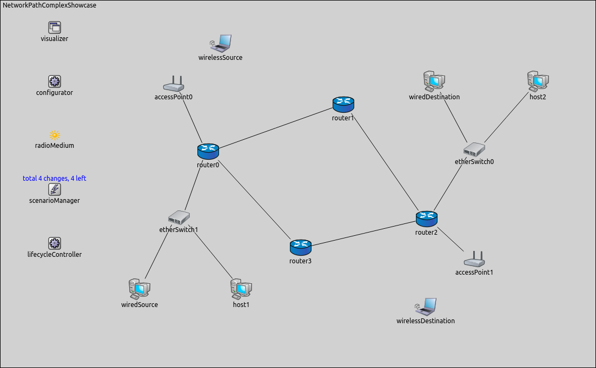

## Goals

In INET simulations, it is often useful to be able to visualize traffic between
network nodes. INET offers several visualizers for this task, operating at various
levels of the network stack. In this showcase, we examine
<var>NetworkRouteVisualizer</var> that can provide graphical feedback about
network layer level traffic.

The showcase consists of four simulation models, each demonstrating different
features of network path activity visualization.

INET version: <var>3.6</var><br>
Source files location: <a href="https://github.com/inet-framework/inet-showcases/tree/master/visualizer/networkpathactivity" target="_blank"><var>inet/showcases/visualizer/networkpathactivity</var></a>

## About the Visualizer

In INET, network path activity can be visualized by including a
<var>NetworkRouteVisualizer</var> module in the simulation. Adding an
<var>IntegratedVisualizer</var> module is also an option, because it also contains a
<var>NetworkRouteVisualizer</var> module. Network path activity visualization
is disabled by default, it can be enabled by setting the visualizer's
<var>displayRoutes</var> parameter to true.

<var>NetworkRouteVisualizer</var> currently observes packets that pass
through the network layer (i.e. carry data from/to higher layers), but not those
that are internal to the operation of the network layer protocol. That is, packets
such as ARP, although potentially useful, will not trigger the visualization.
Visualizing such packets may be implemented in future INET revisions.

The activity between two nodes is represented visually by a polyline arrow which
points from the source node to the destination node.
<var>NetworkRouteVisualizer</var> follows packet throughout its path so the polyline
goes through all nodes that are part of the packet's path. The arrow appears after
the first packet has been received, then gradually fades out unless it is reinforced
by further packets. Color, fading time and other graphical properties can be
changed with parameters of the visualizer.

By default, all packets and nodes are considered for the visualization. This
selection can be narrowed with the visualizer's <var>packetFilter</var> and
<var>nodeFilter</var> parameters.

## Enabling Visualization of Network Path Activity

The following example shows how to enable the network path activity visualization
with its default settings. For the first example, we configured a wired network. The
simulation can be run by choosing the <var>EnablingVisualization</var>
configuration from the ini file.

The network contains two <var>StandardHosts</var>, a <var>source</var>
host and a <var>destination</var> host. In this configuration, the
<var>source</var> host will be pinging the <var>destination</var> host.


The <var>pathVisualizer's</var> type is <var>NetworkRouteVisualizer</var>.
We enable network path activity visualization by setting the
<var>displayRoutes</var> parameter to true.

``` {.snippet}
*.pathVisualizer.*.displayRoutes = true
```

The following video shows what happens when we start the simulation.

<video autoplay loop controls onclick="this.paused ? this.play() : this.pause();" width="622" height="352" src="EnablingVisualization_v0614.m4v"></video>

At the beginning of the video, a red strip appears and moves from
<var>source</var> to <var>destination</var>. This strip is the standard OMNeT++
animation for packet transmissions, and has nothing to do with
<var>NetworkRouteVisualizer</var>. When the packet is received in whole by
<var>destination</var> (the red strip disappears), an arrow is added by
<var>NetworkRouteVisualizer</var> between the two hosts, indicating network path
activity. The packet's name is also displayed on the arrow. The arrow fades out
quickly, because the <var>fadeOutTime</var> parameter of the visualizer is set
to a small value.

Note, however, that ARP traffic does not activate the visualization, because ARP
packets do not pass through the network layer.

## Filtering Network Path Activity

In complex networks where many nodes are placed and several protocols are
used, it is often useful to be able to filter network traffic to visualize only the part
of the network traffic we are interested in.

The following example shows how to set packet filtering. This simulation can be
run by choosing the <var>StaticNetworkPaths</var> configuration from the ini
file.

We use the following network for this showcase:



The network consists of five <var>routers</var> (<var>router0..router4</var>),
four <var>etherSwitches</var> (<var>etherSwitch0..etherSwitch3</var>) and
eight <var>StandardHosts</var>. There are two source hosts,
<var>source1</var> and <var>source2</var>, which will be pinging the two
destination hosts, <var>destination1</var> and <var>destination2</var>. The
<var>videoServer</var> node streams a video to the <var>videoClient</var>
node. The remaining two endpoints (<var>host1</var> and <var>host2</var>)
are inactive in this simulation.

For this network, the visualizer's type is <var>IntegratedVisualizer</var>.
Network path visualization is filtered to display only ping traffic. The video stream
packets are not visualized by network path activity visualizer. We adjust the
<var>fadeOutMode</var> and the <var>fadeOutTime</var> parameters, so
network path activity arrow does not fade out completely before the next ping
packet arrives.

``` {.snippet}
*.visualizer.*.networkRouteVisualizer.displayRoutes = true
*.visualizer.*.networkRouteVisualizer.packetFilter = "ping*"
*.visualizer.*.networkRouteVisualizer.fadeOutMode = "simulationTime"
*.visualizer.*.networkRouteVisualizer.fadeOutTime = 1.4s
```

The following video shows what happens, when the simulation is run.

<video autoplay loop controls onclick="this.paused ? this.play() : this.pause();" width="900" height="664" src="StaticNetworkPaths_v0703.m4v"></video>

Each arrow has a different color indicating different paths. You can see that
although there is both video stream and ping traffic in the network,
<var>NetworkRouteVisualizer</var> displays only the latter, due to the presence of the
<var>packetFilter</var> parameter.

## Visualizing Network Path Activity in a Mobile Ad-Hoc Network

The following example shows how visualization can help you to follow dynamically
changing network path activity in a wireless environment. A simulation is created
for this example, that can be run by choosing the <var>Mobile</var>
configuration from the ini file.

Nodes are of the type <var>AODVRouter</var>, and are placed randomly on the
playground. One of the nodes is the <var>source</var> node which will be
pinging the <var>destination</var> node. The communication range of the
nodes is chosen so that the network is connected, but nodes can typically only
communicate by using multi-hop paths. The nodes will also randomly roam within
predefined borders.



The routing protocol is AODV. It works as follows: As long as <var>source</var>
has a valid route towards <var>destination</var>, AODV is inactive. When a new
route is needed towards <var>destination</var>, for example
<var>source</var> wants to send a packet to <var>destination</var>,
<var>source</var> starts to flood the network with AODV route request (RREQ)
messages. RREQ messages propagate through the intermediate nodes until one of
them reaches the <var>destination</var> node. The route is made available by
unicasting AODV route reply (RREP) messages back to the originator of the RREQ
messages. (You can watch a video about AODV route searching process in the
<var>Data Link Activity</var> showcase, in the <var>Visualizing Data Link
Activity in a Mobile Ad-Hoc Network</var> configuration.)

We use the following configuration for the visualization.

``` {.snippet}
*.visualizer.*.networkRouteVisualizer.displayRoutes = true
*.visualizer.*.networkRouteVisualizer.packetFilter = "ping*"
*.visualizer.*.networkRouteVisualizer.fadeOutMode = "simulationTime"
*.visualizer.*.networkRouteVisualizer.fadeOutTime = 5s
```

The following video shows what happens when the simulation is run.

<video autoplay loop controls onclick="this.paused ? this.play() : this.pause();" width="682" height="732" src="Mobile_v0614.m4v"></video>

Blue circles are displays the communication range of <var>source</var> and
<var>destination</var>.

The video shows the network path ping packets are taking between
<var>source</var> and <var>destination</var>. Ping packets are forwarded to the
next hop until they reach <var>destination</var>. The network path activity is
visualized after the ping packet has arrived to <var>destination</var> so we get
information about the path changes immediately.

When the existing route breaks due to two nodes drifting away (going out of the
communication range of each other), this manifests as link-level failure. This
condition is detected by AODV and it starts searching for a new route. When the
new route is found, the ping traffic resumes.

You can observe in the video that the route the ping packets take is not always
optimal (in terms of hop count). The reason is that nodes use an existing route as
long as possible, even when a shorter route becomes available as a result of node
movement. AODV is only activated when the existing route breaks.

## Displaying Network Path Activity in a Complex Network

This configuration demonstrates how the visualizer reacts to the routing changes
in a complex network. A simulation is created for this example. The simulation can
be run by choosing the <var>ChangingPaths</var> configuration from the ini
file.

The network contains four routers (<var>router0..router3</var>) which are
connected so as to create redundant network paths. The network also contains six
hosts. There are a wired and a wireless source-destination pair. The remaining two
hosts are inactive in this simulation. The wired hosts are connected to the routers
via switches (<var>etherSwitch0</var> and <var>etherSwitch1</var>), the
wireless hosts are connected to the routers via access points (
<var>accessPoint0</var> and <var>accessPoint1</var>).

The following image displays the network for this example.



We assign IP addresses manually by creating a configuration file (
<var>configuration.xml</var>). A lifecycle is also created (
<var>changeRoute.xml</var>) for this configuration to turn off and on the routers at a
certain time. Network routes will change dynamically, because RIP routing
protocol is used in this example. During the simulation, <var>wiredSource</var>
will be pinging <var>wiredDestination</var> and <var>wirelessSource</var>
will be pinging <var>wirelessDestination</var>.

In this showcase, we set the <var>packetFilter</var> parameter to display only
ICMP echo traffic. We use the following configuration for the visualization.

``` {.snippet}
*.visualizer.*.networkRouteVisualizer.displayRoutes = true
*.visualizer.*.networkRouteVisualizer.packetFilter = "ping* and not *reply"
*.visualizer.*.networkRouteVisualizer.fadeOutMode = "simulationTime"
*.visualizer.*.networkRouteVisualizer.fadeOutTime = 1.4s
```

In the following video we can examine that how network path activity visualization follows the routing changes in a complex network.

<video autoplay loop controls onclick="this.paused ? this.play() : this.pause();" width="900" height="610" src="ChangingPaths_v0614.m4v"></video>

In the beginning of the video, ping traffic goes towards <var>router1</var>.
After five seconds small cogwheels appear above <var>router1</var>
then cogwheels change to a red cross, indicating <var>router1</var>
went offline.

Routers update their routing tables in no time by using RIP routing protocol.
In the next few seconds, the traffic goes towards <var>router3</var>
between the sources and the destinations. While ping traffic goes towards
<var>router3</var>, <var>router1</var> turns on again (the red cross
disappears). In the 15th second, you can see that <var>router3</var> goes offline. 
Routing tables are updated by using RIP and as a result of this, ping traffic 
goes through <var>router1</var> again. At the end of the video, <var>router3</var>
turns on, but it does not have an effect on the network traffic.


## More Information

This example only demonstrated the key features of network path visualization.
For more information, refer to the <var>NetworkRouteVisualizer</var> NED
documentation.
