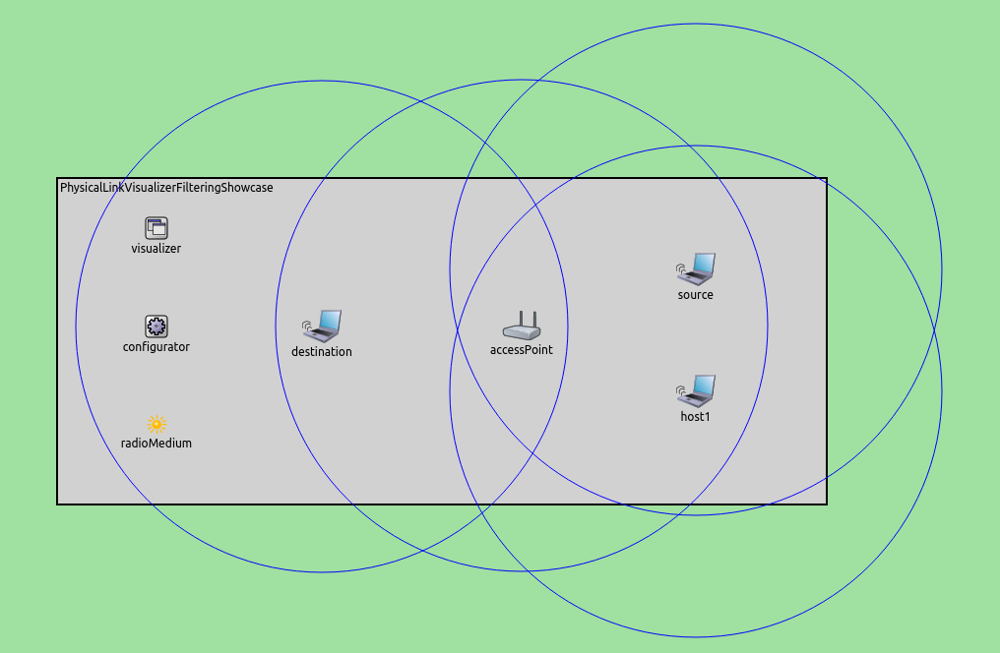

## Goals

With INET simulations, it is often useful to be able to visualize network traffic.
For this task, there are several visualizers in INET, operating at
various levels of the network stack. In this showcase, we demonstrate working of
`PhysicalLinkVisualizer` that can provide graphical feedback about
physical layer traffic.

The showcase consists of three simulation models, each demonstrating different
features of the physical link visualizer.

INET version: `3.6`<br>
Source files location: <a href="https://github.com/inet-framework/inet-showcases/tree/master/visualizer/physicallinkactivity" target="_blank">`inet/showcases/visualizer/physicallinkactivity`</a>

## About the Visualizer

In INET, physical link activity can be visualized by including a
`PhysicalLinkVisualizer` module in the simulation. Adding an
`IntegratedVisualizer` module is also an option, because it also contains a
`PhysicalLinkVisualizer` module. Physical link activity visualization is
disabled by default, it can be enabled by setting the visualizer's
`displayLinks` parameter to true.

`PhysicalLinkVisualizer` observes frames that pass through the
physical layer, i.e. are received correctly.

The activity between two nodes is represented visually by a dotted arrow which
points from the sender node to the receiver node. The arrow appears after the
first frame has been received, then gradually fades out unless it is refreshed by
further frames. Color, fading time and other graphical properties can be changed
with parameters of the visualizer.

By default, all packets, interfaces and nodes are considered for the visualization.
This selection can be narrowed with the visualizer's `packetFilter`,
`interfaceFilter`, and `nodeFilter` parameters.

## Enabling Visualization of Physical Link Activity

The following example shows how to enable the visualization of physical link
activity with its default settings. In this example, we configure a simulation for an
ad-hoc wireless network. The simulation can be run by choosing the
`EnablingVisualization` configuration from the ini file.

The network contains two `AdhocHosts`, `source` and
`destination`. The `linkVisualizer's` type is
`PhysicalLinkVisualizer`. In this simulation, `source` will be
pinging `destination`.


Physical link activity visualization is enabled by setting the
`displayLinks` parameter to true.

``` {.snippet}
*.linkVisualizer.*.displayLinks = true
```

The following animation shows what happens when we start the simulation.

<p><video autoplay loop controls onclick="this.paused ? this.play() : this.pause();" width="622" height="402" src="EnablingVisualization_v0614.m4v"></video></p>

At the beginning of the animation, a red strip appears and moves from
`source` to `destination`. This strip is the standard OMNeT++
animation for packet transmissions, and has nothing to do with
`PhysicalLinkVisualizer`. A blue dotted line also appears at the same time. It
can be ignored, as it is also part of the standard OMNeT++ animation for packet
transmission. When the frame is received in whole by `destination`
(the red strip disappears), a dotted arrow is added by
`PhysicalLinkVisualizer` between the two hosts, indicating physical link
activity. The frame's name is also displayed on the arrow. In this simulation, the
arrow fades out quickly, because the `fadeOutTime` parameter of the
visualizer is set to a small value.

## Filtering Physical Link Activity

In complex networks with many nodes and several protocols in use, it is often
useful to be able to filter network traffic, and visualize only the part of the traffic
we are interested in.

The following example shows how to set packet filtering. The simulation 
can be run by choosing the `Filtering` configuration from the ini file.

We have configured a wifi infrastructure mode network for this showcase. The network
consists of one `accessPoint` and three wireless hosts, `source`, `destination` 
and `host1`. In this configuration, the `source` host will be pinging the
`destination` host. The `host1` node does not generate any
traffic except for connecting to `accessPoint`.

The communication ranges of the nodes (blue circles in the picture) have been
reduced so that `source` and `destination` cannot receive frames
correctly from each other.



For this network, the type of `visualizer` module is `IntegratedVisualizer`. 
Physical link activity visualization is filtered to display
only ping traffic. Other frames, e.g. Beacon frames and ACK frames, are not
displayed by `PhysicalLinkVisualizer`.

We use the following configuration for the visualization.

``` {.snippet}
*.visualizer.*.physicalLinkVisualizer.displayLinks = true
*.visualizer.*.physicalLinkVisualizer.packetFilter = "ping*"
*.visualizer.*.physicalLinkVisualizer.fadeOutTime = 5s
```

The following video shows what happens when the simulation is run. The video was
captured from the point when the hosts had already associated with `accessPoint`.

<p><video autoplay loop controls onclick="this.paused ? this.play() : this.pause();" width="802" height="432" src="Filtering_v0614.m4v"></video></p>

You can see that although there are also ACK frames, Beacon frames and ping
traffic in the network, `PhysicalLinkVisualizer` displays only ping,
due to the presence of `packetFilter`. The ping frames travel between
`source` and `destination` through `accessPoint`, but `host1` also receives
ping frames from `accessPoint` and `source`. That is because `host1`
is within the communication range of `source` and `accessPoint`.

## Physical Link Activity in a Mobile Ad-Hoc Network

The goal of this simulation is to visualize dynamically changing physical link
activity in a mobile wireless environment. This simulation can be run by choosing
the `Mobile` configuration from the ini file.

The network consists of seven nodes (`host1..host7`) are type of
`AdhocHost`. The nodes are placed randomly on the playground and
will also randomly roam within predefined borders. The communication range of
nodes is reduced so that nodes can typically communicate only with some closer
nodes.


The nodes send UDP packets in every second by using an `UDPBasicApp`
application. The packets' names are set to `Broadcast-nnn`. The nodes
manage the received `Broadcast` packets using an `UDPSink` application.

The visualizer's `packetFilter` parameter is set to display only
`Broadcast` traffic.

Here is the configuration of the visualization.

``` {.snippet}
*.visualizer.*.physicalLinkVisualizer.displayLinks = true
*.visualizer.*.physicalLinkVisualizer.packetFilter = "*Broadcast*"
*.visualizer.*.physicalLinkVisualizer.fadeOutMode = "simulationTime"
*.visualizer.*.physicalLinkVisualizer.fadeOutTime = 5s
```

The following video shows what happens when we run the simulation. (If the 
video does not show up, try refreshing the page with Ctrl+Shift+R.)
<!-- TODO that happens at least with Chrome 59 on Ubuntu; investigate! -->

<p><video autoplay loop controls onclick="this.paused ? this.play() : this.pause();" width="682" height="732" src="Mobile_v0614.m4v"></video></p>

Here, physical link activity looks like a connection graph, where vertices are
hosts, and each edge is physical link activity between two hosts. The graph is
continually changing as a result of node movement. When two nodes drift
away (out of the communication range of each other), the physical link between
them breaks. When two nodes come close (move within each other's communication
range), there will be physical link activity between them again.

## More Information

This example only demonstrates the key features of physical link visualization.
For more information, refer to the `PhysicalLinkVisualizer` NED
documentation.

## Discussion

Use <a href="https://github.com/inet-framework/inet-showcases/issues/13"
target="_blank">this page</a> in the GitHub issue tracker for commenting on
this showcase.

