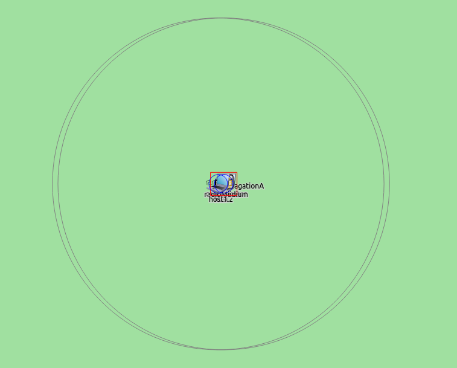

## Goals

In a large network, there might be multiple wireless nodes transmitting
simultaneously, resulting in interference at receiving nodes, and
incorrecly received packets. The logs contain the clues as to what
happened to various packets, but scanning through the logs is tedious.

INET contains support for visualizing radio signals as they propagate
through space, making it easy to see which nodes are transmitting and
which are receiving at any given time, and what transmissions are
present at various nodes.

This showcase contains three configurations of increasing complexity,
each showing different features of the visualization.

INET version: `3.6` 
Source files location: <a href="https://github.com/inet-framework/inet-showcases/tree/master/visualizer/physicalmediumactivity" target="_blank">`inet/showcases/visualizer/physicalmediumactivity`</a>

## About the visualizer

The `MediumVisualizer` module (included in the network as part
of `IntegratedVisualizer`) can visualize various aspects of
radio communications. It has three main features:

-   **Visualization of propagating signals**
-   **Indication of transmitting and receiving nodes**
-   **Displaying communication and interference ranges**

By default, all packets, interfaces and nodes are considered for the
visualization. This selection can be narrowed with the visualizer's
`packetFilter`, `interfaceFilter`, and
`nodeFilter` parameters.

## Displaying signal propagation, transmissions and receptions

This configuration demonstrates the visualization, with the visualizer's
default settings. It uses the following network:

It contains two `WirelessHosts`. The `host1` is
configured to send UDP packets to `host2`. Displaying of
transmissions and receptions, propagating signals, communication and
interference ranges are enabled with these visualizer settings:

*.visualizer.*.mediumVisualizer.displaySignals = true
*.visualizer.*.mediumVisualizer.displayReceptions = true
*.visualizer.*.mediumVisualizer.displayTransmissions = true
*.visualizer.*.mediumVisualizer.displayCommunicationRanges = true
*.visualizer.*.mediumVisualizer.displayInterferenceRanges = true

When the simulation is run the networks looks like this:

Parts of the communication range circles are visible in the image.

The interference ranges are way larger than the communication ranges.
One has to zoom out for them to be visible:

This animation illustrates the visualization of propagating signals:

<video autoplay loop controls src="propagation9.mp4" onclick="this.paused ? this.play() : this.pause();" width="852" height="591"></video>

The `host1` sends an ARP request packet to `host2`,
which sends an ARP reply. The `host1` ACKs it, then sends the
first UDP packet. This is followed by `host2's` ACK. The blue
transmission indicator icons are displayed above nodes when they are
transmitting. Similarly, the red reception indicators are displayed
above them when they are receiving. The transmission power and power of
the received signal is indicated on the transmission/reception icons in
dBW.

**The propagating signal**

The visualization of the propagating signal has two phases. In each of
them, the simulation speed is different. The `Propagation
phase` is at the beginning and the end of the transmission,
visualized with a growing and receeding disk. The propagation phase
lasts until the transmission reaches the node farthest from the source.
The `Transmission phase` is when the transmission is present on
the entire playground. The animation slows down in the propagation
phase, when the edges of the signal are crossing the playground. Since
this happens very fast, with the speed of light, the simulation has to
slow down in order for the animation to be visible. When the signal is
present on the playground, keeping the same simulation speed would
result in the transmission animation being very long. The transmission
itself has a duration that is a few magnitudes longer than the time it
takes for the beginning of the transmission to reach the nodes fathest
away from the source. Thus a different, faster simulation speed is
required when the transmission is present at all nodes. The simulation
speed changes smoothly between the two values.

By default, the propagation phase animation both at the beginning and at
the end of the transmission have a duration of one second. The duration
of the transmission phase is also one second, thus visualizing a
packet's transmission takes three seconds as per the default animation
settings. With these settings, all transmissions have a duration of
three seconds, regardless of their actual, real-world duration. These
settings can be configured with the visualizer's parameters, more on
this in the next section.

## Multiple nodes

This configuration contains three nodes, as opposed to two in the
previous one. Additionally, this section describes the propagation
animation settings of the visualizer. The configuration uses the
following network:

It contains three `AdhocHosts`. The `source` is
configured to ping the `destination`. The communication ranges
are configured so that hosts can reach only the adjacent hosts. The
center host relays packets between the hosts on the two sides.

The simulation speed during the propagation pahse and the transmission
phase - i.e. the speed of the signal animation - is determined by the
visualizer's animation speed parameters. The two parameters are
`signalPropagationAnimationSpeed` and
`signalTransmissionAnimationSpeed` (not specified by default).
If not value is specified for these parameters, the
`signalPropagationAnimationTime` and
`signalTransmissionAnimationTime` parameters take effect, these
set a fixed duration for the corresponding phases of the transmission
animation (by default, both are one second). When the duration is fixed,
all transmission animations take the same amount of time, regardless of
their actual, real-time duration. A rule of thumb for setting the
animation speed parameters is illustrated with the following example:

-   Setting the propagation animation speed to 300/c, where c is the
    speed of light, results in the animation speed value of 10^-6^, and
    the animation of the propagating signal traveling 300 meters on the
    playground in one second, when the playback speed is set to 1.
-   The transmission animation speed should be about two magnitudes
    larger, as the time it takes for the propagating signal to reach the
    node farthest from the transmitter is two magnitudes smaller than
    the time it takes to transmit the signal. Thus in this example, it
    should be about 10^-4^.

The speed of the signal animation can be adjusted at runtime with the
playback speed slider.

By default, the animation switches from propagation phase to
transmission phase when the propagating signal reaches the node farthest
from the signal source. The `signalPropagationAdditionalTime`
parameter can specify how long to continue the propagation animation
after the edge of the signal has left the farthest node.

When the simulation is run, this happens:

<!--

The animation speed during the propagation phase and the transmission phase can be specified by the `signalPropagationAnimationSpeed`
and `signalTransmissionAnimationSpeed` parameters. TODO: how.
Alternatively, a fixed duration can be specified for the two phases with the `signalPropagationAnimationTime` and
`signalTransmissionAnimationSpeed` parameters. These take effect when no corresponding animation speed is defined.
Additionally, additional time can be specified TODO.
AnimationSpeedTimeChange TODO

-->

<video autoplay loop controls src="multiplenodes.mp4" onclick="this.paused ? this.play() : this.pause();" width="870" height="510"></video>

It depicts as a ping packet from `source` makes its way to
`destination`, and as the ping reply packet gets back to
`source`.

When a node starts to transmit a frame, the simulation speed is slower
than during the propagation phase. The gradient between the two
simulation speeds is smooth. As per the parameters, the transmission
travels about 300 meters on the playground each second. The duration of
the ACK is longer than the duration of the ping packet, despite the ping
packet being larger. The reason is that the ACK is transmitted with a
slower bitrate (control bitrate instead of databitrate).

## Interfering signals

This configuration demonstrates the visualization of interfering
signals. It uses this network:

It contains three `AdhocHosts` laid out in a chain, just like
in the previous configuration. The hosts on the two sides,
`source1` and `source2`, are configured to ping the
host in the middle, `destination`. There is a wall positioned
between the two hosts on the sides. The obstacle loss model is
`IdealObstacleLoss`, thus the wall blocks transmissions
completely. Both source hosts can reach the destination, but cannot
reach each other, and cannot detect whatsoever when the other source is
transmitting. Thus the collision avoidance mechanism can't work
effectively.

<!--
The third config shows the interference

when there are two signals present at a node
at the same time

it causes interference

there are interfering signals

but it doesnt necessarily cause collisions

that is, the node cannot receive the transmission correctly, because of the other transmission

it garbles up the transmission

there is a transmission close, and it is for the node
and there is one far, it is not for it

it might be weak the node's position, but it might be enough

to garble up the main transmission
-->

Here is what happens when the simulation is run:

<video autoplay loop controls onclick="this.paused ? this.play() : this.pause();" src="interference.mp4" width="819" height="472"></video>

The two sources can't detect each other's transmission, but they receive
the ACKs and ping replies of the destination. This helps with collision
avoidance, but they often transmit simulataneously. When they do, both
signals are present at the destination concurrently, visualized by the
transmission disks overlapping. Since both sources are in communication
range with the destination, the simulatenous transmissions result in
collisions.

Several signals being present at a receiving node doesn't necessarily
cause collision. One of the signals might not be strong enough to garble
the other transmission.

For further information, refer to the `MediumVisualizer` NED
documentation.
