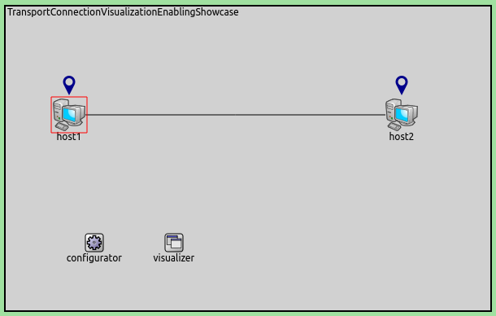
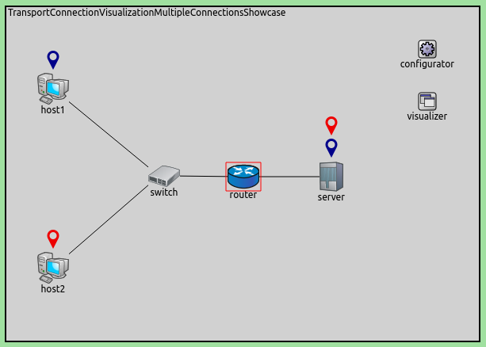

## Goals

In a large network with a complex topology, there might be many
transport layer applications and many nodes communicating. In such a
case, it might be difficult to see which nodes communicate with which,
or if there is any communication at all. Transport connection
visualization makes it easy to get information about the active
transport connections in the network at a glance. Visualization makes it
easy to identify connections by their two endpoints, and to tell
different connections apart. It also gives a quick overview about the
number of connections in individual nodes and the whole network.

This showcase demonstrates the visualization of TCP connections via two
example simulations.

INET version: `3.6`<br>
Source files location: <a href="https://github.com/inet-framework/inet-showcases/tree/master/visualizer/transportconnection" target="_blank">`inet/showcases/visualizer/transportconnection`</a>

## About the visualizer

The `TransportConnectionVisualizer` module (also part of
`IntegratedVisualizer`) displays color-coded icons above the
two endpoints of an active, established transport layer level
connection. The icons will appear when the connection is established,
and disappear when it is closed. Naturally, there can be multiple
connections open at a node, thus there can be multiple icons. Icons have
the same color at both ends of the connection. In addition to colors,
letter codes (A, B, AA, ...) may also be displayed to help in
identifying connections. Note that this visualizer does not display the
paths the packets take. If you are interested in that, take a look at
`TransportRouteVisualizer`, covered in the <a href="../transportpathactivity" target="_blank">Visualizing Transport Path Activity</a> showcase.

The visualization is turned off by default, it can be turned on by
setting the `displayTransportConnections` parameter of the
visualizer to `true`.

It is possible to filter the connections being visualized. By default,
all connections are included. Filtering by hosts and port numbers can be
achieved by setting the `sourcePortFilter`,
`destinationPortFilter`, `sourceNodeFilter` and
`destinationNodeFilter` parameters.

The icon, colors and other visual properties can be configured by
setting the visualizer's parameters.

## Enabling the visualization of transport connections

The first example simulation, configured in the
`EnablingVisualization` section of the ini file, demonstrates
the visualization with default settings. This example simulation uses
the following network:


The network contains two `StandardHosts` connected to each
other, each containing a TCP application. IP addresses and routing
tables are configured by a `IPv4NetworkConfigurator` module.
The visualizer module is a `TransportConnectionVisualizer`. The
application in `host1` is configured to open a TCP connection
to `host2`, and send data to it. The visualization of transport
connections is enabled with the visualizer's
`displayTransportConnections` parameter:

``` {.snippet}
*.visualizer.*.displayTransportConnections = true
```

After the simulation is run for a while and the TCP connection is
established, the icons representing the endpoints of the TCP connection
will appear above the hosts. The network will look like the following:



## Multiple transport connections

The following example simulation demonstrates the visualization of multiple
connections, and the filtering by node and port number. The simulation
can be run by choosing the `MultipleConnections` configuration from the ini
file. It uses the following network:


There are two `StandardHosts` connected to a switch, which is
connected via a router to the server, another `StandardHost`.
IP addresses and routing tables are configured by a
`IPv4NetworkConfigurator` module. The visualizer module is an
`IntegratedVisualizer`.

The hosts are configured to open TCP connections to the server:

-   `host1`: two connections on port 80 (http), one connection
    on port 22 (ssh)
-   `host2`: one connection on port 80, another one connection
    on port 22

The visualizer is instructed to only visualize connections with
destination port 80:

``` {.snippet}
*.visualizer.*.transportConnectionVisualizer.destinationPortFilter = "80"
```

When the simulation is run and the connections are established, the
network will look like the following. Note that there are several icons
above `host1` and the server, indicating multiple connections.
Endpoints can be matched by color.


To visualize the connections that use port 22 at the server, the
`destinationPortFilter` should be set to 22. The network will
look like this:



Additionally, to visualize port 22 connections at `host2` only,
the `sourceNodeFilter` parameter should be set to
`host2`. The result looks like this:


<!--
TODO: demonstrate the letters too! A, B, C, AA, AB, etc. "To differentiate connections with the same icon color, capital letters are displayed on the icon."

To differentiate connections with the same icon color, capital letters are displayed on the icon.
To demonstrate the letters, the `destinationPortFilter` parameter is set to "`*`" (the default setting) to visualize all three transport connections in the network. Also, the `iconColor` parameter is set to `"blue, red"` to limit the number of used colors to two:


-->

## Further information

For more information, refer to the
`TransportConnectionVisualizer` NED documentation.

## Discussion

Use <a href="https://github.com/inet-framework/inet-showcases/issues/15"
target="_blank">this page</a> in the GitHub issue tracker for commenting on
this showcase.
