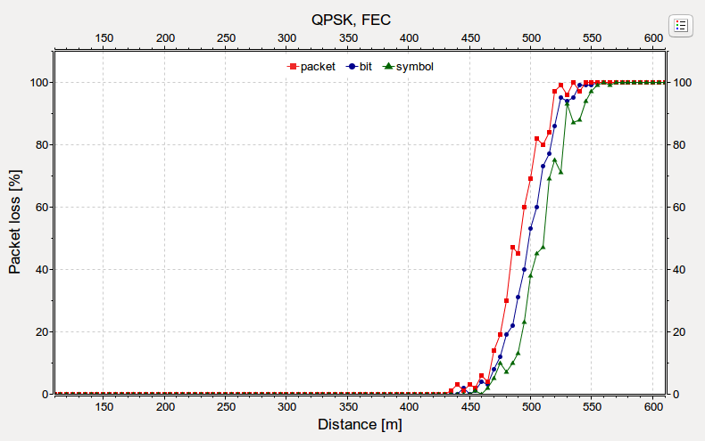
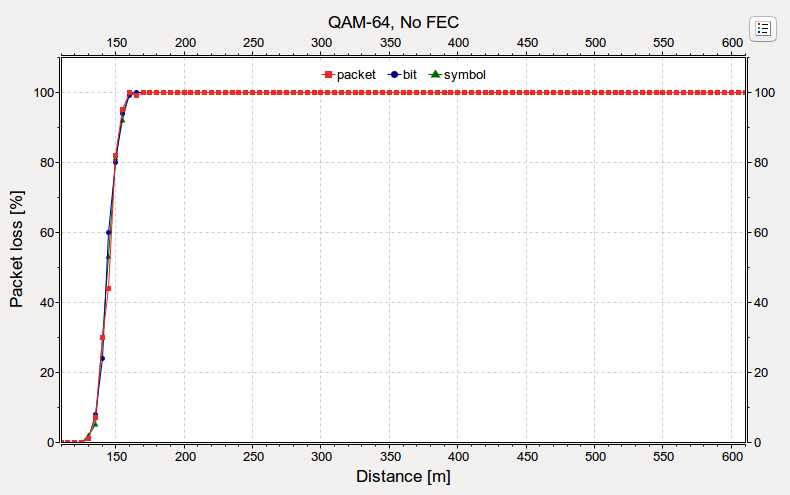

## Goals

INET can model radio transmissions with various levels of detail. The radio models range from simpler ones that simulate the transmission of individual packets, to more complex and realistic ones which simulate modulation symbols.

This showcase describes the different levels of detail in which INET can simulate radio transmissions. It also demonstrates a hypothetical layered radio, which can simulate transmissions at multiple levels of detail. These are 'packet', 'bit' and 'symbol' level. The example simulation for this showcase is a parameter study that examines packet loss as a function of distance when using various modulations and levels of detail.

Source files location: <a href="https://github.com/inet-framework/inet-showcases/tree/master/wireless/levelofdetail" target="_blank">`inet/showcases/wireless/levelofdetail`</a>

## The model

### Layered radio

The model uses `APSKScalarRadio` with
`APSKLayeredTransmitter` and `APSKLayeredReceiver`. The
latter two implements the layered radio features. When operating in 'packet'
domain, the error model computes packet errors, bits are not computed. In 'bit'
domain, the error model computes erroneous bits. In the 'symbol' domain, the
encoding and decoding of symbols are simulated, the error model computes
erroneous symbols. Simulations with different levels of detail are expected to
produce similar curves.

- Packet level: transmissions are simulated as individual packets. The error model computes bit errors from the signal-to-noise-and-interference-ratio (SNIR)
- Bit level: the individual bits of transmissions are simulated. The error model computes which bits get corrupted from the SNIR
- Symbol level: the encoding and decoding of individual symbols of transmissions are simulated. The error model computes which symbols get corrupted. The error model can calculate which bits get corrupted. The calculation is not an estimation, but the corrupted bits can actually be simulated.

When using packet and bit level simulation, even though forward error correction is not simulated, the error model accounts for its effects on the bit error rate.

### Calculating error rates

The `APSKLayeredReceiver` module uses the `APSKLayeredErrorModel` by default. The error model calculates packet error rate (PER), bit error rate (BER) and symbol error rate (SER), depending on the level of detail used. The error rates are calculated from the SNIR, the transmission's modulation, bandwidth, and bitrate.

In case of packet level modeling, the error model computes which packets get corrupted.
When bit precise modeling is used, the error model calculates erroneous bits, from which the receiver mechanism can decide which packets are corrupt. When symbol level precision is used, the error model computes which symbols get corrupted. The error model replaces a corrupted symbol with another one, which differs from the originally transmitted symbol in just 1 bit. The symbol is then decoded by the receiver, which decides which bits and in turn packets, are corrupt.

The error model compensates for the use of forward error correction when calculating PER, in case of packet level of detail. If bit or symbol precision is used, the FEC encoding and decoding mechanism is applied to the bits.

Note that the error model can be replaced.

### Configuration

There are two hosts, and one of them pings the other one once every second. Each simulation runs for 100 seconds, thus 100 pings are sent. There are four axes in the parameter study:

-   **Distance** runs from 210m to 710m in steps of 5m
-   **Level of detail** for the transmissions are 'packet', 'bit' and 'symbol'
-   **Forward error correction** (FEC) is either `ConvolutionalCoder` or not using forward error correction
-   **Modulations** used are 'BPSK', 'QPSK', 'QAM-16' and 'QAM-64'

We record the ping loss rate.

### Forward error correction

The used convolutional code has a code rate R = 1 / 2, memory m = 1, and
generator matrix G(D) = (1 1+D). To keep the net bitrate constant across all
simulations, the gross bitrate is increased two-fold when using forward error
correction (36 Mbps instead of 18 Mbps).

## Results

<!--


-->

Packet loss vs. distance is displayed on the following plots, for each modulation and forward error correction usage case. Each plot contains three curves pertaining to the three levels of detail. The three detail levels produce similar curves for the same modulation and forward error
correction, except for two cases (more on these exceptions below). Click on the images to zoom:

### BPSK


### QPSK



### QAM-16


### QAM-64



The two exceptions are QAM-16 and QAM-64 with forward error correction
(the two plots for these cases are indicated above with a red border.)
QAM-16 and QAM-64 has 4 and 6 bits/symbol. When simulating with symbol detail level, the error model
computes which symbols get corrupted. Erroneous bits result from the decoding of corrupted symbols.
Since bits get corrupted in chunks represented by a symbol, the distribution of bit errors is not independent. Also, currently the error model "corrupts" just 1 bit/symbol, when simulating with symbol level precision. These effects lead to the gap between the curves.
(the gap is present with the QPSK modulation, but it is not as prominent, since QPSK only has 2 bits/symbol).

<!--
The two exceptions are QAM-16 and QAM-64 with forward error correction
(the two plots for these cases are indicated above with a red border.)
QAM-16 and QAM-64 has 4 and 6 bits/symbol. When simulating with symbol detail level, the error model
computes which symbols get corrupted. From the corrupted symbols the reception mechanism can compute which bits are erroneous.
Since bits get corrupted in chunks represented by a symbol, the distribution of bit errors is not independent. Also, currently the error model "corrupts" just 1 bit/symbol, when simulating with symbol level precision. These effects lead to the gap between the curves.
(the gap is present with the QPSK modulation, but it is not as prominent, since QPSK only has 2 bits/symbol).
-->

<!--
```
So actually, when using qam that has lots of bits per symbol, the bits would get corrupted in chunks,
represented by symbols. The bit errors are not independent, so...the conclusion is what?
bit error will be worse? the error model cant compute accuratelly?
actually, the bit error rate will be lower because the forward error correction mitigates this effect
for an extent, and it is just lower because the packet and bit levels computed by the error model
are higher, because they cant be computed as accurately?
The fact that bit errors are not independent results in what?
```
-->

<!--
Correction
in the case of symbol level, the bit errors are the result of the decoding of the symbol level transmission.

From the SNIR, modulation, bandwidth, and bitrate, the BER, PER, and SER is calculated.
The error model selects which packets will be corrupted with the PER
The error model selects which bits will be corrupted with the BER
The error model selects which symbols will be corrupted with the SER, but
it only corrupts 1 bit (selects a symbol that is 1 bit away from the transmitted)
This is not very realistic, because more than one bit might get corrupted.
That is one reason why the curve is shifted to the right (or just to the right of the others. maybe
the others are shifted to the left because maybe they dont compute the error accuratelly.)
The other reason is that the bit errors are not distributed independently.

On the bit level, the FEC is simulated. So as on the symbol level. On the packet level, the error
model just takes the FEC into account and corrects the bit error rate.

something like this:

packet:
packet -> SNIR -> packet error rate -> effect of FEC -> corrupted packets

bit:
packet -> bits -> FEC -> SNIR -> corrupted bits -> unFEC -> corrupted bits -> corrupted packets

symbol:
packet -> bits -> FEC -> symbol coding -> SNIR -> corrupted symbols -> some bits -> unFEC -> corrupted bits -> corrupted packets
-->

Generally, the more complex modulations have less range.
It is apparent from the plots that forward error correction can extend the range of transmissions to some extent.
When just a few bits get corrupted, the forward error correction can correct those, and the transmission is correctly receivable.

The following image contains all modulations and forward error correction use cases on one plot:

<a href="General.svg" target="_blank">
