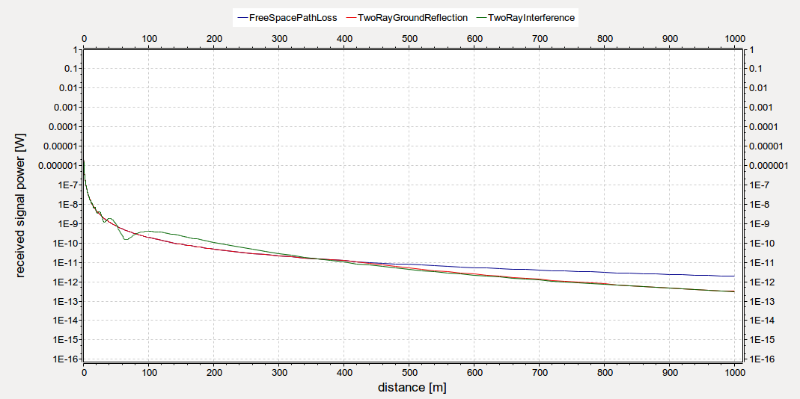
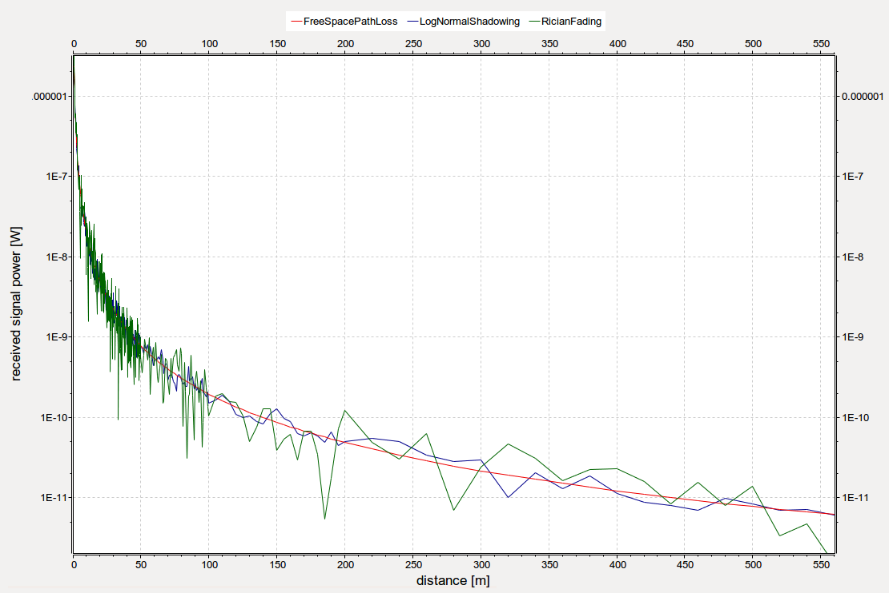

## Goals

INET features various path loss models for simulating radio propagation, ranging
from simple ones like free space path loss to more complex ones like Rician and
Rayleigh fading. This showcase demonstrates some of the available path loss
models and how to use them in simulations.

The showcase contains an example simulation, which computes received power
vs. distance using several path loss model types.

INET version: `3.6`<br>
Source files location: <a href="https://github.com/inet-framework/inet-showcases/tree/master/wireless/pathloss" target="_blank">`inet/showcases/wireless/pathloss`</a>

## About path loss models

Path loss models are used to compute the decrease in the power of a radio signal
as it propagates away from the transmitter. The default path loss model in INET is
free space path loss, which computes attenuation according to the inverse square
law along a single line-of-sight propagation path. This is a simple model, and
realistic only in certain cases, e.g. when modeling satellite-to-satellite
communications. Because of its low computational cost, it is also useful if the
emphasis of the simulation is not on the accuracy of radio propagation (e.g.
for testing protocols.) However, there are several more path loss models
available in INET, suitable for various other scenarios.
Here is a list of those featured in this showcase example:

- `FreeSpacePathLoss:` Computes loss of signal power in a single line-of-sight
  propagation path, without any reflections or shadowing.
- `TwoRayGroundReflection:` Computes loss of signal power by assuming a
  line-of-sight wave interfering with another wave reflected from the ground
  between the transmitter and the receiver. This model computes interference
  in the far-field only, and is the same as free space path loss up until a
  certain crossover distance.
- `TwoRayInterference:` This model is the same as the two-ray ground reflection
  model in the far-field, but it models the interference of the two waves
  in the near-field as well.
- `RicianFading:` It's a stochastic path loss model which assumes a dominant
  line-of-sight signal and multiple reflected signals between the transmitter
  and the receiver. It is useful for modeling radio propagation in an urban
  environment.
- `LogNormalShadowing:` It's a stochastic path loss model, where power levels
  follow a lognormal distribution. It is useful for modeling shadowing caused
  by objects such as trees.

Other path loss models in INET include `RayleighFading`, `NakagamiFading`,
`UWBIRStochasticPathLoss`, `BreakpointPathLoss`, and `SUIPathLoss`.

The various path loss models each have sets of parameters to fine-tune their
behavior. In this showcase we leave the parameters at their defaults.


## The model

The study will involve two wireless hosts that communicate at a varying
distance. For each distance and path loss model, a probe packet will be sent
from one host to the other, and the signal's received power will be recorded.

In addition to the two hosts named named `source` and `destination`, the network
also contains a `PhysicalEnvironment` module, an `IPv4NetworkConfigurator`, and
a `Ieee80211ScalarRadioMedium`:


<!--TODO: rewrite when the two-ray interference model is modified to use the ground model if there is one-->

The antenna height of the transmitter and the receiver is an important part of
the two-ray ground reflection and two-ray interference model, because it affects path loss.
The two-ray interference model calculates antenna heights from the z co-ordinates
of the two nodes by assuming the z co-ordinate of the ground to be 0.
The two-ray ground reflection model needs a ground model, which contains the elevation
of the ground. The ground model is part of the physical environment module.
By default, the physical environment module doesn't use a ground model, but
it is set in the configuration to use `FlatGround`:

```
*.physicalEnvironment.groundType = "FlatGround"
```

We will leave the ground's elevation parameter at default, which is 0. The z co-ordinate of both hosts is set to 2 meters, thus both antennas are 2 meters
above the ground. (The hosts have isotropic antennas, which lack directionality.)

The simulation is a parameter study, where `source` is configured to
send a UDP packet to `destination`. One of the parameters of the study is the distance between the hosts (the x co-ordinate of `destination's` position.) The distance changes from 0 to 1000 meters. It changes with smaller steps
near 0, where the change in power will be more rapid.

Here are the keys from the configuration relevant for positioning the hosts:

<p><pre class="snippet">
# mobility settings
*.*.mobility.initFromDisplayString = false
*.*.mobilityType = "StationaryMobility"
*.*.mobility.initialY = 200m
*.*.mobility.initialZ = 2m

*.source.mobility.initialX = 0m
*.destination.mobility.initialX = ${distance=0..50 step 0.25, 51..100 step 1, 105..200 step 5, 220..1000 step 20}m
</pre></p>

The other variable in the parameter study is the path loss type, which takes on the
following values: `FreeSpacePathLoss`, `TwoRayGroundReflection`,
`TwoRayInterference`, `RicianFading`, `LogNormalShadowing`.

The source host will transmit with the default power of 20mW. We will record the
power of the received transmission (`receptionPower` signal in the
transmitter module.)

## Results

The power of the received signal vs. distance, using `FreeSpacePathLoss`,
`TwoRayGroundReflection` and `TwoRayInterference` path loss models, 
is displayed on the following plot:

<a href="tworay.svg" target="_blank"></a>

Here is the same plot zoomed in:

<a href="tworay2.svg" target="_blank"></a>

It is apparent that the two-ray ground reflection model yields the same values as
the free space path loss model, up until the cross-over distance. After that point,
the two curves diverge. The power of the two-ray interference model fluctuates in
the near-field, and converges to the two-ray ground reflection model in the far-
field. Thus the two-ray interference model can be used for more realistic two-ray
propagation simulations.

The next plot displays the power of the received signal vs. distance using the
`RicianFading` and `LogNormalShadowing` models, and the `FreeSpacePathLoss` model
for reference:

<a href="ricianlognormal.svg" target="_blank"></a>

The sharp visual change in the "raggedness" of the curves near 100m is due to
the data points becoming less dense. Here is the same plot zoomed in on the
near-field:

<a href="ricianlognormal2.svg" target="_blank"></a>

## Further Information

For more information about the path loss models in INET, refer to the <a href="https://omnetpp.org/doc/inet/api-current/neddoc/index.html" target="_blank">INET Reference</a>.
The following links provide more information about the path loss models in general (not about the INET implementation):

- <a href="https://en.wikipedia.org/wiki/Free-space_path_loss" target="_blank">Free space path loss</a>
- <a href="https://en.wikipedia.org/wiki/Two-ray_ground-reflection_model" target="_blank">Two-ray ground reflection</a>
- <a href="https://pdfs.semanticscholar.org/a86f/90f1238ccb90181c26335684fd762247408e.pdf" target="_blank">Two-ray interference</a>
- <a href="https://en.wikipedia.org/wiki/Rician_fading" target="_blank">Rician fading</a>
- <a href="https://en.wikipedia.org/wiki/Log-distance_path_loss_model" target="_blank">Log-normal shadowing</a>

## Discussion

Use <a href="https://github.com/inet-framework/inet-showcases/issues/19" target="_blank">this page</a>
in the GitHub issue tracker for commenting on this showcase.

