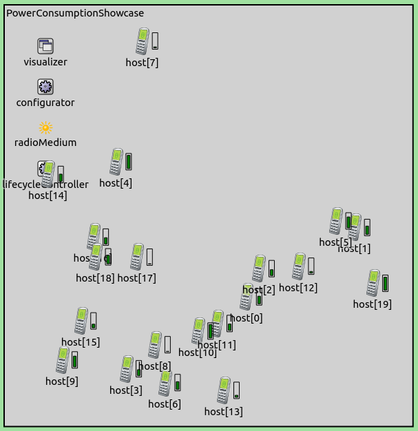
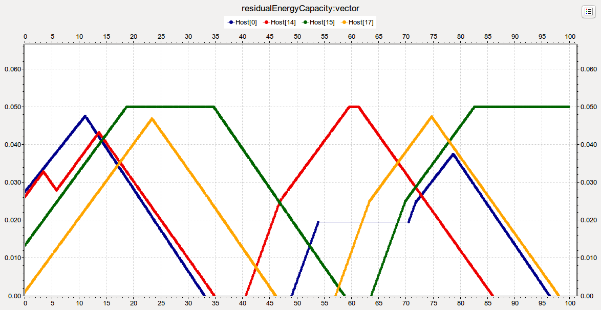

## Goals

This showcase is about the effect of wireless communication on the power
consumption of mobile devices. It models the power consumption associated with
the physical layer of wireless hosts. It demonstrates energy consumption, storage
and generation.

Source files location: <a href="https://github.com/inet-framework/inet-showcases/tree/master/wireless/power" target="_blank"><var>inet/showcases/wireless/power</var></a>

## The model

The hosts will send out ping requests, which will deplete their energy storage,
while their power generators will charge them. After the simulation has
concluded, we will analyze energy storage statistics.

### The network

The network contains mobile hosts (type <var>AdhocHost</var>), the number of
which can be specified in the ini file. The default number specified is 20. They are
randomly placed on the playground, and they're static (they don't move around).
Here is what it looks like when the simulation is run:

### Configuration and behavior

All hosts are configured to send a ping request to <var>Host[0]</var> every
second. <var>Host[0]</var> doesn't send ping requests, just replies to the
requests that it receives. The radio transmissions will deplete hosts' energy
storage. To reduce the probability of collisions, the ping application's start time is
choosen randomly for each hosts as a value between 0 and 1 seconds. Since ping
requests have a short duration and hosts transmit infrequently, it is assumed that
the probability of collisions will be very low.

### Energy Storage, Generation and Management

Hosts are configured to contain a <var>SimpleEpEnergyStorage</var> module.
<var>SimpleEpEnergyStorage</var> keeps a record of stored energy in Joules,
and power input/output in Watts. (The letters <var>Ep</var> stand for energy
and power, denoting how the module represents energy storage and power
input/output. There are other energy storage models in INET that similarly to real
batteries, use charge and current (denoted by <var>Cc</var>), such as
<var>SimpleCsBattery</var>.) <var>SimpleEpEnergyStorage</var> models energy
storage by integrating the difference of absorbed and provided power over time.
It does not simulate other effects of real batteries, such as temperature
dependency and hysteresis. It is used in this model because the emphasis is on
the energy that transmissions use, not how the batteries store the energy. Each
host is configured to have a nominal energy storage capacity of 0.05 Joules. The
charge they contain at the beginning of the simulation is randomly selected
between zero and the nominal capacity for each host.

Each host contains an <var>AlternatingEnergyGenerator</var> module. This
module alternates between generation and sleep modes. It starts in generation
mode, and generates the amount of power that is specified by its
<var>powerGeneration</var> parameter (now set to 4 mW). In sleep mode, it generates
no power. It stays in each mode for the duration specified by the
<var>generationInterval</var> and <var>sleepInterval</var> parameters. These are
set to a random value with a mean of 25s for each host.

Energy storage and generator modules are controlled by energy management
modules. In this showcase, hosts are configured to contain a
<var>SimpleEpEnergyManagemenet</var> module. We configure energy management
modules to shut down hosts when their energy levels reach zero, and restart them
when their energy storage charges to half of their nominal energy capacity, i.e.
0.025 Joules.

### Radio modes and states

In the <var>Ieee80211ScalarRadio</var> model used in this simulation (and in
other radio models), there are different modes in which radios operate, such as
off, sleep, receiver, transmitter. The mode is set by the model, and does not
depend on external effects. In addition to mode, radios have states, which depend
on what they are doing in the given mode - ie. listening, receiving a transmission,
or transmitting. This depends on external factors, such as if there are
transmissions going on in the medium.

### Energy consumption of radios

Radios in the simulation are configured to contain a
<var>StateBasedEnergyConsumer</var> module. In this model, energy consumption is
based on power consumption values for various radio modes and states, and the
time the radio spends in these states. For example, radios consume a small
amount of power when they are idle in receive mode, i.e. when they are listening
for transmissions. They consume more when they are receiving a transmission,
and even more when they are transmitting.

TODO: some of the default values in StateBasedEnergyConsumer?

## Results

<var>Host[0]</var> is the target for the ping requests of all other hosts. It
doesn't send ping requests, but it replies to all requests. After a while, the energy
storage of hosts get depleted, and the hosts shut down. This is indicated by a red
x on the host's symbol. The energy generator charges hosts regardless of whether
they are depleted or not (as if they were charged by a solar panel).

The following plot shows the energy storage levels (recorded as the
<var>residualEnergyCapacity</var> statistic) of all the hosts through the course of the
simulation. In general, hosts start from a given charge level, and their energy
storage level depletes, and reaches zero. When that happens, the hosts shut
down. Then they start to charge, and when their charge level reaches the 0.025J
threshold, they turn back on. They continue sending ping requests, until they get
depleted again. The generator generates more power than hosts consume when
they are idle, but not when they are receiving or transmitting. This appears on the
graph as increasing curves when the generator is charging, with tiny zigzags
associated with receptions and transmissions. When hosts get fully charged, they
maintain the maximum charge level while the generator is charging.

The plot below shows the energy storage level (red curve) and the energy
generator output (blue curve) of <var>Host[12]</var>. The intervals when the
generator is charging the energy storage can be discerned on the energy storage
graph as increasing slopes. When the host is transmitting and the generator is
charging, the energy levels don't increase as fast. The generator generates 4 mW
of power, and radios consume 2 mW when they are idle in receiver mode. Radios
are in idle state most of the time, thus their power consumption is roughly 2 mW.
When the host is turned on and it is being charged, the net charge is 2 mW (4 mW
provided by the generator and 2 mW consumed by the radio). When the host is
turned off and being charged, the net charge is 4 mW. The latter corresponds to
the most steeply increasing curve sections. When the host is turned on but not
charging, the consumption is 2 mW, and the curve is decreasing.

When hosts are turned on, they occasionally transmit. This results in tiny zigzags
in the graph because of temporary increase in power consumption associated with
transmissions (the power requirement of transmissions is 100 mW). In the
intervals when the host is turned off, the host doesn't transmit, and the curve is
smooth (note that there are drawing artifacts due to multiple line segments).

The following plot shows how the energy level of <var>Host[12]</var> changes
during a transmission while charging.

<var>Host[0]</var> is different from the other hosts in that it doesn't generate
ping requests, but sends replies to all the ping requests it receives. Therefore it
consumes energy faster. As other hosts just send one ping request every second,
<var>Host[0]</var> has to reply to 20 ping request each second. This increased
consumption can be seen on the following energy level graph as more rapidly
decreasing curve (<var>Host[0]</var> is the blue curve).

<var>Host[0]</var> transmits around 20 times more than the other hosts, thus it
consumes 20 times more energy when it is transmitting. The curve doesn't
decrease 20 times as fast because most of the time the hosts are listening.
Transmissions are rare, and the time hosts spend transmitting is far less than they
spend listening. Energy consumtion is dominated by reception.

The following plot shows a ping request-ping reply exchange (with the associated
ACKs) between hosts 0 and 3 on the sequence chart and the corresponding
changes in energy levels of <var>Host[0]</var>. Note that <var>Host[0]</var>
consumes less energy receiving than transmitting. In the intervals between the
transmissions, the curve is increasing, because the generator is charging
<var>Host[0]</var>. This image shows that hosts indeed consume more power when
transmitting than the generator generates. However, transmissions are very short
and very rare, so one needs to zoom in on the graph to see this effect.

## Further Information

More information can be found in the <a href="https://omnetpp.org/doc/inet/api-current/neddoc/index.html" target="_blank">INET Reference</a>.
