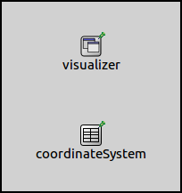
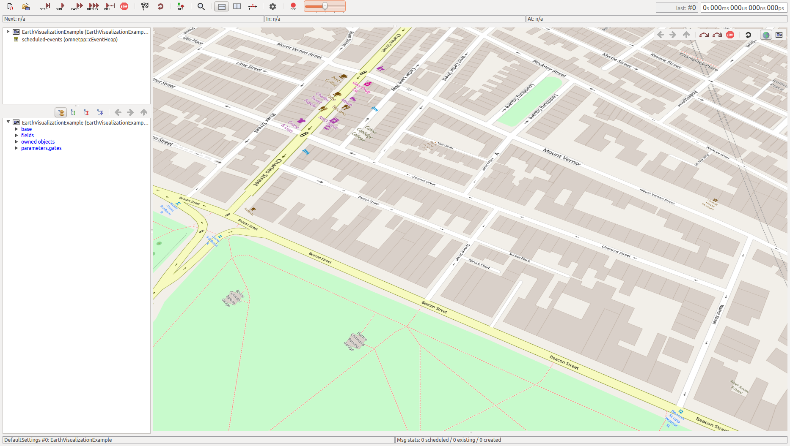
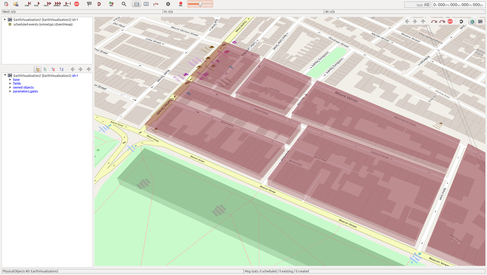
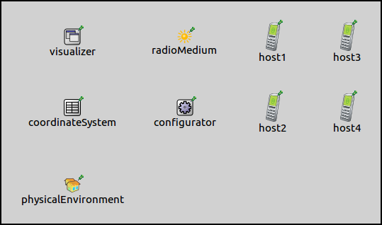
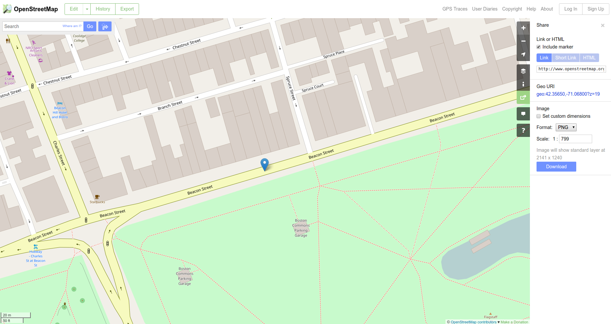

:orphan:

Visualizing Terrain and Urban Environment
=========================================

Goals
-----

It is often desirable for simulations to have a real world context. One
way to achieve this is to place network nodes on a real world map. The
map doesn't have any effect on the simulation, it only alters the
visuals of the network. However, objects can be added to represent
buildings, which can affect the simulation.

This showcase is about placing a map in the simulation. It contains
three example configurations of increasing complexity, each
demonstrating various features of the visualization.

| INET version: ``4.0``
| Source files location: `inet/showcases/visualizer/earth <https://github.com/inet-framework/inet-showcases/tree/master/visualizer/earth>`__

About the Visualizer
--------------------

The map can be displayed by including a :ned:`SceneOsgEarthVisualizer`
module in the network. It can display the map on the 3D view by using
osgEarth, thus any part of the world can be inserted (provided there is
a source for the map data). The use of the map requires an internet
connection, and it is only available in the 3D view.

Visualization with the Default Settings
---------------------------------------

This example configuration demonstrates inserting the map of downtown
Boston into the simulation. It can be run by choosing the
``DefaultSettings`` configuration from the ini file. It uses the
following network:

The network contains an :ned:`IntegratedVisualizer` module, and an
:ned:`OsgGeographicCoordinateSystem` module. The configuration from
:download:`omnetpp.ini <../omnetpp.ini>` is the following:

.. literalinclude:: ../omnetpp.ini
   :start-at: SceneOsgEarthVisualizer
   :end-at: sceneLatitude
   :language: ini

-  By default, the type of the scene visualizer module in
   :ned:`IntegratedVisualizer` is :ned:`SceneOsgVisualizer`. Inserting the map
   requires the :ned:`SceneOsgEarthVisualizer` module, thus the default osg
   scene visualizer is replaced. The :ned:`SceneOsgEarthVisualizer`
   provides the same functionality as :ned:`SceneOsgVisualizer`, and adds
   support for the osgEarth map.

-  To display the map, the visualizer requires a .earth file. This is an
   XML file that specifies how the source data is turned into a map, and
   how to fetch the necessary data from the internet. In this
   configuration, the boston.earth file is used. There are more .earth
   files in the osgEarth directory, and at
   `osgearth.org <http://osgearth.org>`__). There are also instructions
   on this site on how to create .earth files.

-  Locations on the map are selected with geographical coordinates, i.e.
   longitude and latitude. In INET, locations of nodes and objects are
   represented internally by Cartesian coordinates. The
   ``OsgGeorgraphicCoordinateSystem`` module is responsible for
   converting between geographical and Cartesian coordinates. The
   geographical coordinates of the Cartesian coordinate system's origin
   must be specified, to connect the map and the location of nodes and
   objects in the simulation. The origin's coordinates are specified by
   the visualizer's ``sceneLongitude`` and ``sceneLatitude``
   parameters. In this configuration, the origin is set to somewhere
   near Boston Common park. Additionally, the origin's altitude can be
   configured, However, specifying the latitude and longitude is
   sufficient for the map visualization to work.

-  The size of the scene is determined automatically, taking into
   account the position of objects, network nodes, and movement
   constraints of network nodes. Thus everything in the simulation should
   happen within the boundaries of the scene. The scene's
   elevation, heading, and bank can be specified in the coordinate
   system module. The scene is visualized on the map using a semi-transparent rectangle overlay.
   The scene rectangle is visible by default. When the
   simulation starts, the view will be centered on the Cartesian
   coordinate system's origin if there are no nodes in the network. If
   there are nodes, the initial viewpoint will be set so that all nodes
   are visible.

It looks like the following when the simulation is run:

The map is displayed on the 3D scene. Since there are no nodes or
objects in the network, the size of the scene is zero (thus not
visible).

Adding Physical Objects
-----------------------

The map doesn't affect simulations in any way, just gives a real world
context to them. For network nodes to interact with their environment,
physical objects have to be added. The example configuration for this
section can be run by selecting the ``PhysicalObjects`` configuration
from the ini file. It extends the previous configuration by adding
physical objects to the simulation. The objects are placed in the
simulation to align with the building blocks on the map; they are meant
to represent those building blocks. The objects could affect radio
transmissions if an obstacle loss model was set.

The network for this configuration extends the network from the previous
section with a :ned:`PhysicalEnvironment` module:

.. figure:: objectsnetwork.png
   :width: 25%
   :align: center

The configuration for this example simulation extends the previous
configuration with the following:

.. literalinclude:: ../omnetpp.ini
   :start-at: coordinateSystemModule
   :end-at: config
   :language: ini

The :ned:`PhysicalEnvironment` module is responsible for placing the
physical objects on the scene. The physical environment module
doesn't use a coordinate system module by default, but it is set to use
the one present in the network. This makes it possible to define the
objects using geographical coordinates. The objects are defined in the
obstacle.xml config file.

It looks like the following when the simulation is run:

The objects representing building blocks are displayed with transparent
red, and there is a line of trees on the other side of the road
displayed in transparent green.

Placing Network Nodes on the Map
--------------------------------

This example configuration demonstrates the placement of network nodes
on the map. The simulation can be run by choosing the ``NetworkNodes``
configuration from the ini file. The network for this configuration
extends the previous network with a radio medium and a network
configurator module. It also adds two ``AdhocHosts``:

The configuration extends the previous configuration with the following:

.. literalinclude:: ../omnetpp.ini
   :start-at: sceneShading
   :end-at: host4.mobility.initialLongitude
   :language: ini

The first block of keys configure the scene to be transparent
black, so the underlying map is visible. The next block sets the
altitude of the scene. By default, the altitude is zero; it is set
to one meter, so the nodes are not on the level of the ground. The
heading is also specified, so that the edges of the scene roughly
aligns with the streets on the map.

Network nodes are placed on the map by setting their mobility type to
:ned:`StationaryMobility`. This mobility module has parameters which can
position the node with geographical coordinates.

The required coordinates can be easily obtained from
`www.openstreetmap.org <http://www.openstreetmap.org>`__. Choose *Share*
from the menu at the right, and tick *Include marker*. The marker can be
dragged on the map, and the coordinates of the marker's location is
shown in the Share panel.

It looks like the following when the simulation is run:

.. figure:: nodesmap2.png
   :width: 100%

The scene is visible against the map, and the nodes are placed to the specified coordinates.

.. todo::

   This paragraph doesn't seem useful

Sources: :download:`omnetpp.ini <../omnetpp.ini>`, :download:`EarthVisualizationShowcase.ned <../EarthVisualizationShowcase.ned>`

Further Information
-------------------

For further information about the visualizer, refer to the
:ned:`SceneOsgEarthVisualizer` NED documentation.

Discussion
----------

Use `this page <https://github.com/inet-framework/inet-showcases/issues/TODO>`__ in the GitHub issue tracker for commenting on
this showcase.
