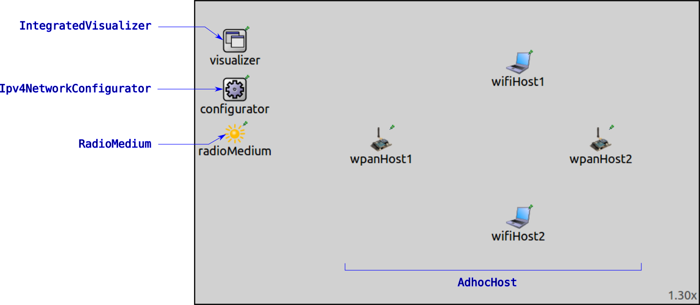
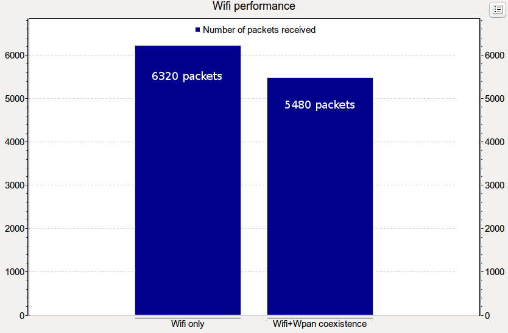
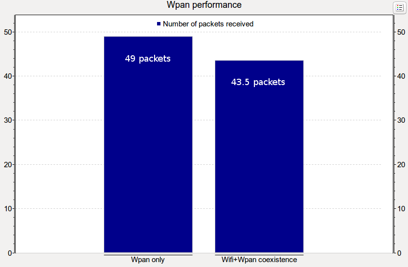
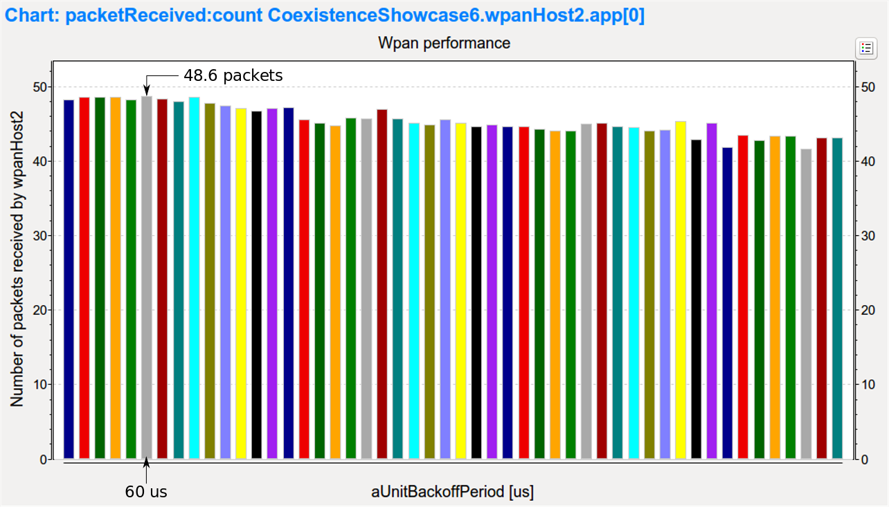
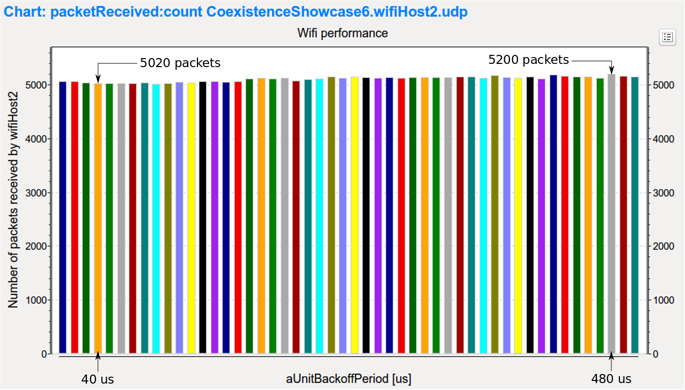
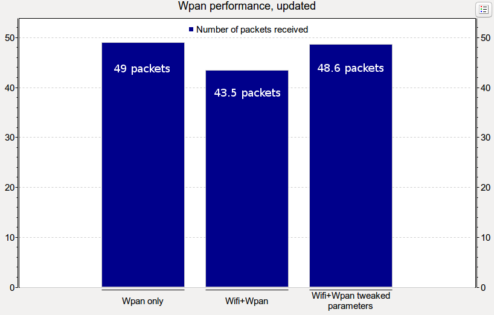
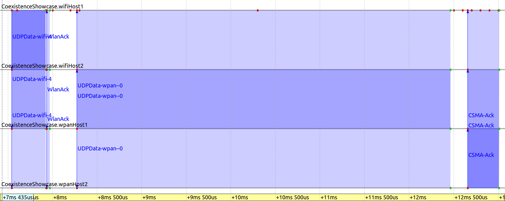

:orphan:

Coexistence of different wireless technologies in the same frequency band
=========================================================================

Goals
-----

Different wireless technologies can operate in the same frequency range.
For example, both 802.11 and 802.15.4 have versions which use the 2.4 GHz ISM band.
As the two technologies share the same wireless frequency range, their signals can interfere.

INET has support for simulating the simultaneous operation of different wireless protocols
in the same frequency band. The simulation can be used to examine how the different protocols
interact and affect each other's operation. This showcase demonstrates the coexistence
of 802.11 and 802.15.4 models, with an example simulation.

| INET version: ``4.0``
| Source files location: `inet/showcases/wireless/coexistence <https://github.com/inet-framework/inet-showcases/tree/master/wireless/coexistence>`__

The model
---------

The example simulation features a Wifi and a Wpan network close to each other. The networks contain 802.11
and 802.15.4 hosts, respectively, which communicate in the 2.4 GHz band. The signals
for the two wireless protocols have different center frequencies and bandwidths,
but the signal spectrums can overlap. We simulate a scenario where the spectrums overlap
to demonstrate the spectral coexistence of the two technologies.

As the signal center frequencies and bandwidths of the two technologies are not identical, the dimensional
analog model needs to be used. The two technologies have to share a radio medium module.
Both 802.11 and 802.15.4 have their own dimensional radio medium module types,
with slightly different parameterization by default. For simplicity, we use neither.
Instead, we use the more generic :ned:`RadioMedium` module, which is the base module
that all radio medium modules extend (including :ned:`Ieee80211DimensionalRadioMedium`
and :ned:`Ieee802154NarrowbandDimensionalRadioMedium`) by specifying its parameters.
We configure this module so that the :ned:`Ieee80211DimensionalRadio` and
:ned:`Ieee802154NarrowbandDimensionalRadio` modules can both use it.

The simulation uses the ``CoexistenceShowcase`` network, defined in :download:`CoexistenceShowcase.ned <../CoexistenceShowcase.ned>`:

The network contains four :ned:`AdhocHost`'s, a :ned:`RadioMedium`, a :ned:`Ipv4NetworkConfigurator`
and an :ned:`IntegratedVisualizer` module. Two of the hosts, ``wifiHost1`` and ``wifiHost2``,
communicate via 802.11, in adhoc mode. The other two hosts, ``wpanHost1`` and ``wpanHost2``,
communicate via 802.15.4. The four hosts are arranged in a rectangle, and all of them
are in communication range with each other.

One host in each host pair is configured to send UDP packets to the other
(``wifiHost1`` to ``wifiHost2``, and ``wpanHost1`` to ``wpanHost2``).

The radio medium module is configured to use the :ned:`DimensionalAnalogModel`.
The background noise type is set to :ned:`IsotropicDimensionalBackgroundNoise`,
with a power of -110 dBm. Here is the radio medium configuration in :download:`omnetpp.ini <../omnetpp.ini>`:

.. literalinclude:: ../omnetpp.ini
   :start-at: radioMedium.analogModel.typename
   :end-at: radioMedium.backgroundNoise.power
   :language: ini

The Wifi hosts are configured to have :ned:`Ieee80211DimensionalRadio`. The default signal shape
is not changed in the transmitter, so the radio uses a flat signal in time and frequency.
The default transmission bandwidth in the Wifi is 20 MHz. The Wifi channel is set to channel 8
(center frequency of 2452MHz), to ensure that the Wifi transmissions overlap with the 802.15.4
transmissions in frequency. Here is the configuration for the Wifi host radios in
:download:`omnetpp.ini <../omnetpp.ini>`:

.. literalinclude:: ../omnetpp.ini
   :start-at: Ieee80211DimensionalRadio
   :end-at: channelNumber
   :language: ini

The Wpan hosts are configured to have an :ned:`Ieee802154NarrowbandInterface`,
with a :ned:`Ieee802154NarrowbandDimensionalRadio`. As in the case of the Wifi hosts,
the default flat signal shape is used. By default, the center frequency is 2450 MHz,
the bandwidth is 2.8 MHz, so the Wifi and Wpan signal spectrums do overlap.
Here is the configuration for the Wpan host radios in :download:`omnetpp.ini <../omnetpp.ini>`:

.. literalinclude:: ../omnetpp.ini
   :start-at: Ieee802154NarrowbandInterface
   :end-at: Ieee802154NarrowbandDimensionalRadio
   :language: ini

The transmission power parameters for both technologies are left on default (20 mW for the Wifi and 2.24 mW for the Wpan).

The Wifi hosts operate in the default 802.11g mode (without QoS features, like shorter SIFS and TXOP).
``wifiHost1`` is configured to send a 1000-byte UDP packet to ``wifiHost2`` every 0.1 milliseconds,
corresponding to about 80 Mbps traffic. Thus the Wifi channel is completely saturated.
Here is the Wifi traffic configuration in :download:`omnetpp.ini <../omnetpp.ini>`:

.. literalinclude:: ../omnetpp.ini
   :start-at: wifiHost1.numApps = 1
   :end-at: wifiHost2.app[*].localPort = 5000
   :language: ini

``wpanHost1`` is configured to send an 88-byte UDP packet to ``wpanHost2`` every 0.1 seconds, which
is about 7 Kbps of traffic.
(the packet size is set to 88 bytes in order not to exceed the default maximum transfer unit in 802.15.4).
The Wpan traffic is significantly smaller than the Wifi traffic in this scenario.
Here is the Wpan traffic configuration in :download:`omnetpp.ini <../omnetpp.ini>`:

.. literalinclude:: ../omnetpp.ini
   :start-at: wpanHost1.numApps = 1
   :end-at: wpanHost2.app[0].localPort = 5000
   :language: ini

It is expected that there will be collisions between the different technologies,
due to the different timing parameters. Regarding channel access, the Wifi might be more dominant,
not giving the chance for Wpan to gain the channel.
As such, with the default parameters, the Wifi might starve the Wpan.
The Wpan might be wasting energy for unsuccessful transmissions.
The Wifi might overpower the Wpan, so the Wifi transmissions are received correctly even when there
is interference from the Wpan.

Results
-------

The simulation can be run by choosing the ``Coexistence`` configuration from omnepp.ini.
It looks like the following when the simulation is run:

.. video:: coexistence1.mp4
   :width: 90%
   :align: center

The hosts using the two wireless technologies detect each others' transmissions (but cannot receive them),
and this causes them to defer from transmitting. Sometimes they transmit at the same time, and the
transmissions interfere and corrupt one another.

The Wifi hosts have the MAC contention state, the Wpan hosts have the MAC state
displayed above them, using :ned:`InfoVisualizer`. At first, ``wifiHost1``
starts transmitting, sending UDP packets. (Note that the MAC contention state is IDLE while
the host is transmitting, as the MAC is not deferring or backing off.) ``wpanHost1`` wants to transmit,
so it waits in a backoff state. When the Wifi host transmits its third packet,
the Wpan host switches to Clear channel assessment (CCA) mode. It perceives
the channel as free, so it starts transmitting. ``wifiHost1`` senses the
transmission and defers from transmitting itself. ``wpanHost2`` receives
the packet correctly (indicated by both physical and data link layer activity arrows showing)
and sends an ACK, but ``wifiHost2`` starts transmitting concurrently with
the ACK, resulting in interfering transmissions. ``wifiHost2`` receives its
transmission correctly, but ``wpanHost2`` doesn't (the incorrectly received
packet is dropped, indicated by the packet drop animation). Eventually
``wpanHost1`` transmits the packet again (``wifiHost1`` defers),
and ``wpanHost2`` receives the transmission correctly. There is no
data link activity arrow, because ``wpanHost2`` already received that packet,
it just did not yet ACK it successfully. Thus it sends an ACK, which is successfully
received this time.

..  The topic of spectral coexistence is complex,
    the results in this showcase are for just this particular scenario.
    There are many variables, e.g. there might be more nodes,
    different transmission power values, different distances, etc.

Performance
-----------

We examine the performance of the two technologies by looking at the number of received UDP packets
at ``wifiHost2`` and ``wpanHost2``. Since the two wireless technologies coexist on the same
frequency band and affect each others' operation, they both take a performance hit when they operate with
high channel utilization. In this section, we look at the independent performance
of the Wifi and Wpan hosts (i.e. when there is just one of the technologies communicating),
and see how their performances change when they share the same frequency range.
Then we examine if the coexisting performance can be improved by changing some
of the MAC parameters from their defaults.

The concurrent performance data comes from the ``CoexistencePerformance`` configuration,
the independent performance data can be obtained by running the ``WifiHostsOnly``
and the ``WpanHostsOnly`` configurations in :download:`omnetpp.ini <../omnetpp.ini>`.
All of these extend the ``Coexistence`` configuration. The latter two disable either the Wifi or the Wpan
host communication by setting the number of applications to 0. The simulations are
run for five seconds, and repeated eight times:

.. literalinclude:: ../omnetpp.ini
   :start-at: CoexistencePerformance
   :end-at: wifiHost1.numApps
   :language: ini

Here are the results of the simulations:

In this particular scenario, the performance of both technologies is decreased,
by about 10 percent for Wpan and 15 percent for Wifi, when they operate concurrently in the shared frequency range.
Note that the fractional number of packets in the case of Wpan is due to
the averaging of the repetitions.

.. note::

   You can find all charts for this showcase in the ``Coexistence.anf`` and ``Coexistence_py.anf`` files.
   The two files contain the same charts, but the latter is for python based result processing using the preview releases of the upcoming OMNeT++ 6.0.

.. note::

   You can find all charts for this showcase in the ``Coexistence.anf`` file.

In the next section, we examine if the performance of both technologies
could be improved by changing some parameters of the 802.15.4 MAC.

Performance improvements
~~~~~~~~~~~~~~~~~~~~~~~~

802.11 and 802.15.4 differ in many ways. Typically, 802.11 has an emphasis on high data rate,
while 802.15.4 prioritizes energy efficiency. By default, the Wifi hosts operate
with a 24 Mbps data rate, while the Wpan hosts with 250 Kbps. Also, by default, the Wpan hosts
use longer backoff periods and longer interframe space (SIFS), making them disadvantaged when
trying to gain access to the channel. However, typically the Wpan traffic is lower than the Wifi traffic
(as is the case in our example simulation).

We change some parameters of 802.15.4 MAC to make the Wpan hosts less disadvantaged.
Also, we run a parameter study to optimize one of the selected parameters, and examine
how these changes improve the performance of either technology.

The parameter study is defined in the ``ParameterStudy`` configuration in
:download:`omnetpp.ini <../omnetpp.ini>`:

.. literalinclude:: ../omnetpp.ini
   :start-at: ParameterStudy
   :end-at: aUnitBackoffPeriod
   :language: ini

The configuration extends the ``Coexistence`` configuration, and it is repeated eight times.
The ACK wait duration and the SIFS is lowered to values which are comparable to the 802.11 defaults.
The CCA duration is also lowered. The default backoff method in :ned:`Ieee802154NarrowbandMac`
is exponential, here we change it to linear.

.. note:: These parameter changes are for the purposes of experimentation, they're not totally realistic, e.g. CCA time and ACK wait time might be determined by the hardware.

The iterated parameter in the study is the MAC's :par:`aUnitBackoffPeriod` parameter,
which configures a base unit for the backoff duration calculations. By default,
it is 320 us. The study iterates the parameter's value from 10 to 500 us in 10 us steps.

.. note:: The simulations are repeated eight times to get smoother results, but the runtime is high,
          around 20 minutes, depending on hardware. To make the study run quicker, lower the repetition count or the sim time limit.

Here are the results for the Wpan, the optimal performance ``aUnitBackoffPeriod``
value is indicated with an arrow:

The results for the Wifi is shown on the following bar chart.
The minimum and maximum number of packets are indicated with arrows:

.. Both technologies perform about 10 percent slower when they share the channel.

After tweaking the Wpan parameters, the Wifi performance decreases even more, to about 5000 packets.
However, the results show that in this scenario, the Wifi is mostly unaffected by the iteration parameter's
value, the performance is more or less the same, around 5000 packets. However, the Wpan is
more affected by the parameter, and in the best case, it has about the same performance (48.6 packets)
as in the case where it operated without interference from the Wifi (49 packets).

The following bar charts show the number of received packets, updated with the results for the
tweaked parameters:

.. figure:: wifiperformance_updated.png
   :width: 80%
   :align: center

In general, the Wpan takes a performance hit from the Wifi because the Wifi is more likely
to win channel access, due to shorter SIFS and backoff periods. On the other hand,
when the Wpan gains channel access, it keeps the channel busy for longer than the Wifi would.
It takes about ten times as much time for the Wpan to transmit its 88-byte packet as it
takes for the Wifi to transmit its 1000-byte packet. The relative duration of transmissions of
the two technologies is illustrated with the sequence chart below. The chart shows a packet
transmission and ACK, for Wifi and Wpan, respectively. The scale is linear.

Sources: :download:`omnetpp.ini <../omnetpp.ini>`, :download:`CoexistenceShowcase.ned <../CoexistenceShowcase.ned>`

Conclusion
----------

The scenario could be more complex, with more nodes. This simulation demonstrates that
the two technologies can work alongside each other in this simple scenario.

Discussion
----------

Use `this <https://github.com/inet-framework/inet-showcases/issues/TODO>`__ page in the GitHub issue tracker for commenting on this showcase.
