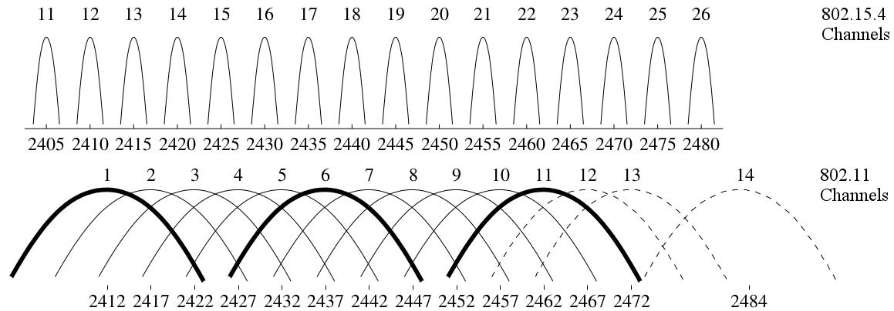
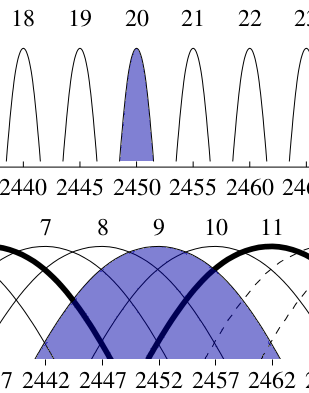
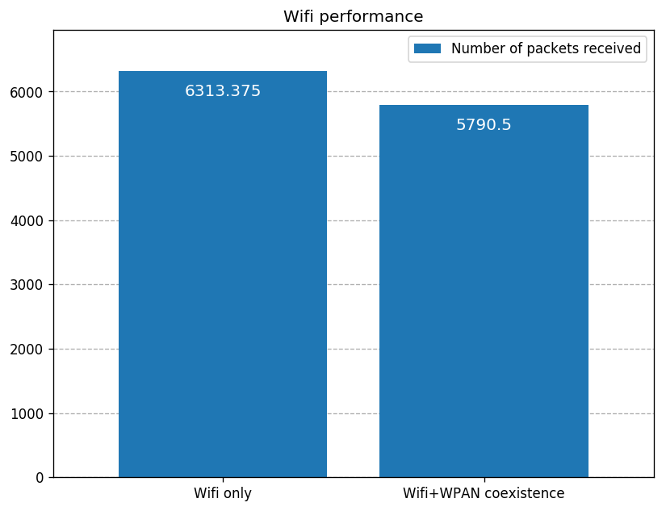
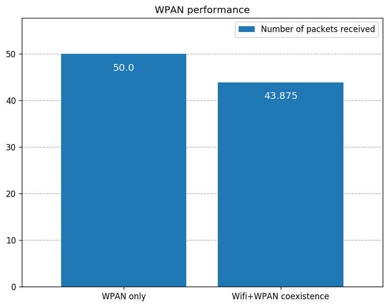

Coexistence of IEEE 802.11 and 802.15.4
=======================================

Goals
-----

Different wireless technologies sometimes operate in the same frequency range.
For example, both IEEE 802.11 and IEEE 802.15.4 have versions that use the 2.4 GHz ISM band.
As such, the signals of the two protocols can interfere (called cross-technology interference, or CTI).

INET has support for simulating CTI between any of its wireless protocol models.
Simulation can be used to examine how the different protocols
interact and affect each other's operation. This showcase demonstrates the coexistence
of INET's 802.11 and 802.15.4 models.

| INET version: ``4.1``
| Source files location: `inet/showcases/wireless/coexistence <https://github.com/inet-framework/inet-showcases/tree/master/wireless/coexistence>`__

The Model
---------

..  **Milyen problémákat vizsgálunk? balanced-e az együttműködés?**

    problémák:

    - tudunk cti-t szimulálni?
    - hogy tudunk?
    - képesek együttműködni cooperatívan?
    - mi kell hozzá?
    - balanced-e az együttműködés?
    - milyen feature-ök működnek és milyenek nem?

    - amúgy lesz egy base-line is amikor egyedül vannak és ahhoz tudjuk majd hasonlítani

We'll examine how CTI can be simulated, see if two interfering wireless technology models can cooperate, and if their cooperation is balanced. We'll run the example simulation with both 802.11 and 802.15.4 models present, and measure their performance. Also, to get a baseline of their performance, we'll run the simulation with both models, with just one of them present at a time. Then, we can compare the baseline performance of both models to their concurrent performance.

The example simulation features a Wifi (802.11) and a WPAN (802.15.4) network close to each other. All nodes communicate in the 2.4 GHz band. The signals
for the two wireless protocols have different center frequencies and bandwidths,
but the signal spectrums can overlap. In this showcase, we will configure the two networks to actually use overlapping channels. The channel spectrums for both technologies are shown on the following image:

.. .. figure:: channels/channels2.png
      :width: 100%
      :align: center

.. #how do the signals overlap?

For the WPAN, we'll use INET's 802.15.4 narrowband version, in which transmissions have a 2450 MHz carrier frequency and a 2.8 MHz bandwidth by default. For the Wifi, we'll use 802.11g, in which transmissions have a 20 MHz bandwidth. We'll leave the frequency and bandwidth of 802.15.4 on default, and we'll use Wifi Channel 9 (center frequency of 2452 MHz) so that the Wifi and WPAN transmission spectrums overlap:

.. As the signal center frequencies and bandwidths of the 802.11 and 802.15.4 models are not identical,
   the dimensional analog model needs to be used. The dimensional analog model is able to represent
   signal strength in the function of frequency (as opposed to the
   scalar analog model, which only stores one center frequency and a bandwidth), so it is
   better suited for our study. TODO due to the limitation of the scalar analog model

.. As the signal center frequencies and bandwidths of the 802.11 and 802.15.4 models are not identical,
   the dimensional analog model needs to be used instead of the scalar analog model, due to a limitation of the latter. With the scalar analog model, signal strength can change in time, but it has a constant center frequency and bandwidth. With the dimensional analog model, the signal strength can change in time and frequency.
   The dimensional analog model has more computational cost, but it can model the interference of signals with partially overlapping spectrums.

.. #how can that be simulated?

.. **TODO: what is an analog model?**

In INET, a radio signal, as a physical phenomenon, is represented by the analog model while it is being transmitted, propagated, and received.
As the signal center frequencies and bandwidths of the 802.11 and 802.15.4 models are not identical,
the dimensional analog model needs to be used, instead of the scalar analog model. The scalar analog model represents signals with a scalar signal power, and a constant center frequency and bandwidth. The scalar model can only handle situations when the spectrums of two concurrent signals are identical or don't overlap at all. When using the dimensional analog model, signal power can change in both time and frequency. This model is also able to calculate the interference of signals whose spectrums partially overlap.

.. #whats a radio medium module?

In order for the signals of Wifi and WPAN to interfere,
the two networks have to share a radio medium module instance.
The radio medium module keeps track of transmitters, receivers, transmissions and noise on the network, and computes signal and noise power at reception. The radio medium module has several submodules, such as signal propagation, path loss, background noise, and analog signal representation modules.
(For more information, read the :doc:`corresponding section </users-guide/ch-transmission-medium>` in the INET User's Guide.)

.. **TODO: this seems unfinished**

The standard radio medium module in INET is :ned:`RadioMedium`. Wireless protocols in INET (such as 802.11 or 802.15.4) often have their own radio module types (e.g. :ned:`Ieee80211DimensionalRadioMedium`), but these modules are actually :ned:`RadioMedium`, just with different default parameterizations (each parameterized for its typical use case).
For example, they might have different defaults for path loss type, background noise power, or analog signal representation type.
However, setting these radio medium parameters are not required for the simulation to work. Most of the time, one could just use RadioMedium with its default parameters (with the exception of setting the analog signal representation type to dimensional when simulating CTI).

For our simulation, we'll use :ned:`RadioMedium`. Since we'll have two different protocols, the analog model and the background noise of the radio medium and the protocol specific radios need to match (they need to be dimensional).
We'll set just these two parameters, and leave the others on default.

..   **keywords/pointers:**

    | milyen problémákat vizsgálunk?
    | működik-e ha cti van?
    | ha van backoff és cca akkor tudnak együttműködni (miért?).
    | timing paraméterek, a contention-t a wifi nyeri.
    | TUDNAK-E EGYÜTTMŰKÖDNI, BALANCED-E AZ EGYÜTTMŰKÖDÉS?
    | issue-k a coexistence-el (aminek utána lehet nézni).
    | ack előtt nincs cca egyik technológiánál sem.
    | nem ismerik egymás timing paramétereit -> kiüthetik egymás ack-jait.

.. V1 In INET, 802.11 and 802.15.4 radios can detect each other's transmissions, but can only receive their own **rephrase**. Transmissions belonging to the other technology appear as noise. Both technologies employ the Clear Channel Assessment (CCA) technique (they listen to the channel to make sure there are no ongoing transmissions before starting to transmit), and defer from transmitting when the channel is busy (backoff). The use of CCA and backoff enables the two technologies to coexist cooperatively.

.. V2

.. #how do they coexist? whats needed for coexistence?

In INET, different types of radio modules (e.g. 802.11 and 802.15.4) can detect each other's transmissions, but can only receive transmissions of their own type. Transmissions belonging to the other technology appear to receivers as noise. However, this noise can be strong enough to make a node defer from transmitting. As such, the fact that a radio treats transmissions it cannot receive as noise is the mechanism that allows any wireless protocol models to interfere with each other.

.. **TODO? this is the basis of coexistence...they just detect each other's transmissions as noise -> not sure its needed**

In reality and INET, both 802.11 and 802.15.4 employ the Clear Channel Assessment (CCA) technique (they listen to the channel to make sure there are no ongoing transmissions before starting to transmit) and defer from transmitting for the duration of a backoff period when the channel is busy. The use of CCA and backoff enables the two technologies to coexist cooperatively (both of them can communicate successfully), as opposed to destructively (they ruin each other's communication). In our case, the nodes of the different technologies sense when the other kind is transmitting, and tend not to interrupt each other.

.. **TODO: what is cooperative and destructive?**

Here are some duration values in the example simulation, for both 802.11 and 802.15.4 (sending 1000B application packets with 24 Mbps, and 88B application packets with 250 kbps, respectively):

+--------------+----------+-----------+
|              | 802.11   | 802.15.4  |
+==============+==========+===========+
| Data         | 382 us   | 4192 us   |
+--------------+----------+-----------+
| SIFS         | 10 us    | 192 us    |
+--------------+----------+-----------+
| ACK          | 34 us    | 352 us    |
+--------------+----------+-----------+
| Backoff (avg)| 600 us   | 1200 us   |
+--------------+----------+-----------+

An 802.15.4 data frame transmission takes about ten times more than an 802.11 one, even though the payload is about ten times smaller.
The SIFS and ack together are also about ten times longer in 802.15.4. The relative duration of transmissions of
the Wifi and the WPAN is illustrated with the sequence chart below. The chart shows a packet
transmission and ACK, first for the Wifi and then for the WPAN. The scale is linear.

.. figure:: seqchart.png
   :width: 100%
   :align: center

.. **TODO: collision**

.. TODO: specifically if you want to simulate cti -> so by default, the radio medium works out of the box -> for cti, it needs to have the same analog model and background noise as the radios of the protocols

.. #doesn't 802.11 and 802.15.4 has their own radio medium modules?

.. Both 802.11 and 802.15.4 have their own dimensional radio medium module types,
   but they are actually both :ned:`RadioMedium`, just with different parameterizations (each parameterized for its typical use case). For example, they both set a carrier frequency for MediumLimitCache. MediumLimitCache optimizes simulations by limiting the reception computation to signals with certain properties, e.g. a certain minimum reception power. Signals outside these limits are considered unreceivable.

.. TODO more on this...typical parameterization

.. For our simulation, we'll use :ned:`RadioMedium`, and configure it so that it suits both the Wifi and the WPAN.

.. The radio medium modules for 802.11 and 802.15.4 are actually both :ned:`RadioMedium`, just with different parameterizations

.. **TODO** However, ACKs are not protected.

.. **TODO rewrite the beginning**

Transmissions are protected within a particular wireless technology, i.e. nodes receiving a data frame can infer how long the transmission of the data frame and the subsequent ACK will be, from the data frame's MAC header. They assume the channel is busy for the duration of the DATA + SIFS + ACK (thus they don't start transmitting during the SIFS). However, this protection mechanism doesn't work with the transmissions of other technologies, since nodes cannot receive and make sense of the MAC header. They just detect some signal power in the channel that makes them defer for the duration of a backoff period (but this duration is independent of the actual duration of the ongoing transmission). Also, neither technology performs CCA before sending an ack. Thus they are susceptible for transmitting into each others' ACKs, which can lead to more retransmissions.

.. **TODO** Hidden node protection doesn't work

Also, the hidden node protection mechanism in 802.11 relies on the successful reception of RTS and CTS frames, so hidden node protection might not work in a multi-technology wireless environment.

Configuration
~~~~~~~~~~~~~

The simulation uses the ``CoexistenceShowcase`` network, defined in :download:`CoexistenceShowcase.ned <../CoexistenceShowcase.ned>`:

.. figure:: network2.png
   :width: 100%
   :align: center

The network contains four :ned:`AdhocHost`'s. Two of the hosts, ``wifiHost1`` and ``wifiHost2``,
communicate via 802.11, in ad hoc mode. The other two hosts, ``wpanHost1`` and ``wpanHost2``,
communicate via 802.15.4. The four hosts are arranged in a rectangle, and all of them
are in communication range with each other (corresponding hosts are 20 meters apart).
One host in each host pair sends frames to the other
(``wifiHost1`` to ``wifiHost2``, and ``wpanHost1`` to ``wpanHost2``).

.. **TODO they are about 10 meters appart**

.. **TODO most of the settings are in the Coexistence configuration**

The simulation is defined in the ``Coexistence`` configuration in :download:`omnetpp.ini <../omnetpp.ini>`.
The radio medium module in the network is a :ned:`RadioMedium`. It is configured to use the :ned:`DimensionalAnalogModel`.
The background noise type is set to :ned:`IsotropicDimensionalBackgroundNoise`,
with a power of -110 dBm. Here is the radio medium configuration in :download:`omnetpp.ini <../omnetpp.ini>`:

.. literalinclude:: ../omnetpp.ini
   :start-at: radioMedium.analogModel.typename
   :end-at: radioMedium.backgroundNoise.power
   :language: ini

.. **TODO: wifi channel number offset**

The Wifi hosts are configured to have :ned:`Ieee80211DimensionalRadio`. The default signal shape
is not changed in the transmitter, so the radio uses a flat signal in time and frequency.
The Wifi channel is set to Channel 9 (center frequency of 2452MHz) to ensure that the Wifi transmissions overlap with the 802.15.4 transmissions in frequency. Here is the configuration for the Wifi host radios in
:download:`omnetpp.ini <../omnetpp.ini>`:

.. literalinclude:: ../omnetpp.ini
   :start-at: Ieee80211DimensionalRadio
   :end-at: channelNumber
   :language: ini

.. note:: The channel number is set to 8 because in INET's 802.11 model, the channels are numbered from 0, so that this setting corresponds to Wifi Channel 9.

The WPAN hosts are configured to have an :ned:`Ieee802154NarrowbandInterface`,
with a :ned:`Ieee802154NarrowbandDimensionalRadio`. As in the case of the Wifi hosts,
the default flat signal shape is used. The default carrier frequency (2450 MHz) and bandwidth (2.8 MHz) is not changed.
Here is the configuration for the WPAN host radios in :download:`omnetpp.ini <../omnetpp.ini>`:

.. literalinclude:: ../omnetpp.ini
   :start-at: Ieee802154NarrowbandInterface
   :end-at: Ieee802154NarrowbandDimensionalRadio
   :language: ini

The transmission power parameters for both technologies are left on default (20 mW for the Wifi and 2.24 mW for the WPAN). The Wifi hosts operate in the default 802.11g mode and use the default data bitrate of 24 Mbps. The WPAN hosts use the default bitrate of 250 kbps (specified in :ned:`Ieee802154Mac`).

``wifiHost1`` is configured to send a 1000-byte UDP packet to ``wifiHost2`` every 0.4 milliseconds,
corresponding to about 20 Mbps traffic, saturating the Wifi channel.
Here is the Wifi traffic configuration in :download:`omnetpp.ini <../omnetpp.ini>`:

.. literalinclude:: ../omnetpp.ini
   :start-at: wifiHost1.numApps = 1
   :end-at: wifiHost2.app[*].localPort = 5000
   :language: ini

``wpanHost1`` is configured to send an 88-byte UDP packet to ``wpanHost2`` every 0.1 seconds, which
is about 7 Kbps of traffic
(the packet size is set to 88 bytes in order not to exceed the default maximum transfer unit in 802.15.4).
Here is the WPAN traffic configuration in :download:`omnetpp.ini <../omnetpp.ini>`:

.. literalinclude:: ../omnetpp.ini
   :start-at: wpanHost1.numApps = 1
   :end-at: wpanHost2.app[0].localPort = 5000
   :language: ini

.. TODO Wifi only and Wpan only

The independent performance data can be obtained by running the ``WifiOnly``
and the ``WpanOnly`` configurations in :download:`omnetpp.ini <../omnetpp.ini>`.
The latter two configurations extend the ``Coexistence`` configuration, and disable either the Wifi or the WPAN host communication by setting the number of applications to 0:

.. literalinclude:: ../omnetpp.ini
   :start-at: WifiOnly
   :end-at: wifiHost1.numApps
   :language: ini

In all configurations, the simulations are run for five seconds and repeated eight times.

.. TODO: the traffic configuration is...the wifi saturates the channel, the wpan occasianally has frames to transmit
   we'll see if it can do that while the wifi is constantly transmitting, and if the wifi can keep transmitting...
   we suspect that they both will be able to do their thing because of the cooperative coexistence

**TODO the Wifi saturates the channel -> is that needed?**

Results
-------

.. **EXPECTATIONS SECTION**

  (without QoS features, like shorter SIFS and TXOP). **TODO**

  The WPAN traffic is significantly smaller than the Wifi traffic in this scenario. **TODO**

  It is expected that there will be collisions between the different technologies,
  due to the different timing parameters. Regarding channel access, the Wifi might be more dominant,
  not giving the chance for WPAN to gain the channel.
  As such, with the default parameters, the Wifi might starve the WPAN.
  The WPAN might be wasting energy for unsuccessful transmissions.
  The Wifi might overpower the WPAN, so the Wifi transmissions are received correctly even when there
  is interference from the WPAN.

  - DONE It is expected that there will be collisions between the different technologies, due to the different timing parameters.
  - DONE Regarding channel access, the Wifi might be more dominant, not giving the chance for WPAN to gain the channel.
  - DONE As such, with the default parameters, the Wifi might starve the WPAN.
  - The WPAN might be wasting energy for unsuccessful transmissions.
  - DONE The Wifi might overpower the WPAN, so the Wifi transmissions are received correctly even when there is interference from the WPAN.

  **TODO: expectations here (?)**

  - different tx power (and consequences)
  - contention (and requirements for such)
  - transmissions are not protected cross technology
  - different timing parameters (and what timing parameters)
  - different transmission duration
  - hidden node protection doesnt work -> there are no hidden nodes here
  - different traffic

.. We expect that the Wifi and WPAN nodes can coexist cooperatively, as they both feature CCA and backoff. There is contention...

   It is expected that the Wifi and WPAN nodes can coexist cooperatively. Both feature CCA and backoff, so there is contention between the nodes of the two technologies. However, protection mechanisms in each don't work in the other; the transmissions are not not protected cross-technology, so as the acks. It is likely happen that they start transmitting during each others' acks. Also, there is no CCA before sending the ack in both.

   - we expect that they will be able to coexist cooperatively
   - because there is contention
   - because they use cca and backoff

.. It is expected that the Wifi and the WPAN will be able to coexist cooperatively, because there will be contention between them. However, the coexistence will degrade the performance of both, because their protection mechanisms don't work cross-technology, and it is likely that they'll start transmitting during each others' tranmissions. Also, the duration of WPAN transmissions is long compared to a Wifi one, and the WPAN might steal some air time from the Wifi. Because the Wifi waits less before accessing the channel, it is expected that the Wifi will gain channel access most of the time. However, the WPAN sends frames much less frequently, so its performance might be mostly unaffected. The Wifi's transmission power is greater than the WPAN's, so concurrent WPAN transmissions might not corrupt the Wifi frames (but the other way around). TODO rewrite

.. - there is contention
   - protection mechanisms dont work cross technology
   - longer wpan tx
   - the wifi waits less
   - the wpan sends frames less frequently
   - the wifi has greater tx power

.. V1 Since both 802.11 and 802.15.4 use CCA and backoff, there will be contention between the Wifi and WPAN hosts, though the protection mechanisms of neither technology will be effective. The Wifi hosts wait less than the WPAN hosts before accessing the channel, and the Wifi transmissions are significantly shorter than the WPAN transmissions. The WPAN host sends frames less frequently than the Wifi host.
   Also, the Wifi has significantly greater tranmission power.

There is contention between the Wifi and WPAN hosts so that it is expected that they will be able to coexist cooperatively. However, protection mechanisms don't work between the two technologies, so it is likely that they'll transmit into each other's transmissions, and the performance of both will be degraded. The Wifi host waits less than the WPAN host before accessing the channel, so it is expected that the Wifi host will gain channel access most of the time. The Wifi might even starve the WPAN.

WPAN transmissions are significantly longer than Wifi transmissions, thus, when the WPAN host does gain channel access, it'll take lots of air time from the Wifi host during the transmission of a single 802.15.4 frame. However, the WPAN host sends frames much less frequently than the Wifi host, so it can afford to wait for channel access, so that its performance might be mostly unaffected. Also, the Wifi host's transmission power is significantly greater than the WPAN host's, so that when the two transmit concurrently, the Wifi transmission might be correctly receivable, but the WPAN transmission might be corrupted.

.. Why will performance be degraded?

   - the contention without the protection mechanisms -> i.e. they dont know timings of the other -> means that its not as efficient
   - the 802.15.4 is slow, so it might steal a lot of airtime from the wifi
   - because of the timings (the wifi waits less), its expected that the wifi will gain the channel most of the time. However, the 802.15.4 has less traffic to send, so this might not affect it too much.
   - the wifi tx power is greater, so the WPAN might not corrupt the Wifi transmissions, but the other way around

  to say:

  - cooperative coexistence because there is contention -> cca and backoff
  - but there is no protection, just the backoff, which is independent. they dont have timing info -> the acks are not protected
  - the wifi might have more chance of accessing the channel because it waits less during contention
  - the wpan has low traffic, compared to the wifi...ACTUALLY do we know wpan max throughput? -> its 112 kbps -> its actually 1/16th
  - different tx power -> the wifi might be able to receive transmissions successfully during a wpan transmission -> but not the other way around -> actually, it works the other way around as well

   Different traffic, different timing, different duration. They might be able to receive the transmissions correctly (?)(is it working correctly?)

The simulation can be run by choosing the ``Coexistence`` configuration from omnepp.ini.
It looks like the following when the simulation is run:

.. TODO when running the coexistence configuration it looks like the following...

.. video:: coexistence1.mp4
   :width: 90%
   :align: center

The hosts using the two wireless technologies detect each others' transmissions (but cannot receive them),
and this causes them to defer from transmitting. Sometimes they transmit at the same time, and the
transmissions can interfere and corrupt one another.

The Wifi hosts have the MAC contention state, and the WPAN hosts have the MAC state
displayed above them, using :ned:`InfoVisualizer`. At first, ``wifiHost1``
starts transmitting, sending UDP packets. (Note that the MAC contention state is IDLE while
the host is transmitting, as the MAC is not deferring or backing off.) ``wpanHost1`` wants to transmit,
so it waits in a backoff state. When the Wifi host transmits its third packet,
the WPAN host switches to Clear channel assessment (CCA) mode. It perceives
the channel as free, so it starts transmitting. ``wifiHost1`` senses the
transmission and defers from transmitting itself. ``wpanHost2`` receives
the packet correctly (indicated by both physical and data link layer activity arrows showing)
and sends an ACK, but ``wifiHost2`` starts transmitting concurrently with
the ACK, resulting in interfering transmissions. ``wifiHost2`` receives its
transmission correctly, but ``wpanHost2`` doesn't (the incorrectly received
packet is dropped, indicated by the packet drop animation). Eventually,
``wpanHost1`` transmits the packet again (``wifiHost1`` defers),
and ``wpanHost2`` receives the transmission correctly. There is no
data link activity arrow because ``wpanHost2`` already received that packet,
it just didn't ACK it successfully yet. Thus, it sends an ACK, which is successfully
received this time.

.. **TODO is this still correct?**

   **at the first wpan frame, the wifi starts to transmit, then the WPAN, and they transmit together. the first wifi frame is incorrectly received, but the subsequent ones are correctly received, while the wpan is transmitting. then, the wpan stops transmitting during a wifi ack, and the wifi ack is incorrectly received. the wpan frame is correctly received. it also happens with the second wpan frame -> is this ok?**

..  The topic of spectral coexistence is complex,
    the results in this showcase are for just this particular scenario.
    There are many variables, e.g. there might be more nodes,
    different transmission power values, different distances, etc.

.. Performance section

We examine the performance of the two technologies by looking at the number of received UDP packets
at ``wifiHost2`` and ``wpanHost2``. We look at the independent performance
of the Wifi and WPAN hosts (i.e. when there is just one of the host pairs communicating),
and see how their performances change when both of them communicate concurrently.

.. Since the two wireless technologies coexist on the same
   frequency band and affect each others' operation, they both take a performance hit when they operate with
   high channel utilization **really?**. -> ?

.. Then we examine if the coexisting performance can be improved by changing some
   of the MAC parameters from their defaults.

Here are the performance results:

In this particular scenario, the performance of both technologies is decreased,
by about 10 percent, compared to the base performance.
Note that the fractional number of packets is due to
the averaging of the repetitions.

.. .. note::

   You can find all charts for this showcase in the ``Coexistence.anf`` and ``Coexistence_py.anf`` files.
   The two files contain the same charts, but the latter is for python based result processing using the preview releases of the upcoming OMNeT++ 6.0.

.. .. note::

   You can find all charts for this showcase in the ``Coexistence.anf`` file.

.. In the next section, we examine if the performance of both technologies
   could be improved by changing some parameters of the 802.15.4 MAC.

.. Performance improvements DELETE
   ~~~~~~~~~~~~~~~~~~~~~~~~~~~~~~~

   802.11 and 802.15.4 differ in many ways. Typically, 802.11 has an emphasis on high data rate,
   while 802.15.4 prioritizes energy efficiency. By default, the Wifi hosts operate
   with a 24 Mbps data rate, while the WPAN hosts with 250 Kbps. Also, by default, the WPAN hosts
   use longer backoff periods and longer interframe space (SIFS), making them disadvantaged when
   trying to gain access to the channel. However, typically the WPAN traffic is lower than the Wifi traffic
   (as is the case in our example simulation).

   We change some parameters of 802.15.4 MAC to make the WPAN hosts less disadvantaged.
   Also, we run a parameter study to optimize one of the selected parameters, and examine
   how these changes improve the performance of either technology.

   The parameter study is defined in the ``ParameterStudy`` configuration in
   :download:`omnetpp.ini <../omnetpp.ini>`:

   .. literalinclude:: ../omnetpp.ini
      :start-at: ParameterStudy
      :end-at: aUnitBackoffPeriod
      :language: ini

   The configuration extends the ``Coexistence`` configuration, and it is repeated eight times.
   The ACK wait duration and the SIFS is lowered to values which are comparable to the 802.11 defaults.
   The CCA duration is also lowered. The default backoff method in :ned:`Ieee802154NarrowbandMac`
   is exponential, here we change it to linear.

   .. note:: These parameter changes are for the purposes of experimentation, they're not totally realistic, e.g. CCA time and ACK wait time might be determined by the hardware.

   The iterated parameter in the study is the MAC's :par:`aUnitBackoffPeriod` parameter,
   which configures a base unit for the backoff duration calculations. By default,
   it is 320 us. The study iterates the parameter's value from 10 to 500 us in 10 us steps.

   .. note:: The simulations are repeated eight times to get smoother results, but the runtime is high,
          around 20 minutes, depending on hardware. To make the study run quicker, lower the repetition count or the sim time limit.

   Here are the results for the WPAN, the optimal performance ``aUnitBackoffPeriod``
   value is indicated with an arrow:

   .. figure:: wpan_study.png
      :width: 100%

   The results for the Wifi is shown on the following bar chart.
   The minimum and maximum number of packets are indicated with arrows:

   .. figure:: wifi_study.png
      :width: 100%

   .. Both technologies perform about 10 percent slower when they share the channel.

   After tweaking the WPAN parameters, the Wifi performance decreases even more, to about 5000 packets.
   However, the results show that in this scenario, the Wifi is mostly unaffected by the iteration parameter's
   value, the performance is more or less the same, around 5000 packets. However, the WPAN is
   more affected by the parameter, and in the best case, it has about the same performance (48.6 packets)
   as in the case where it operated without interference from the Wifi (49 packets).

   The following bar charts show the number of received packets, updated with the results for the
   tweaked parameters:

   .. figure:: wifiperformance_updated.png
      :width: 80%
      :align: center

   .. figure:: wpanperformance_updated.png
      :width: 80%
      :align: center

   In general, the WPAN takes a performance hit from the Wifi because the Wifi is more likely
   to win channel access, due to shorter SIFS and backoff periods. On the other hand,
   when the WPAN gains channel access, it keeps the channel busy for longer than the Wifi would.
   It takes about ten times as much time for the WPAN to transmit its 88-byte packet as it
   takes for the Wifi to transmit its 1000-byte packet. The relative duration of transmissions of
   the two technologies is illustrated with the sequence chart below. The chart shows a packet
   transmission and ACK, for Wifi and WPAN, respectively. The scale is linear.

   .. figure:: seqchart.png
      :width: 100%

Sources: :download:`omnetpp.ini <../omnetpp.ini>`, :download:`CoexistenceShowcase.ned <../CoexistenceShowcase.ned>`

Discussion
----------

Use `this <https://github.com/inet-framework/inet-showcases/issues/TODO>`__ page in the GitHub issue tracker for commenting on this showcase.
