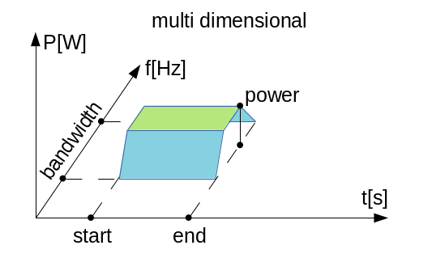

:orphan:

Crosstalk between adjacent IEEE 802.11 channels
===============================================

Goals
-----

By default, 802.11 hosts and access points in INET are configured to use
the same wifi channel (channel 1.) In reality, however, it is rarely the
case. There are many wifi networks at the same location, typically spead
out on all channels (especially in the case of 2.4 GHz wifi where there
are a low number of channels compared to 5 GHz.) Transmissions on many
adjacent channels also overlap in frequency, and can cause crosstalk
effects.

INET has support for simulating communication on the different wifi
channels, both in the 2.4 GHz and 5 GHz frequency range. This showcase
demonstrates using both overlapping and non-overlapping wifi channels in
simulations, and how transmissions on different channels interfere with
each other. It also describes the available analog signal representation
models.

This showcase divides the topic of the simulation of different wifi
channels into three cases:

-  **Completely overlapping frequency bands**: all nodes communicate on
   the same wifi channel
-  **Independent frequency bands**: nodes communicate on different
   channels that doesn't affect each other
-  **Partially overlapping frequency bands**: nodes communicate on
   adjacent channels, which interfere with each other

There is a simulation for each case in omnetpp.ini.

INET version: ``4.0``

Source files location: `inet/showcases/wireless/crosstalk <https://github.com/inet-framework/inet-showcases/tree/master/wireless/crosstalk>`__

The model
---------

Wifi channels
~~~~~~~~~~~~~

.. todo::

   draft:

   2.4 ghz wifi has 11 channels, some bandwidth data, and every 4th channel is independent in
   frequency, the others overlap. The same thing looks like how in 5 GHz.

   2.4GHz: 22MHz channel bandwidth, 3 non-overlapping channels in US (1,6,11, only 12 channels available), 4 non-overlapping channels in EU (1,5,9,13, 13 channels available, and there is a slight side-lobe overlap.)

   5GHz: 20MHz or 40MHz channel bandwidth, many non-overlapping channels.

The 2.4 GHz frequency range in 802.11g, for example, can use a limited
number of channels (13 in the EU.) The bandwidth of transmissions in
802.11g is 20MHz, and channels are spaced 5MHz apart. Thus adjacent
channels overlap, and they can suffer from crosstalk effects. There can
be a few independent channels, where there is no cross-channel
interference, e.g. channels 1, 6, and 11. Because the low number of
channels, the 2.4 GHz wifi range can be overcrowded.

Analog signal representation
~~~~~~~~~~~~~~~~~~~~~~~~~~~~

.. todo::

   There are two analog signal representation models in INET. when using scalar, the frequency
   bands either completely overlap, or not at all. The dimensional is more detailed, and it can
   simulate partially overlapping channels.

   what is it ?

   it is not just part of the radio medium but transmitters and receivers...they need to be compatible

The analog signal representation refers to how signal power is
represented physically in the time and frequency domains. The analog
signal representation is implemented by the analog models in INET. The
analog model is part of the radio medium module. INET has various analog
signal representation model types. The two main types are **scalar** and
**dimensional**. In a scalar representation, the signal is represented
by a power level that is constant in both frequency and time, and is
described by two values: a center frequency and a bandwidth. Two scalar
transmissions can only interfere if the frequency and bandwidth of two
transmission are exactly identical. Partially overlapping signals cause
an error, but completely non-overlapping signals are allowed by the
scalar model.)

For example, :ned:`Ieee80211ScalarRadioMedium` and
:ned:`Ieee80211DimensionalRadioMedium` are radio medium modules which use a
scalar and a dimensional analog model by default. These two radio medium
modules are to be used with :ned:`Ieee80211ScalarRadio` and
:ned:`Ieee80211DimensionalRadio` in hosts. (Generally, the name hints as to
which kind of analog model is used by radio medium and radio modules.)

.. figure:: scalar.png
   :width: 100%

In a dimensional representation, the signal can have a power level that
is not constant in time and frequency. The "shape" of the signal can be
specified in both time and frequency with parameters of the analog
model. The dimensional representation can accurately model signal
interference even in the case of signals that partially overlap in
frequency and bandwidth. However, dimensional analog models require more
processing power.

Example simulations
~~~~~~~~~~~~~~~~~~~

There are example simulations for the three cases outlined in the Goals
section. All simulations use variations of the same network, which is
illustrated by the image below:

.. figure:: basenetwork.png
   :width: 100%

The networks contains four ``adhocHost``\ s, named ``host1`` to
``host4``. The networks also contains an :ned:`Ipv4NetworkConfigurator`
module, an :ned:`IntegratedVisualizer` module, and radioMedium module(s).
The number and type of the radio medium modules varies in the networks
for the different simulations, either containing one or two. All hosts
are within communication range of each other. The hosts are arranged in
a rectangle, and each host is configured to send UDP packets to the host
on the far side of the rectangle (i.e. ``host1`` to ``host2``, and
``host3`` to ``host4``.) The configuration keys common to all
simulations, specifying e.g. traffic generation and visualization, are
defined in the ``General`` configuration.

Nodes on same wifi channel (completely overlapping frequency bands)
~~~~~~~~~~~~~~~~~~~~~~~~~~~~~~~~~~~~~~~~~~~~~~~~~~~~~~~~~~~~~~~~~~~

.. todo::

   the configuration for the certain simulation and about the scalar/dimensional models and results

The simulation for this case demonstrates the hosts communicating on the
same wifi channel, the default channel 1. The simulation can be run by
selecting the ``CompletelyOverlappingFrequencyBands`` configuration from
the ini file. Since the frequency and bandwidth of transmissions for all
hosts is exactly the same, inferring which transmissions interfere is
trivial (all of them). In this case a scalar analog model is sufficient.
The following video shows the node-pairs communicating:

.. video:: overlapping1.mp4
  :width: 698

   <!--internal video recording, animation speed none, playback speed 0.59, zoom 1.69, display message name and message class off, run until #141-->

At first the two source nodes, ``host1`` and ``host3``, start
transmitting at the same time. The transmissions collide, and neither
destination host is able to receive any of them correctly. The collision
avoidance mechanism takes effect, and ``host3`` wins channel access.
Both nodes can transmit their data succesfully after one another.

.. todo::

   transmissions are "sent" to all nodes

Nodes on non-overlapping wifi channels (independent frequency bands)
~~~~~~~~~~~~~~~~~~~~~~~~~~~~~~~~~~~~~~~~~~~~~~~~~~~~~~~~~~~~~~~~~~~~

In this case, we are modeling host-pairs that are communicating on
different, non-overlapping wifi channels (e.g. channels 1 and 6.) Since
the channels are independent, it is trivial that there won't be any
interference. The scalar analog model is sufficient for this case.

.. todo::

   This case is demonstrated by two example simulations. In the first one, the
   hosts are using one scalar radio medium, and in the second one each pair of
   hosts is on a different radio medium.

In the first configuration for this case, the hosts use the same radio
medium module. The simulation can be run by choosing the
``IndependentFrequencyBandsOneScalarRadioMediumModule`` configuration
from the ini file. The video below shows the hosts communicating:

.. video:: independent2.mp4
  :width: 698

   <!--internal video recoding, animation speed none, playback speed 0.59, zoom 1.69, display message name and message class off, run until #159-->

Since host-pairs communicate on independent channels, there is no
interference. ``host1`` and ``host3`` can transmit simultaneously, and
their transmissions are correctly receivable by both destination hosts.
Note that all transmissions are sent to all hosts by the radio medium
module.

In the above, it was trivial that ``host4`` cannot receive ``host1``'s
transmissions, just as ``host2`` cannot receive ``host3``'s
transmissions. Yet the radio medium module sent all transmissions to all
hosts, where the radio module decided that some of the transmissions
cannot be received because the host's receiver is set to a different
channel.

The simulation can be optimized by ommiting these unnecessary message
sends by the radio medium, by using two radio medium modules and placing
the trivially non-interfering host-pairs on a different radio medium.

.. todo:: it scales better

The second example simulation demonstrates the use of two radio medium
modules to optimize the simulation. The simulation can be run by
choosing the ``IndependentFrequencyBandsTwoScalarRadioMediumModules``
configuration from the ini file. The following video shows the
host-pairs communicating:

.. video:: independent_2radiomediums1.mp4
  :width: 698

   <!--internal video recording, animation speed none, playback speed 0.59, zoom 1.69, display message name and message class off, run until #129-->

Notice that there are only message sends between hosts on the same
channel.

Nodes on adjacent wifi channels (partially overlapping frequency bands)
~~~~~~~~~~~~~~~~~~~~~~~~~~~~~~~~~~~~~~~~~~~~~~~~~~~~~~~~~~~~~~~~~~~~~~~

.. todo::

   by default, the dimensional signal shapes are the same as the
   scalar but it is more accurately simulated -> partially overlapping
   transmissions can be simulated

   this should be done from the angle of wifi channels

   so it would be nodes on the same wifi channel

   nodes on independent wifi channels

   nodes on adjacent wifi channels
