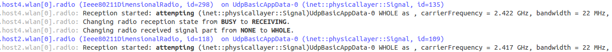

:orphan:

Crosstalk between adjacent IEEE 802.11 channels
===============================================

Goals
-----

By default, 802.11 hosts and access points in INET are configured to use
the same Wifi channel (channel 1.) In reality, however, it is rarely the
case. There are many Wifi networks at the same location, typically spread
out on all channels (especially in the case of 2.4 GHz Wifi where there
are a low number of channels compared to 5 GHz.) Transmissions on many
adjacent channels also overlap in frequency and can cause crosstalk
effects.

INET has support for simulating communication on the different Wifi
channels, both in the 2.4 GHz and 5 GHz frequency range. This showcase
demonstrates using both overlapping and non-overlapping Wifi channels in
simulations, and how transmissions on different channels interfere with
each other. It also describes the available analog signal representation
models.

This showcase divides the topic of the simulation of different Wifi
channels into three cases:

-  **Completely overlapping frequency bands**: all nodes communicate on
   the same Wifi channel
-  **Independent frequency bands**: nodes communicate on different
   channels that don't affect each other
-  **Partially overlapping frequency bands**: nodes communicate on
   adjacent channels, which interfere with each other

There is a simulation for each case in omnetpp.ini.

| INET version: ``4.0``
| Source files location: `inet/showcases/wireless/crosstalk <https://github.com/inet-framework/inet-showcases/tree/master/wireless/crosstalk>`__

The model
---------

Wifi channels
~~~~~~~~~~~~~

The 2.4 GHz frequency range in 802.11g, for example, can use a limited
number of channels (13 in the EU.) The bandwidth of transmissions in
802.11g is 20MHz, and channels are spaced 5MHz apart. Thus adjacent
channels overlap, and they can suffer from crosstalk effects. There can
be a few independent channels, where there is no cross-channel
interference, e.g. channels 1, 6, and 11. Because the low number of
channels, the 2.4 GHz Wifi range can be overcrowded.

Analog signal representation
~~~~~~~~~~~~~~~~~~~~~~~~~~~~

The analog signal representation refers to how signal power is
represented physically in the time and frequency domains. The analog
signal representation is implemented by the analog models in INET. The
analog model is part of the radio medium module. INET has various analog
signal representation model types; the main ones are **scalar** and
**dimensional**. In a scalar representation, the signal is represented
by a power level that is constant in both frequency and time, and is
described by two values: a center frequency and a bandwidth. Two scalar
transmissions can only interfere if the frequency and bandwidth of two
transmissions are exactly identical. Partially overlapping signals cause
an error, but completely non-overlapping signals are allowed by the
scalar model.

.. figure:: scalar.png
   :width: 60%
   :align: center

In a dimensional representation, the signal can have a power level that
is not constant in time and frequency. The "shape" of the signal can be
specified in both time and frequency with parameters of the analog
model. The dimensional representation can accurately model signal
interference even in the case of signals that partially overlap in
frequency and bandwidth. However, dimensional analog models require more
processing power.

.. figure:: dimensional.png
   :width: 60%
   :align: center

For example, :ned:`Ieee80211ScalarRadioMedium` and
:ned:`Ieee80211DimensionalRadioMedium` are radio medium modules that use a
scalar and a dimensional analog model by default. These two radio medium
modules are to be used with :ned:`Ieee80211ScalarRadio` and
:ned:`Ieee80211DimensionalRadio` in hosts. (Generally, the name hints as to
which kind of analog model is used by radio medium and radio modules.)

Dimensional transmitters have parameters that control the shape of the
signal in the frequency and time domains. The :par:`dimensions` parameter
controls the dimensions along which power is represented. The parameter's
value is either ``"time"``, ``"frequency"``, or ``"time frequency"`` (default).
Furthermore, the shape of the signal is specified by the :par:`timeGains` and
:par:`frequencyGains` parameters. These two parameters take a sequence of
time and gain value pairs. The default for both parameters is ``"0% 0dB 100% 0dB"``,
which results in a flat signal. The flat signal is constant in time and frequency,
just as with the scalar signal representation, but the dimensional model can be
used to calculate interference, as opposed to the scalar representation.
The interpolation mode for the gain parameters is controlled by the
:par:`interpolationMode` parameter; it is either ``"linear"`` or
``"sample-hold"`` (default).

Example simulations
~~~~~~~~~~~~~~~~~~~

There are example simulations for the three cases outlined in the Goals
section. All simulations use variations of the same network, which is
illustrated by the image below:

.. figure:: basenetwork.png
   :width: 80%
   :align: center

The networks contain four :ned:`AdhocHost`'s, named ``host1`` to
``host4``. The networks also contain an :ned:`Ipv4NetworkConfigurator`
module, an :ned:`IntegratedVisualizer` module, and radio medium module(s).
The number and type of the radio medium modules vary in the networks
for the different simulations, either containing one or two. All hosts
are within communication range of each other. The hosts are arranged in
a rectangle, and each host is configured to send UDP packets to the host
on the far side of the rectangle (i.e. ``host1`` to ``host2``, and
``host3`` to ``host4``.) The configuration keys common to all
simulations, specifying e.g. traffic generation and visualization, are
defined in the ``General`` configuration in :download:`omnetpp.ini <../omnetpp.ini>`.

Nodes on same Wifi channel (completely overlapping frequency bands)
~~~~~~~~~~~~~~~~~~~~~~~~~~~~~~~~~~~~~~~~~~~~~~~~~~~~~~~~~~~~~~~~~~~

The simulation for this case demonstrates the hosts communicating on the
same Wifi channel, the default channel 1. The simulation can be run by
selecting the ``CompletelyOverlappingFrequencyBands`` configuration from
the ini file. The configuration doesn't specify anything beyond the keys
of the ``General`` configuration, so it's empty:

.. literalinclude:: ../omnetpp.ini
   :start-at: CompletelyOverlappingFrequencyBands
   :end-before: IndependentFrequencyBandsOneScalarRadioMediumModule
   :language: ini

Since the frequency and bandwidth of transmissions for all
hosts is exactly the same, inferring which transmissions interfere is
obvious (all of them). In this case, a scalar analog model is sufficient.
The following video shows the node-pairs communicating, the number of
sent/received packets is displayed above the nodes, as well as the state
of the contention modules of the transmitting hosts.

.. video:: overlapping1.mp4
  :width: 90%
  :align: center

   <!--internal video recording, animation speed none, playback speed 0.59, zoom 1.69, display message name and message class off, run until #141-->

At first the two source nodes, ``host1`` and ``host3``, start
transmitting at the same time. The transmissions collide, and neither
destination host is able to receive any of them correctly. The collision
avoidance mechanism takes effect, and ``host3`` wins channel access.
Both nodes can transmit their data successfully after one another.

Nodes on non-overlapping Wifi channels (independent frequency bands)
~~~~~~~~~~~~~~~~~~~~~~~~~~~~~~~~~~~~~~~~~~~~~~~~~~~~~~~~~~~~~~~~~~~~

In this case, we are modeling host-pairs that are communicating on
different, non-overlapping Wifi channels (e.g. channels 1 and 6.) Since
the channels are independent, it is obvious that there won't be any
interference. The scalar analog model is sufficient for this case.

In the first configuration for this case, the hosts use the same radio
medium module. The simulation can be run by choosing the
``IndependentFrequencyBandsOneScalarRadioMediumModule`` configuration
from the ini file. The radios of the two host pairs are set to use non-overlapping channels:

.. literalinclude:: ../omnetpp.ini
   :start-at: IndependentFrequencyBandsOneScalarRadioMediumModule
   :end-at: 6
   :language: ini

The video below shows the hosts communicating:

.. video:: independent2.mp4
  :width: 90%
  :align: center

   <!--internal video recoding, animation speed none, playback speed 0.59, zoom 1.69, display message name and message class off, run until #159-->

Since host-pairs communicate on independent channels, there is no
interference. ``host1`` and ``host3`` can transmit simultaneously, and
their transmissions are correctly receivable by both destination hosts.
Note that all transmissions are sent to all hosts by the radio medium
module.

As they transmit/receive on different, non-interfering channels, it is obvious that ``host4`` cannot receive ``host1``'s
transmissions, just as ``host2`` cannot receive ``host3``'s
transmissions. Yet the radio medium module sent all transmissions to all
hosts, where the radio module decided that some of the transmissions
cannot be received because the host's receiver is set to a different
channel.

The simulation can be optimized by omitting these unnecessary message
sends by the radio medium, by using two radio medium modules and configuring
the obviously non-interfering host-pairs to use different radio mediums.
By using two radio medium modules, the simulation scales better as the number of nodes increases.

The second example simulation demonstrates the use of two radio medium
modules to optimize the simulation. The simulation can be run by
choosing the ``IndependentFrequencyBandsTwoScalarRadioMediumModules``
configuration from the ini file:

.. literalinclude:: ../omnetpp.ini
   :start-at: IndependentFrequencyBandsTwoScalarRadioMediumModules
   :end-at: 6
   :language: ini

Here, the radios of each host pair are set to use one of the two radio medium modules
(by default, radios use the one named ``radioMedium``).
(Also, the non-overlapping channels are configured,
but from the perspective of interference, it doesn't make any difference,
as the use of two radio modules prevents interference anyway.)

The following video shows the
host-pairs communicating:

.. video:: independent_2radiomediums1.mp4
  :width: 90%
  :align: center

   <!--internal video recording, animation speed none, playback speed 0.59, zoom 1.69, display message name and message class off, run until #129-->

The host pairs communicate without interference.
Notice that there are only message sends between hosts using the same radio medium module.

Nodes on adjacent Wifi channels (partially overlapping frequency bands)
~~~~~~~~~~~~~~~~~~~~~~~~~~~~~~~~~~~~~~~~~~~~~~~~~~~~~~~~~~~~~~~~~~~~~~~

In this case, the host pairs communicate on different Wifi channels, which overlap in frequency.
The scalar analog model is insufficient to simulate partially overlapping channels,
thus we use the dimensional analog model.
The example simulation for this case uses the ``CrosstalkShowcasePartiallyOverlappingFrequencyBands``
network, which contains a :ned:`Ieee80211DimensionalRadioMedium` module.
The simulation is specified in the ``PartiallyOverlappingFrequencyBands`` configuration in omnetpp.ini:

.. literalinclude:: ../omnetpp.ini
   :start-at: PartiallyOverlappingFrequencyBands
   :end-at: host{3..4}
   :language: ini

The hosts are configured to have :ned:`Ieee80211DimensionalRadio` modules.
The host pairs are set to adjacent Wifi channels 1 and 2.

The following video shows the host pairs communicating:

.. video:: partial2.mp4
   :width: 90%
   :align: center

.. internal video recording, animation speed none, playback speed 1, zoom 1.69

Here is an excerpt from the log, showing a transmission of ``host1`` and ``host3``,
as being received by ``host2`` and ``host4``. The two transmissions have a different center frequency:

Even though they are on different channels, the transmissions interfere.
In the beginning, ``host1`` and ``host3`` transmit simultaneously,
and neither transmission can be successfully received.
Due to the collision avoidance mechanism, one of the transmitting hosts
defer from transmitting, and the subsequent transmissions are successful.

Sources: :download:`omnetpp.ini <../omnetpp.ini>`, :download:`Crosstalk.ned <../Crosstalk.ned>`

Discussion
----------

Use `this
page <https://github.com/inet-framework/inet-showcases/issues/TODO>`__ in
the GitHub issue tracker for commenting on this showcase.
