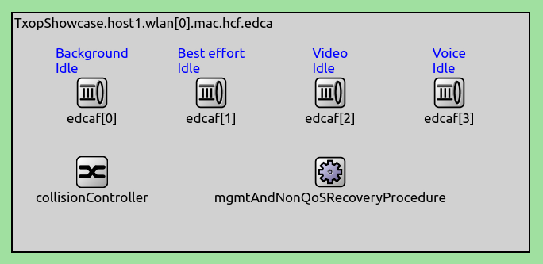
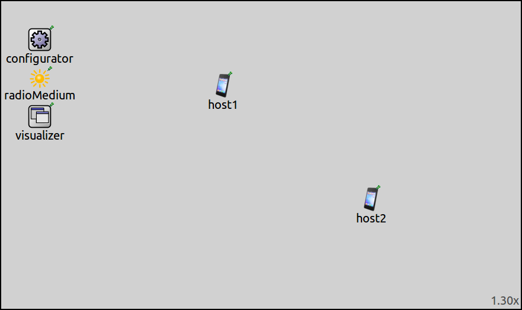
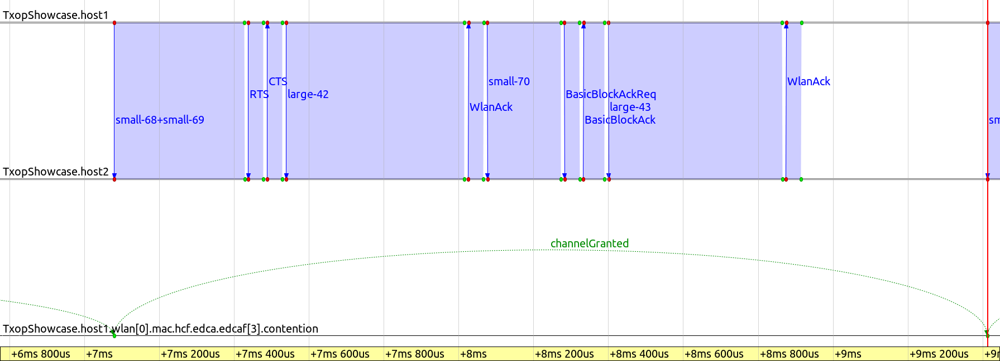

:orphan:

IEEE 802.11 Transmit Opportunity
================================

Goals
-----

.. The transmit opportunity (TXOP) is an EDCA feature. It provides contention free access for a limited
   time, for high priority access categories. It increases throughput, mainly. Also, reduces delay because
   of the lack of contention. Couple it with aggregation and block ack for even better performance.

Transmit opportunity (TXOP) is a MAC feature in 802.11, which increases throughput for high priority data, by providing contention-free channel access for a limited time.

This showcase demonstrates frame exchanges during a TXOP.

| INET version: ``4.0``
| Source files location: `inet/showcases/wireless/txop <https://github.com/inet-framework/inet-showcases/tree/master/wireless/txop>`__

About TXOP
----------

.. -txop is a period of contention free access
   -its for just one access category
   -its signaled in the header?
   -its independent of the block ack -> so the txop and the block ack block is independent
   -it can be over sooner (is it signaled that its over ?)
   -there is no contention so there is no backoff period...its faster
   -its for high priority data...in hcf...video and voice
   -the default values
   -it can contain any frames that are normally sent. its just that there is no contention for the duration of the txop
   -how does it work? when a sender gains channel access, and it wants to transmit high priority frames, it doesn't back off after the first frame, but it keeps sending frames, while inside the txop limit

   -how is it in inet...its automatic i guess, but the default values can be overriden -> but where
   -there is nothing to do...except that the txop is hcf only
   -so if qosStation = true, then its gonna be txop? even if it has just one frame to send ?

   -the model
   -results

   so:

   -txop is contention free access for an access category

.. Transmit opportunity (TXOP) increases throughput, by providing a sender contention free access to the channel, for a limited period. TXOP is part of Enhanced Distributed Channel Access (EDCA) technique,

.. TXOP is part of the Enhanced Distributed Channel Access (EDCA) technique, and it provides contention-free channel access to QoS frames belonging to the video and voice access categories. During a TXOP, packets

.. TXOP provides contention free channel access for a limited duration, when a station can send data belonging to a particular access category.

.. During TXOP, a station can send any data belonging to a particular access category, as long as it doesn't exceed the TXOP limit for that access category.

.. TXOP is a HCF/EDCA feature, thus it works with QoS data frames.
   During a TXOP, a station can send any data belonging to a particular access category, without contention, while not exceeding the TXOP limit. Essentially, access categories have their own channel access rules, such as the AIFS (how much to wait before accessing the channel), min and max contention window size, and the TXOP limit.
   Actually, video and voice priority packets can be sent during a TXOP, as for the best effort and background priorities, the TXOP limit is 0. This means that they can send just one MSDU before contending for channel access again. Also, the AIFS is lower for the higher priority packets (i.e. the MAC waits less before sending them). So higher priority packets are more likely to be sent and they are sent more quickly (?).

   what i wanna say here

   - some stations can send packets of a particular access category without contention, making sure not to exceed the TXOP limit (which is a time limit for the TXOP).
   - this mechanism works for QoS data frames. TODO other frames can be sent in a txop, they are just the main thing/the payload
   - actually, the different categories have their own rules for channel access, such as different values for aifs, contention window size, and TXOP limit. these values are such that higher priority packets are favored (the mac waits less, shorter contention window, they can utilize a txop)
   - the txop limit for the best effort and background is 0, meaning they can only send just one MSDU before contending for channel access again.

   by default the TXOP limit...

   there is nothing to configure

.. During a TXOP, a station can send packets of a particular access category without contention, making sure not to exceed the TXOP limit (a time limit for the TXOP).

   - this mechanism works for QoS data frames. TODO other frames can be sent in a txop, they are just the main thing/the payload
   - actually, the different categories have their own rules for channel access, such as different values for aifs, contention window size, and TXOP limit. these values are such that higher priority packets are favored (the mac waits less, shorter contention window, they can utilize a txop)
   - the txop limit for the best effort and background is 0, meaning they can only send just one MSDU before contending for channel access again.

A TXOP is a limited time period, during which a station can send multiple packets belonging to a certain access category, contention-free. The use of TXOP increases the throughput of QoS data frames (it's an HCF-only feature), although other frames, such as ACKs, can be sent during the TXOP as well. By default, only packets belonging to video and voice priority access categories can use TXOP.

More precisely, all access categories have their own rules for channel access, such as different values for AIFS, contention window size, and TXOP limit. By default, these values are set so that higher priority packets are favored (the MAC waits less before sending them, the contention window is smaller, and they can utilize TXOP). By default, the TXOP limit for the video category is 3 ms, for the voice category 1.5 ms. The background and best effort categories have a TXOP limit of 0, meaning they can send just one MSDU before having to contend for channel access again.

When a station has a high priority packet to send, and it gains channel access, the station can keep transmitting packets without backoff periods until the end of the TXOP. The recipients can ACK the packets. **...during the txop**

In INET, the TXOP is automatically used with high priority packets when using HCF (``qosStation = true`` in the MAC). The TXOP limit can be set by the :par:`txopLimit` parameter in :ned:`TxopProcedure`. It is located at ``hcf.edca.edcaf[*].txopProcedure`` in the module hierarchy; there are four ``edcaf`` modules for the four access categories:

The default value for the :par:`txopLimit` parameter is ``-1``, meaning the default protocol values are used. The contention states of the different access categories are shown in the ``edcaf`` modules' display strings.

The Model
---------

In the example simulation, one host sends video priority UDP packets to the other. The simulation demonstrates frame exchanges of different packets during a TXOP, such as normal data frames, aggregate frames, RTS, CTS, acks, and block acks. It uses the following network:

It contains two :ned:`AdhocHost` modules, an :ned:`Ipv4NetworkConfigurator`,
an :ned:`Ieee80211ScalarRadioMedium` and an :ned:`IntegratedVisualizer` module.

There is just one configuration in omnetpp.ini, the ``General`` config.
One of the hosts, ``host1``, sends UDP packets to ``host2``. There are two UDP apps in ``host1``, sending small (1200B) and large (alternating 3400B and 3500B) packets:

.. literalinclude:: ../omnetpp.ini
   :start-at: host1.numApps
   :end-at: localPort = 2000
   :language: ini

The QoS settings are the following:

.. literalinclude:: ../omnetpp.ini
   :start-at: qosStation
   :end-at: udpPortUpMap
   :language: ini

QoS is enabled in both hosts, and a classifier is included. The port numbers in the classifier are configured to put all UDP packets in the voice access category.

IP and 802.11 fragmentation is turned off:

.. literalinclude:: ../omnetpp.ini
   :start-at: mtu
   :end-at: fragmentationThreshold
   :language: ini

Block acks are enabled:

.. literalinclude:: ../omnetpp.ini
   :start-at: isBlockAckSupported
   :end-at: isBlockAckSupported
   :language: ini

The aggregation, RTS, and block ack thresholds are set:

.. literalinclude:: ../omnetpp.ini
   :start-at: maxAMsduSize
   :end-at: maxBlockAckPolicyFrameLength
   :language: ini

The thresholds are configured to get the following frame exchanges:

- The 1200B packets are block acked
- The 3500B packets are sent after an RTS/CTS exchange, the 3400B ones are not, both are normal acked
- Two of the 1200B packets can be aggregated

Results
-------

